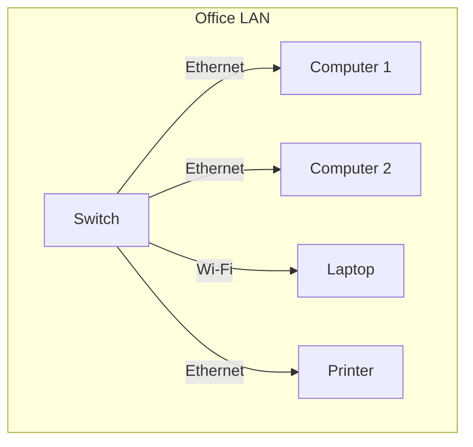
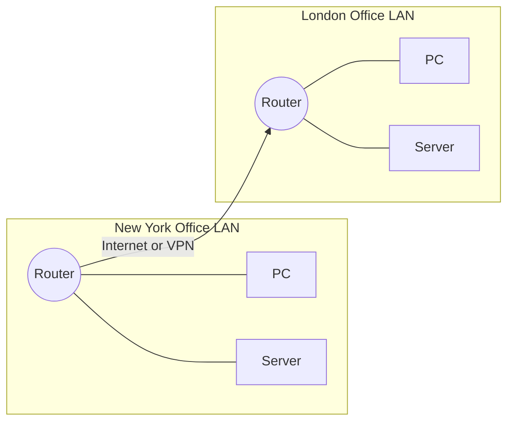
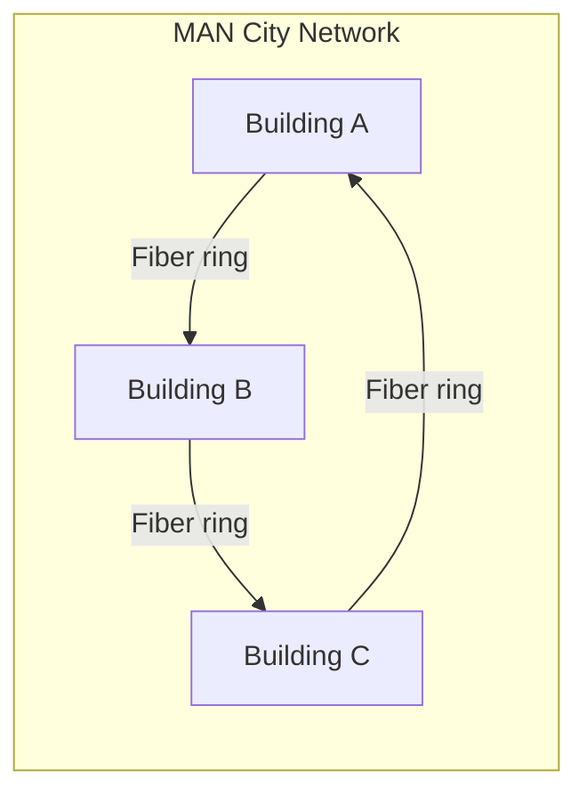
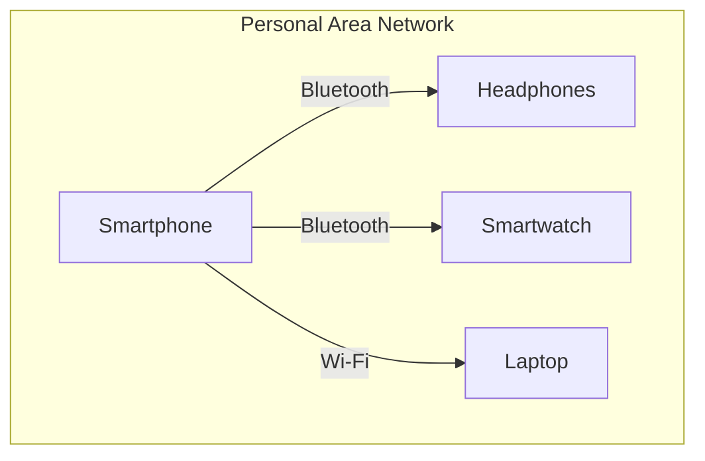

# Network Classifications

## Introduction
Network classifications by geographical scope and their typical characteristics.

### Network Models
- **Client-Server Model**: Centralized servers provide resources/services to multiple clients; common on the internet and in enterprises
- **Peer-to-Peer (P2P) Model**: Decentralized peers both request and provide resources directly; common in file sharing and small collaborative networks

### Overview
Networks are often classified by their geographical scope, which determines their size, performance requirements, and typical use cases. Here's a detailed look at each type:

### LAN (Local Area Network)
- **Definition**: Connects devices within a limited area, like a single building or campus
- **Key Characteristics**:
  - High data transfer rates (typically 1-10 Gbps)
  - Low latency (< 1ms)
  - Direct control and management
- **Common Examples**:
  - Office network connecting computers, printers, and servers
  - School computer lab network
  - Home network connecting personal devices

- **Technologies Used**:
  - Ethernet (wired)
  - Wi-Fi (wireless)
  - Network switches and routers

### WAN (Wide Area Network)
- **Definition**: Spans a large geographical area, such as a country or continent, often connecting multiple LANs
- **Key Characteristics**:
  - Lower data rates compared to LAN
  - Higher latency (> 10ms)
  - Often uses leased lines or public infrastructure
- **Common Examples**:
  - Corporate networks connecting multiple office locations
  - Internet Service Provider networks
  - Government agency networks spanning multiple cities

- **Technologies Used**:
  - Fiber optic cables
  - Satellite links
  - MPLS (Multiprotocol Label Switching)
  - VPN (Virtual Private Network)

### MAN (Metropolitan Area Network)
- **Definition**: Covers a larger area than a LAN but smaller than a WAN, such as a city
- **Key Characteristics**:
  - Medium to high data rates
  - Moderate latency (1-10ms)
  - Often owned by multiple organizations
- **Common Examples**:
  - City traffic control system network
  - Cable TV networks in a city
  - University campus networks across multiple locations

- **Technologies Used**:
  - Fiber optic rings
  - WiMAX
  - Metro Ethernet

### PAN (Personal Area Network)
- **Definition**: A small network for connecting personal devices, typically within a range of 10 meters
- **Key Characteristics**:
  - Very short range
  - Low power consumption
  - Simple configuration
- **Common Examples**:
  - Bluetooth headphones connected to a smartphone
  - Smartwatch syncing with a phone
  - Wireless keyboard and mouse with a computer
  - Fitness tracker connecting to mobile devices

- **Technologies Used**:
  - Bluetooth
  - NFC (Near Field Communication)
  - Infrared
  - ZigBee

### Comparison of Network Types

| Aspect | PAN | LAN | MAN | WAN |
|:-------|:----|:----|:----|:----|
| Range | < 10m | < 1km | < 50km | > 50km |
| Speed | Low-Medium | Very High | High | Medium-Low |
| Latency | Very Low | Very Low | Low | High |
| Cost | Low | Medium | High | Very High |
| Management | Simple | Moderate | Complex | Very Complex |

### Use Case Scenarios
1. **Home Setup**:
   - PAN: Connecting wireless peripherals
   - LAN: Home Wi-Fi network

2. **Business Environment**:
   - LAN: Office network
   - WAN: Multiple office locations
   - MAN: City-wide branch connections

3. **Educational Institution**:
   - LAN: Individual building networks
   - MAN: Campus-wide network
   - WAN: Multi-campus connections

### Best Practices for Network Selection
- Consider geographical distribution of users
- Evaluate bandwidth requirements
- Assess latency sensitivity of applications
- Account for scalability needs
- Factor in budget constraints
- Plan for future expansion
