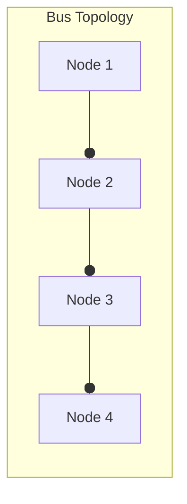
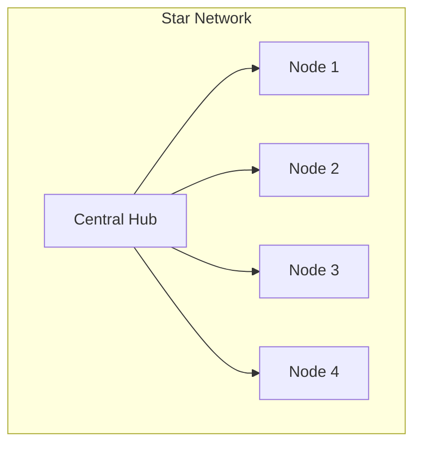
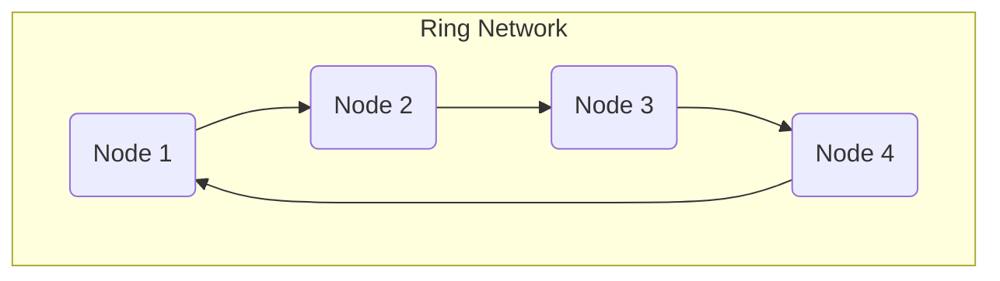
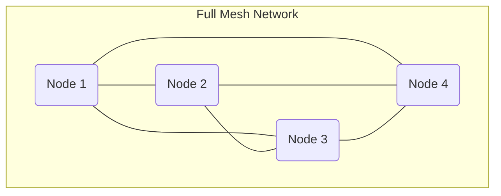
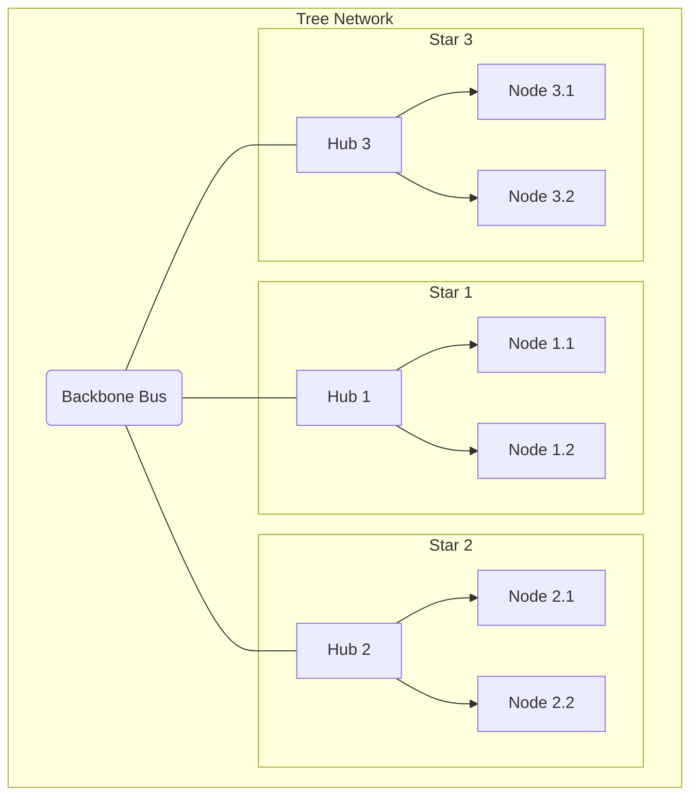
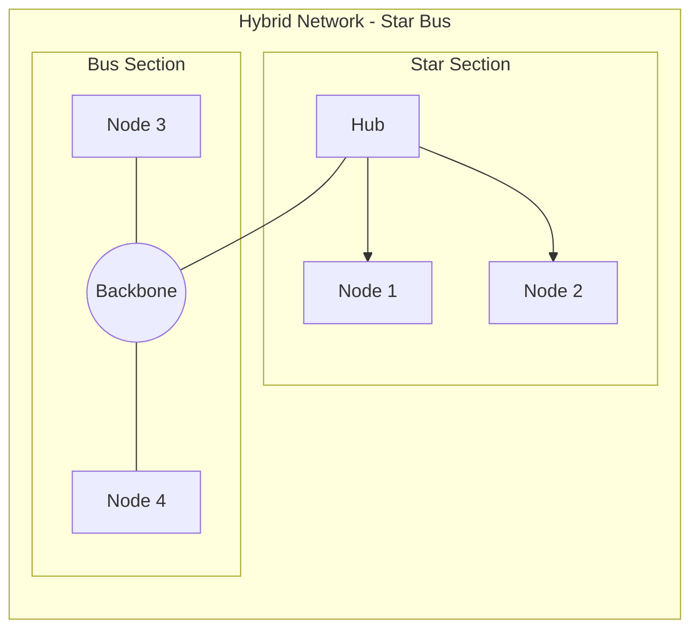

# Network Topologies

## Introduction
Overview of common network topologies and how layout impacts cost, performance, and reliability.

This guide uses vector-based diagrams (Mermaid.js) to illustrate each topology, allowing for easy updates and modifications.

## 1. Bus Topology
### Overview
In a bus topology, all devices are connected to a single central cable, called the bus or backbone. Data is transmitted in both directions along the bus, and all devices on the network can receive the signal.

### Advantages
- **`Cost-effective`**: Requires less cable than other topologies.
- **`Simple to install`**: Easy to set up and extend.
- **`Well-suited for small networks`**: Ideal for temporary or small networks that do not require high performance.

### Disadvantages
- **`Single point of failure`**: If the central bus fails, the entire network goes down.
- **`Difficult troubleshooting`**: Identifying a fault in the bus can be challenging.
- **`Performance degradation`**: Network performance degrades as more devices are added due to data collisions.
- **`Low security`**: All devices on the bus can see all data transmissions.

 

## 2. Star Topology
### Overview
In a star topology, all devices are connected to a central hub or switch. Each device has a dedicated point-to-point connection to the central hub. The central hub acts as a repeater for data flow.

### Advantages
- **`Centralized management`**: The hub allows for centralized monitoring and management of the network.
- **`Robustness`**: Failure of a single node does not affect the rest of the network.
- **`Easy to troubleshoot`**: Faults are easy to isolate and identify.
- **`Better performance`**: No data collisions, as each device has a dedicated connection to the hub.

### Disadvantages
- **`Single point of failure`**: If the central hub fails, the entire network goes down.
- **`Higher cost`**: Requires more cable compared to a bus topology.
- **`Dependent on central hub`**: The performance and capacity of the network depend on the capabilities of the central hub.

 

## 3. Ring Topology
### Overview
In a ring topology, each device is connected to exactly two other devices, forming a circular pathway for signals. Data travels in one direction (unidirectional) or both directions (bidirectional), passing through each device until it reaches its destination.

### Advantages
- **`Efficient data transfer`**: With unidirectional data flow, there are no data collisions.
- **`Orderly network`**: Every device has an equal opportunity to transmit data.
- **`Easy to identify faults`**: A failure in a node can be easily located.

### Disadvantages
- **`Single point of failure`**: A failure in a single node or cable can disrupt the entire network.
- **`Difficult to reconfigure`**: Adding or removing a device requires breaking the ring, which disrupts network operation.
- **`Slower transmission`**: Data must pass through all the nodes between the source and destination, which can slow down communication.

 

## 4. Mesh Topology
### Overview
In a mesh topology, each device is connected to every other device on the network. This setup creates multiple paths for data to travel, making it highly redundant. There are two types:
- **Full Mesh**: Every node is connected to every other node.
- **Partial Mesh**: Some nodes are connected to all others, but some are only connected to nodes with which they exchange the most data.

### Advantages
- **`High redundancy`**: If one path fails, data can be transmitted through an alternative path.
- **`Robust`**: The network is resilient to failures of individual nodes or links.
- **`High performance`**: Multiple devices can transmit data simultaneously without collision.
- **`Point-to-point links`**: Makes fault identification and isolation easy.

### Disadvantages
- **`High cost`**: Requires a significant amount of cabling and I/O ports, making it expensive.
- **`Complex installation`**: The number of connections grows quadratically with the number of nodes, making setup complex.
- **`High maintenance`**: Managing and maintaining the numerous connections can be difficult.

 

## 5. Tree Topology
### Overview
A tree topology is a hybrid structure that combines characteristics of bus and star topologies. It consists of groups of star-configured workstations connected to a linear bus backbone cable.

### Advantages
- **`Scalable`**: Easy to add new nodes or segments to the network.
- **`Easier management`**: The network is divided into segments (stars), making it easier to manage and maintain.
- **`Fault isolation`**: If one segment goes down, it does not affect the others. Error detection is straightforward.

### Disadvantages
- **`Single point of failure`**: If the central backbone cable fails, the entire network is crippled.
- **`High cost`**: Requires more cabling compared to bus or star topologies.
- **`Complex configuration`**: The topology is more complex to configure and wire than other topologies.

 

## 6. Hybrid Topology
### Overview
A hybrid topology is a combination of two or more different basic topologies (e.g., star-bus, star-ring). This approach allows a network to leverage the strengths of various topologies and minimize their weaknesses. The resulting network structure can be complex, tailored to specific requirements.

### Advantages
- **`Flexible`**: Can be designed to meet specific network requirements.
- **`Scalable`**: Easy to expand by adding new segments with different topologies.
- **`Reliable`**: A failure in one part of the network does not necessarily affect others.

### Disadvantages
- **`Complex design`**: Can be challenging to design and implement.
- **`High cost`**: Often expensive due to the hardware required to connect different topologies.
- **`Difficult management`**: Managing a hybrid network can be complex due to its varied structure.

 

## 7. Summary and Conclusion
### Comparison of Topologies

| Topology | Cost      | Reliability | Scalability | Complexity | Best For                     |
| :------- | :-------- | :---------- | :---------- | :--------- | :--------------------------- |
| **Bus**      | Low       | Low         | Low         | Low        | Small, temporary networks    |
| **Star**     | Moderate  | High        | Moderate    | Low        | Small to medium LANs         |
| **Ring**     | Moderate  | Low         | Low         | Moderate   | Networks with orderly traffic|
| **Mesh**     | High      | Very High   | High        | High       | WANs, critical networks      |
| **Tree**     | High      | Moderate    | High        | High       | Large, hierarchical networks |
| **Hybrid**   | Very High | High        | High        | Very High  | Large, complex networks      |

### Conclusion
Choosing the right network topology is a critical decision in network design. Each topology offers a unique balance of cost, reliability, scalability, and complexity. Understanding these trade-offs allows network administrators to build a network that meets their specific needs, whether it's a small, cost-effective LAN or a large, resilient WAN. The key is to align the topology's strengths with the organization's goals and resources.

 
