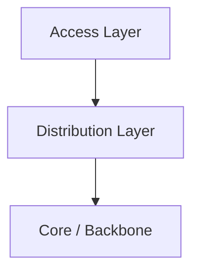
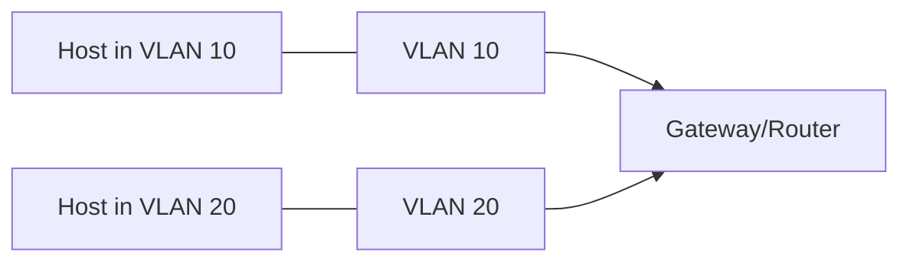

# Backbones and Segmentation

## Why This Matters

- More devices and apps create congestion and large broadcast domains
- Faults can ripple across a flat network
- Backbones provide fast paths; segmentation contains noise and applies policy

## Key Terms

- **Backbone (Core)**: The fast, central part of a network that carries most traffic between areas. Think “highway.”
- **Segment**: A smaller part of a network. Can be made by IP subnets or VLANs.
- **Subnet**: An IP range (like 10.0.10.0/24) that groups hosts together.
- **VLAN**: A logical L2 (Ethernet) grouping; hosts “act” like they’re on the same switch even if not.
- **Default Gateway**: The router/switch IP that devices send traffic to for other subnets.

## Hierarchical Design

- **Access**: Where users/things plug in (edge switches, Wi‑Fi APs)
- **Distribution**: Aggregates access, enforces simple policies, routes between segments
- **Core (Backbone)**: Very fast, resilient forwarding with minimal extra features

Diagram guide: Access connects up to Distribution; Distribution connects up to Core. Redundancy at higher layers is common but not shown here.

## Segmentation: VLANs and Subnets

We split the network into logical groups to reduce noise, improve security, and manage growth.

- **By role**: Engineering, Finance, Guests
- **By location**: Floor 1, Floor 2
- **By function**: Users, Servers, Printers, IoT

VLAN 10 and VLAN 20 are separate groups on the same switch. Devices in the same VLAN talk directly; the gateway routes between VLANs.

## References

- `youtube.com/watch?v=pKoE-QDp6qQ&pp=ygUPTmV0d29yayBzZWdtZW50`
- `youtube.com/watch?v=DMT-vBZdtL0&pp=ygUPTmV0d29yayBzZWdtZW50`
