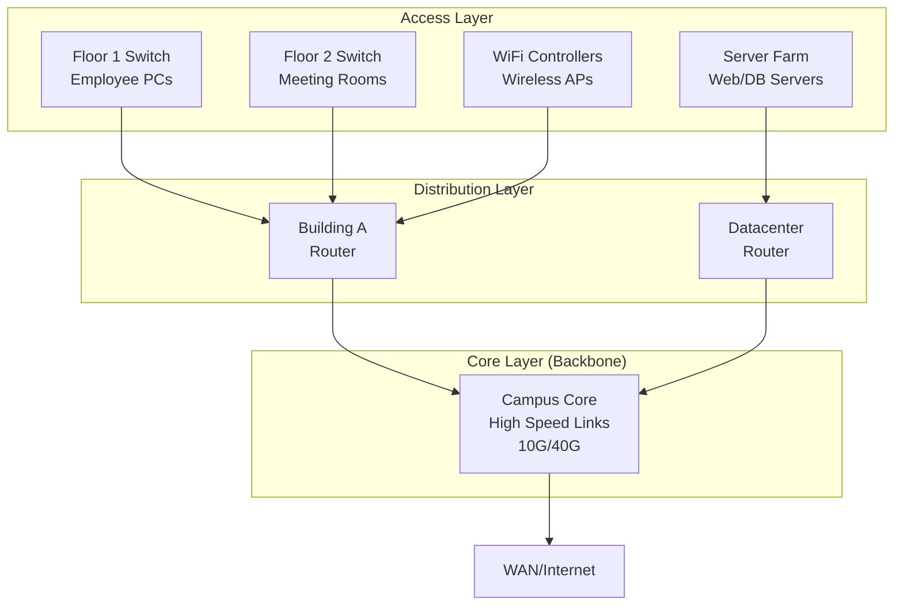
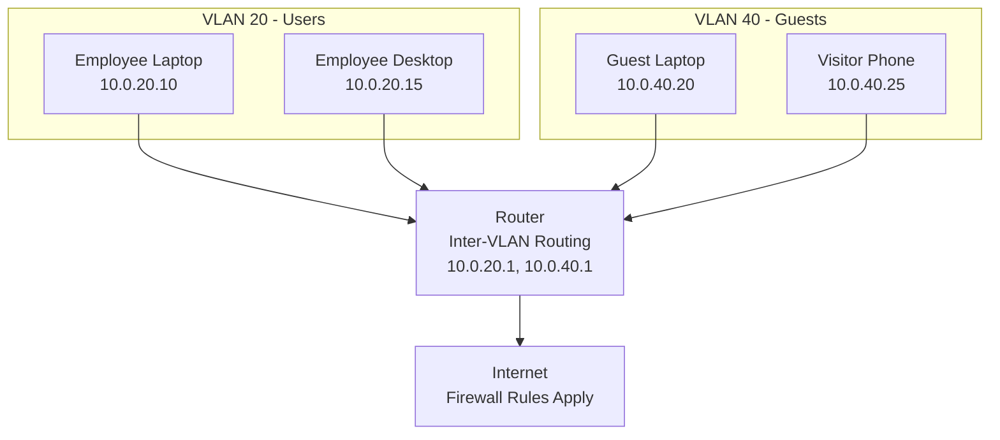

# Backbones and Segmentation

## Why This Matters

- More devices and apps create congestion and large broadcast domains
- Faults can ripple across a flat network
- Backbones provide fast paths; segmentation contains noise and applies policy

## Key Terms

- **Backbone (Core)**: The fast, central part of a network that carries most traffic between areas. Think “highway.”
- **Segment**: A smaller part of a network. Can be made by IP subnets or VLANs.
- **Subnet**: An IP range (like 10.0.10.0/24) that groups hosts together.
- **VLAN**: A logical L2 (Ethernet) grouping; hosts act like they’re on the same switch (even if they are not).
- **Default Gateway**: The router IP that devices send traffic to for other subnets.

## Hierarchical Design: Building Around the Backbone

Networks are built in layers, starting from where users connect and building up to the central **backbone** that connects everything:

- **Access Layer**: Where users and devices connect

  - Edge switches and Wi‑Fi access points
  - User devices (PCs, phones, printers) plug in here
  - Provides basic connectivity and security
- **Distribution Layer**: Aggregates access and manages traffic

  - Uses **routers** to interconnect access layer switches
  - Collects traffic from multiple access switches
  - Routes between VLANs and enforces policies
  - Decides which traffic needs to go to the backbone
- **Core Layer (The Backbone)**: The central nervous system

  - Highest capacity links (10G, 40G, 100G+)
  - Connects all distribution layers together
  - Provides path to WAN/Internet and remote sites
  - Minimal processing - optimized for speed

**Why "Backbone"?** Just like your body's backbone provides the main structural support and efficient pathway for nerve signals, a network backbone provides the main infrastructure for efficient data transport between network segments.

**Why Do We Need a Backbone?**

- **Scalability**: Without a backbone, connecting 10 network segments would require 45 individual links (each segment connected to every other). With a backbone, you only need 10 links (each segment connects once to the backbone).
- **Performance**: Dedicated high-capacity links (10G+) handle inter-segment traffic efficiently, rather than overloading distribution routers with transit traffic.
- **Cost Efficiency**: Fewer total links and centralized high-speed equipment is more economical than multiple point-to-point connections.
- **Traffic Engineering**: All inter-segment traffic flows through known paths, making it easier to monitor, control, and optimize network performance.

Could networks work without a backbone? Yes, but they'd be slower, more expensive, and much harder to manage as they grow.

This diagram shows a realistic campus network with multiple routers at the distribution layer serving different areas. Building A's router aggregates employee floors and WiFi infrastructure while providing inter-VLAN routing, while the datacenter router handles server traffic and routes between server VLANs. All inter-building and Internet traffic flows through the backbone, which provides the high-capacity interconnection between these different network areas.

## Segmentation: VLANs and Subnets

Segmentation divides a large network into smaller, isolated logical groups while maintaining controlled connectivity between them. This fundamental network design principle solves several critical problems:

### Common Segmentation Strategies

- **By role**: Engineering, Finance, Guests, Executives
- **By function**: Users, Servers, Printers, IoT, Voice
- **By location**: Floor 1, Floor 2, Building A, Remote Sites

### Practical Example: Office Network Segmentation

| VLAN    | Subnet       | Purpose | Devices                    |
| ------- | ------------ | ------- | -------------------------- |
| VLAN 20 | 10.0.20.0/24 | Users   | Employee laptops, desktops |
| VLAN 40 | 10.0.40.0/24 | Guests  | Visitor devices            |

This diagram shows network segmentation in action with two isolated VLANs on the same physical infrastructure. Employee devices in VLAN 20 and guest devices in VLAN 40 cannot communicate directly with each other, but both segments can reach the Internet through the router which enforces security policies between the VLANs.

**Key Points:**

- Each VLAN has its own subnet and broadcast domain
- Devices in the same VLAN communicate directly
- Router provides inter-VLAN communication
- Firewall rules can control traffic between VLANs
- Guests are isolated from internal company resources

## References

- [Network Segmentation Fundamentals](https://youtube.com/watch?v=pKoE-QDp6qQ&pp=ygUPTmV0d29yayBzZWdtZW50)
- [VLAN and Network Segmentation Best Practices](https://youtube.com/watch?v=DMT-vBZdtL0&pp=ygUPTmV0d29yayBzZWdtZW50)
