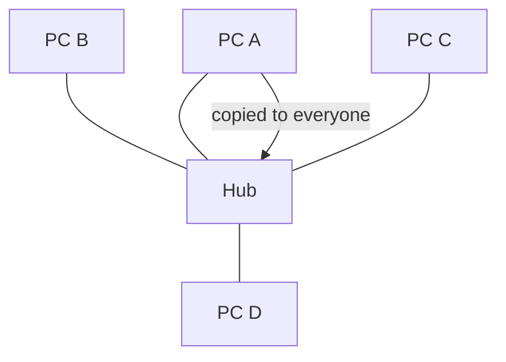
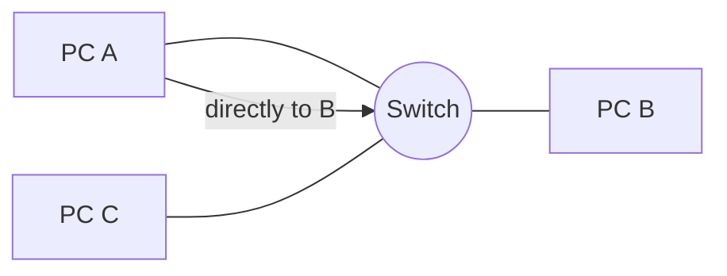
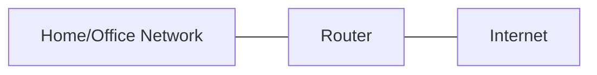
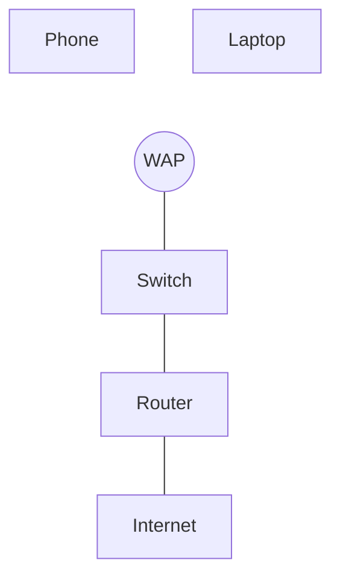
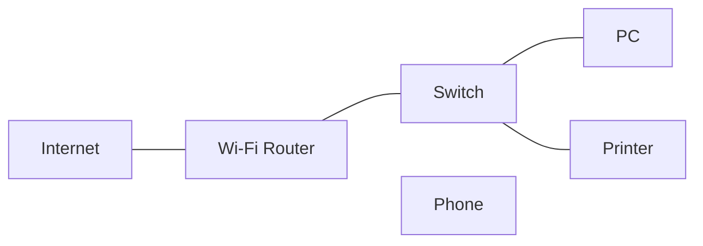

## Network Devices in Practice

### What we’ll cover
- NIC, Hub, Switch, Router, Bridge
- Wi‑Fi gear: Wi‑Fi router, WAP, RAP
- Where each device sits in a simple home/office network and what it does


## NIC (Network Interface Card)
- The network port of a device; has a hardware address (MAC) and sends/receives network traffic.
- Tip: To always assign `192.168.10.50` to MAC `AA:BB:CC:DD:EE:FF`, use a router DHCP reservation or set a static IP.


## Hub vs Switch

### Hub (old/repeater)
- Copies anything it hears to all ports. Simple, noisy, not used today.



### Switch (modern)
- Learns which device is on which port and sends traffic only where needed.



## Bridge
- Like a small 2‑port switch: connects two network segments and forwards useful traffic between them.
- Helps reduce noise between areas and extend networks.

```mermaid
graph LR
  Seg1[Segment A] -- Bridge -- Seg2[Segment B]
```

## Router
- Connects different networks (e.g., your home network to the Internet, or two office segments).
- Chooses a path for traffic between networks; can enforce rules and share one public IP among many devices (home NAT).



Common in homes: the “Wi‑Fi router” is a router + small switch + wireless access point in one box.

## Wi‑Fi: Router, WAP, RAP

### Wi‑Fi Router
- All‑in‑one box: routes to the Internet, provides a few Ethernet ports, and creates your Wi‑Fi network.

### WAP (Wireless Access Point)
- Adds or extends Wi‑Fi coverage; bridges wireless devices onto your existing wired network.

### RAP (Remote Access Point)
- A WAP that connects back to a main site over the Internet for remote locations.



---

## Putting it together (simple view)

