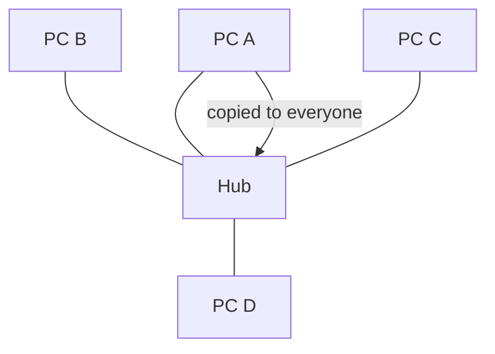
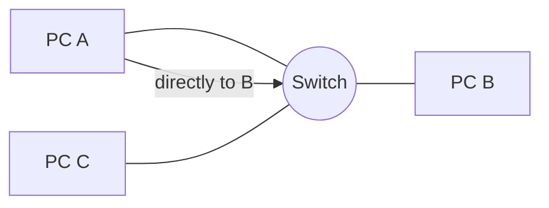
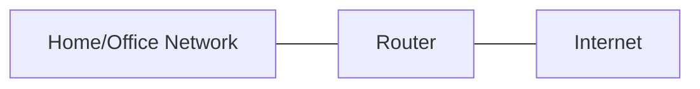
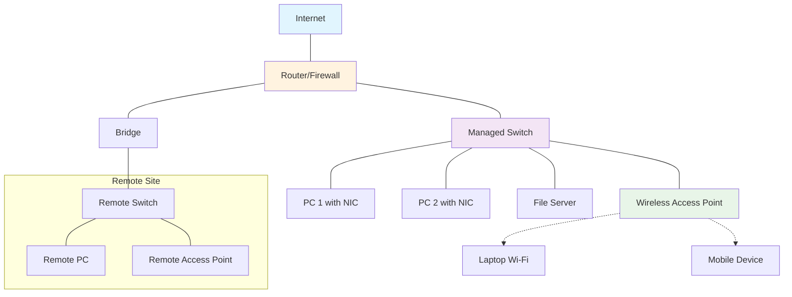

## Network Devices in Practice

### What we'll cover
- NIC, Hub, Switch, Router, Bridge
- Wi‑Fi gear: Wi‑Fi router, WAP, RAP
- Where each device sits in a simple home/office network and what it does

## NIC (Network Interface Card)
 - Lets a device join a network and reach the Internet.
 - The device’s network port with a unique MAC identity that sends and receives traffic.
 - Serves one device, whereas switches/routers connect many devices or networks.
 - Available as wired Ethernet or Wi‑Fi; many devices (e.g., laptops) have both.
 - To keep its IP from changing, pin the IP in your router settings or use a static IP.

## Hub vs Switch

### Hub (old/repeater)
- Sends every message to all ports, so everyone shares bandwidth and can collide.
- Exists from early networks for simplicity; replaced by switches that send only where needed.
- Avoid in modern setups; use only for quick tests or legacy gear.

### Switch (modern)
- Connects devices on the same network and sends traffic only where it needs to go.
- Learns which device is on which port by watching traffic.
- Stops collisions and shares bandwidth more fairly than a hub.
- Works at the Ethernet level and doesn't change IP addresses.
- Can separate groups with VLANs on one physical switch.
- In homes, the Ethernet ports on a Wi‑Fi router are a built‑in switch.

**Unmanaged vs Managed Switches:**
- **Unmanaged**: Plug-and-play, no configuration needed. Good for homes and simple setups.
- **Managed**: Can be configured via web interface or command line. Offers VLANs, QoS, port mirroring, and monitoring. Essential for business networks.

## Bridge
- Like a small 2‑port switch: connects two network segments and forwards relavant traffic between them.
- Helps reduce noise between areas and extend networks.

## Router
- Connects different networks (home LAN to the Internet, or LAN to LAN).
- Chooses where to send traffic between networks.
- Lets many devices share one public address using NAT.
- Acts as the default gateway so devices can reach other networks.
- Often provides a basic firewall and rules (e.g., port forwarding).

Common in homes: the “Wi‑Fi router” is a router + small switch + wireless access point in one box.

## Wi‑Fi: Router, WAP, RAP

### Wi‑Fi Router
- Routes your home network to the Internet and creates the Wi‑Fi network.
- Includes a small Ethernet switch for your wired devices.
- Secures Wi‑Fi with passwords and can offer a guest network.
- Usually assigns IPs (DHCP) and provides a basic firewall.
- Place centrally and elevated for better coverage; add a switch if you need more ports.

### WAP (Wireless Access Point)
- Creates or extends Wi‑Fi coverage and bridges wireless devices onto your existing network.
- Not a router; connects back to your router/switch over a wired link.

### RAP (Remote Access Point)
- A WAP for remote sites that connects back over the Internet to your main network.
- Useful for branch offices or home workers; traffic is tunneled back securely.
- Typically managed by a controller or cloud from the main site.

### Complete Network Overview
Here's how these devices work together in a typical small office network:

## Device Selection Guide

**When to use each device:**

| Scenario | Best Device | Why? |
|----------|-------------|------|
| Connect single device to network | NIC | Every device needs one |
| Connect 5-8 devices in home | Unmanaged Switch | Simple, cheap, reliable |
| Connect 20+ devices in office | Managed Switch | VLANs, monitoring, control |
| Connect home network to Internet | Wi-Fi Router | All-in-one solution |
| Add Wi-Fi to existing network | WAP | Dedicated wireless performance |
| Connect remote office | RAP + VPN | Secure tunnel back to main site |
| Connect two building segments | Bridge | Reduces traffic between segments |
| Connect different networks | Router | Routes between network boundaries |

## Glossary / Quick Reference
- MAC address (Media Access Control address): Unique hardware address of a network interface on a local network.
- IP address (Internet Protocol address): Network address software uses to identify a device across networks.
- Ethernet: Wired networking technology used by switches/routers to connect devices in a LAN.
- DHCP (Dynamic Host Configuration Protocol): Service that automatically assigns IP addresses and other settings to devices.
- NAT (Network Address Translation): Technique on routers that lets many devices share one public IP address.
- VLAN (Virtual LAN): Splits one physical switch into separate, isolated logical networks.
- Firewall: Set of rules on a router that allow or block traffic for safety.