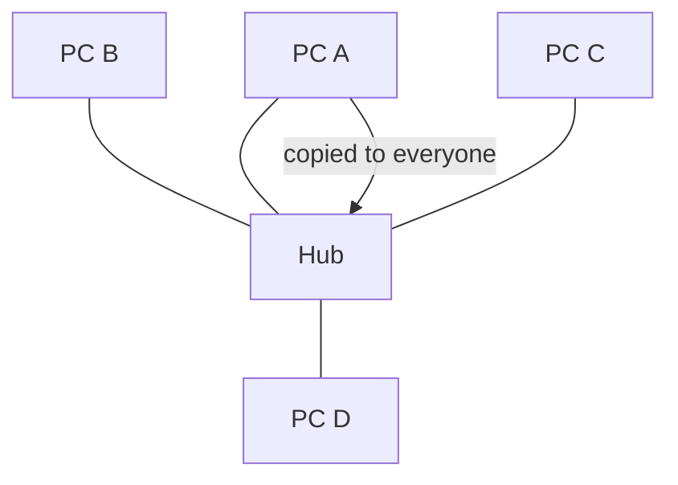
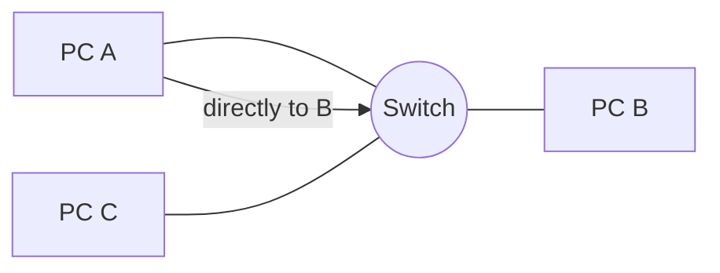
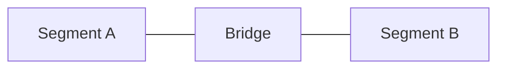
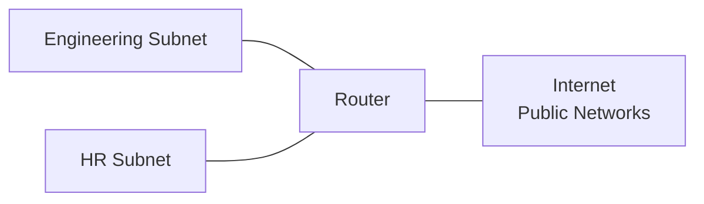
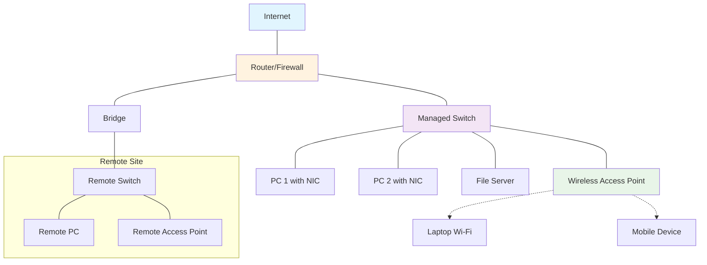

## Network Devices in Practice

### What we'll cover

- Host, NIC, Hub, Switch, Router, Bridge
- Wi‑Fi gear: Wi‑Fi router, WAP, RAP
- Where each device sits in a simple home/office network and what it does

## Host (Computer/Node)

- Any device that connects to a network to send, receive, or process data.
- Examples: desktop PCs, laptops, servers, smartphones, tablets, IoT devices.
- Each host needs a unique IP address to communicate on the network.
- Hosts are endpoints in network communication - they generate and consume network traffic.
- Can act as clients (requesting services) or servers (providing services).

## NIC (Network Interface Card)

- Lets a device join a network and reach the Internet.
- The device’s network port with a unique MAC identity that sends and receives traffic.
- Serves one device, whereas switches/routers connect many devices or networks.
- Available as wired Ethernet or Wi‑Fi; many devices (e.g., laptops) have both.
- To keep its IP from changing, reserve the IP in your router's DHCP settings (DHCP reservation) or use a static IP.

## Network Cables/Channels

Physical cables and wireless channels carry data between devices with different bandwidth, cost, and reliability trade-offs.

| Type | Bandwidth | Cost per 100m | Distance Limit | Reliability | Notes |
|------|-----------|---------------|----------------|-------------|--------|
| Cat5e | 1 Gbps | $20-30 | 100m | Good | Standard for most LANs |
| Cat6 | 1-10 Gbps | $30-50 | 100m (55m @ 10G) | Very Good | Future-proof for 10G |
| Cat6a | 10 Gbps | $50-80 | 100m | Excellent | Shielded, less interference |
| Fiber Multi-mode | 1-100 Gbps | $100-200 | 300-550m | Excellent | Campus/building backbone |
| Fiber Single-mode | 1-100+ Gbps | $150-300 | 40km+ | Excellent | Long distance, ISP links |
| Coax (RG6) | 1 Gbps | $15-25 | 100m | Good | Cable internet, legacy |
| Wi-Fi 6 (5GHz) | 1-9 Gbps | $0/distance | 50m indoor | Fair | Wireless, interference prone |

**Copper** cables are cost-effective but limited by interference. **Fiber** offers highest performance but costs more. **Wireless** provides mobility with variable performance.

## Hub vs Switch

### Hub (old/repeater)

- Sends every message to all ports, so everyone shares bandwidth and can collide.
- Exists from early networks for simplicity; replaced by switches that send only where needed.
- Avoid in modern setups; use only for quick tests or legacy gear.

In the above diagram, the hub acts as a simple repeater, broadcasting every frame to ALL connected ports. When PC A sends data, PCs B, C, and D all receive it unnecessarily. This creates a single collision domain where all devices compete for shared bandwidth, leading to inefficient utilization and potential collisions.

### Switch (modern)

- Connects devices on the same network and sends traffic only where it needs to go.
- Learns which device is on which port by watching traffic.
- Stops collisions and shares bandwidth more fairly than a hub.
- Works at the Ethernet level and doesn't change IP addresses.
- Can separate groups with VLANs on one physical switch.
- In homes, the Ethernet ports on a Wi‑Fi router are a built‑in switch.

**Unmanaged vs Managed Switches:**

- **Unmanaged**: Plug-and-play, no configuration needed. Good for homes and simple setups.
- **Managed**: Can be configured via web interface or command line. Offers VLANs, QoS, port mirroring, and monitoring. Essential for business networks.

In the above diagram, the switch learns MAC addresses and intelligently forwards frames only to the intended recipient. When PC A communicates with PC B, the switch sends the frame directly to PC B's port, not to PC C. This creates separate collision domains per port and enables full-duplex communication with dedicated bandwidth.

**Switch MAC Address Table Example:**

| Port | MAC Address       | Status  | Age (seconds) |
| ---- | ----------------- | ------- | ------------- |
| 1    | AA:BB:CC:01:02:03 | Learned | 45            |
| 2    | AA:BB:CC:01:02:04 | Learned | 12            |
| 3    | AA:BB:CC:01:02:05 | Learned | 8             |
| 4    | -                 | Empty   | -             |

This table shows how the switch automatically builds and maintains its forwarding database. When a device sends a frame, the switch records the source MAC address and associates it with the incoming port. The "Age" column tracks how recently each MAC was seen - entries are removed after a timeout period (typically 5 minutes) to handle device moves or disconnections.

## Bridge

- Like a small 2‑port switch: connects two network segments and forwards relevant traffic between them.
- Helps reduce noise between areas and extend networks.

In the above diagram, the bridge selectively filters traffic between network segments, learning MAC addresses on each side. Local traffic within Segment A stays local and doesn't cross to Segment B, reducing congestion. Only inter-segment traffic gets forwarded, creating two separate collision domains while maintaining connectivity.

## Router

- Connects different networks (home LAN to the Internet, or LAN to LAN).
- Chooses where to send traffic between networks.
- Lets many devices share one public address using NAT.
- Acts as the default gateway so devices can reach other networks.
- Often provides a basic firewall and rules (e.g., port forwarding).

In the above diagram, the router connects multiple different networks - the Engineering Subnet and HR Subnet - to the Internet. Each network segment has its own subnet, and the router performs NAT to allow devices from both networks to share the router's public IP address. The router acts as the default gateway for both networks and can apply different policies (firewall rules, bandwidth limits) to each segment. Additionally, the router enables communication between the two subnets, routing traffic from Engineering to HR and vice versa when inter-departmental communication is needed.

Common in homes: the “Wi‑Fi router” is a router + small switch + wireless access point in one box.

## Wi‑Fi: Router, WAP, RAP

### Wi‑Fi Router

- Routes your home network to the Internet and creates the Wi‑Fi network.
- Includes a small Ethernet switch for your wired devices.
- Secures Wi‑Fi with passwords and can offer a guest network.
- Usually assigns IPs (DHCP) and provides a basic firewall.
- Place centrally and elevated for better coverage; add a switch if you need more ports.

### WAP (Wireless Access Point)

- Creates or extends Wi‑Fi coverage and bridges wireless devices onto your existing network.
- Not a router; connects back to your router/switch over a wired link.

### RAP (Remote Access Point)

- A WAP for remote sites that connects back over the Internet to your main network.
- Useful for branch offices or home workers; traffic is tunneled back securely.
- Typically managed by a controller or cloud from the main site.

### Complete Network Overview

Here's how these devices work together in a typical small office network:

In the above diagram, this network shows how devices work together in a business environment. The Router/Firewall (orange) provides Internet access, security, and NAT. The Managed Switch (purple) distributes wired connections to PCs and servers. The Wireless Access Point (green) serves mobile devices via Wi-Fi (dotted lines). The Remote Site connects through a Bridge, extending the network geographically. The RAP provides centrally-managed wireless access at the remote location.

## Device Selection Guide

**When to use each device:**

| Scenario                         | Best Device      | Why?                              |
| -------------------------------- | ---------------- | --------------------------------- |
| Connect single device to network | NIC              | Every device needs one            |
| Connect 5-8 devices in home      | Unmanaged Switch | Simple, cheap, reliable           |
| Connect 20+ devices in office    | Managed Switch   | VLANs, monitoring, control        |
| Connect home network to Internet | Wi-Fi Router     | All-in-one solution               |
| Add Wi-Fi to existing network    | WAP              | Dedicated wireless performance    |
| Connect remote office            | RAP + VPN        | Secure tunnel back to main site   |
| Connect two building segments    | Bridge           | Reduces traffic between segments  |
| Connect different networks       | Router           | Routes between network boundaries |

## Glossary / Quick Reference

- MAC address (Media Access Control address): Unique hardware address of a network interface on a local network.
- IP address (Internet Protocol address): Network address software uses to identify a device across networks.
- Ethernet: Wired networking technology used by switches/routers to connect devices in a LAN.
- DHCP (Dynamic Host Configuration Protocol): Service that automatically assigns IP addresses and other settings to devices.
- NAT (Network Address Translation): Technique on routers that lets many devices share one public IP address.
- VLAN (Virtual LAN): Splits one physical switch into separate, isolated logical networks.
- Firewall: Set of rules on a router that allow or block traffic for safety.
