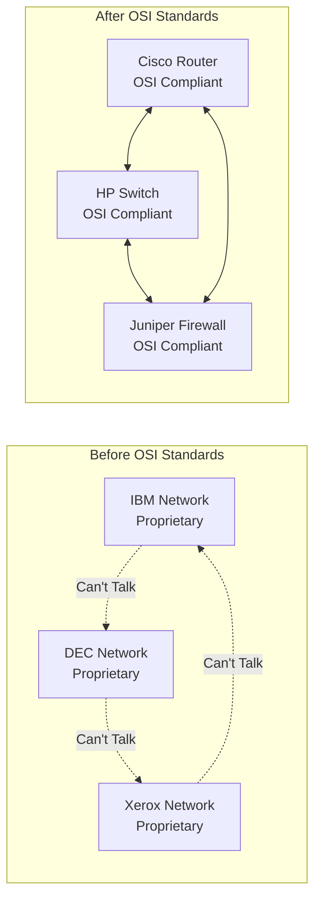
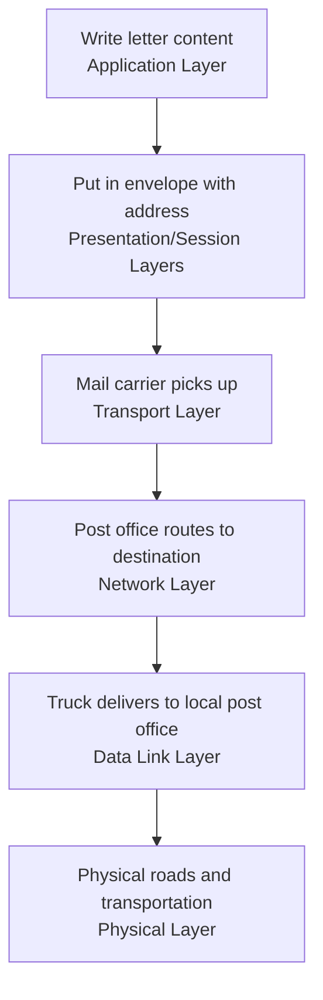
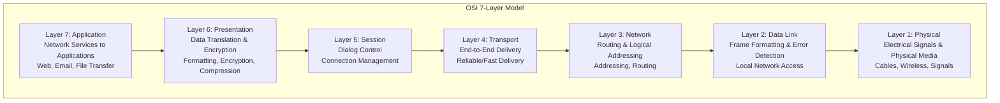

# OSI Model and Internetworking Standards

## Why This Matters

Before the 1980s, different computer manufacturers created their own networking protocols that couldn't communicate with each other. IBM computers couldn't talk to DEC computers, which couldn't talk to Xerox computers. This created "islands" of incompatible networks and forced organizations to buy all equipment from a single vendor.

The Open Systems Interconnection (OSI) model changed everything by providing a universal framework that enables any vendor's equipment to work with any other vendor's equipment—the foundation of today's interconnected world.

## Key Terms

- **OSI (Open Systems Interconnection)**: International standard for network communication developed by ISO
- **ISO**: International Organization for Standardization - develops worldwide standards
- **Interoperability**: Ability of different systems and devices to work together
- **Layered Architecture**: Organizing complex systems into distinct levels with specific responsibilities
- **Protocol**: Set of rules governing how devices communicate
- **Service**: What a layer provides to the layer above it
- **Interface**: Boundary between adjacent layers

## The Open Systems Interconnection Specifications

### What is OSI?

The **Open Systems Interconnection (OSI)** is a conceptual framework developed by the **International Organization for Standardization (ISO)** in the 1980s. The term "Open" refers to open standards—not proprietary—that any vendor can implement.

### Purpose of OSI Standards

1. **Standardization**: Create universal rules for network communication
2. **Interoperability**: Enable different vendors' equipment to work together
3. **Modularization**: Break complex networking into manageable pieces
4. **Education**: Provide common vocabulary for network professionals

### Real-World Impact

**Before OSI**: A Cisco router might not work with a Juniper switch, and an HP printer couldn't connect to an IBM mainframe.

**After OSI**: Any device following OSI principles can communicate with any other OSI-compliant device, regardless of manufacturer.

This diagram shows the transformation from incompatible proprietary networks to interoperable standards-based networks. Before OSI, different vendors' equipment created isolated islands that couldn't communicate. After standards-based networking (OSI/ISO framework alongside IEEE and IETF specifications), compliant devices interoperate across vendors—forming the foundation of today's global Internet.

## Internetworking Models

### What is an Internetworking Model?

An **internetworking model** is a logical framework that organizes the complex task of network communication into distinct, manageable layers. Each layer has specific responsibilities and provides services to the layer above it.

### Why Use Layered Architecture?

**Imagine building a house without a blueprint.** You'd have electricians, plumbers, and carpenters all working at once, getting in each other's way, with no clear plan. Network communication without layers would be similarly chaotic.

**Benefits of Layered Models:**

1. **Separation of Concerns**: Each layer focuses on one specific task
2. **Modularity**: Changes to one layer don't affect others
3. **Easier Troubleshooting**: Problems can be isolated to specific layers
4. **Standardization**: Each layer can have standard interfaces
5. **Vendor Independence**: Different vendors can build different layers

### The Postal System Analogy

Think of sending a letter to a friend—each step represents a network layer:

This diagram shows how sending a letter naturally follows layers. You write content (Application), put it in an addressed envelope (Presentation/Session), a mail carrier handles pickup (Transport), the postal system routes it (Network), trucks carry it (Data Link), and it travels on physical roads (Physical). Network communication works the same way—each layer handles one specific job.

**Key Insight**: Each layer only talks to adjacent layers and doesn't need to know how other layers work. The person writing a letter doesn't need to know truck routes, and truck drivers don't need to read the letter content.

### Service vs. Protocol Distinction

- **Service**: *What* a layer provides (e.g., "reliable delivery")
- **Protocol**: *How* a layer provides it (e.g., "acknowledgment messages")

**Example**: The Transport Layer provides "reliable delivery service" using specific acknowledgment mechanisms.

## The OSI Reference Model

The OSI model divides network communication into **7 distinct layers**, each with specific responsibilities:

This diagram shows the OSI 7-layer model with each layer's primary responsibility and functions. Data flows down through layers when sending (Application to Physical) and up through layers when receiving (Physical to Application). Each layer adds its own header information and provides specific services to enable network communication.

### Layer Details with Real-World Examples

#### Layer 7: Application Layer

**What it does**: Provides network services directly to user applications
**Real examples**: Web browsing, email, file sharing

#### Layer 6: Presentation Layer

**What it does**: Handles data formatting, encryption, and compression
**Real examples**: Encryption, image formats, text encoding

#### Layer 5: Session Layer

**What it does**: Manages dialog between applications (who talks when)
**Real examples**: Database connections, video conference sessions

#### Layer 4: Transport Layer

**What it does**: Provides reliable end-to-end data delivery
**Real examples**: Reliable delivery, fast delivery, port addressing

#### Layer 3: Network Layer

**What it does**: Routes data between different networks using logical addresses
**Real examples**: Network addresses, routing between networks

#### Layer 2: Data Link Layer

**What it does**: Manages access to physical media and local delivery
**Real examples**: Local network switching, physical addresses

#### Layer 1: Physical Layer

**What it does**: Transmits raw bits over physical media
**Real examples**: Cables, fiber optics, radio signals

### Memory Aids

**Top to Bottom**: "All People Seem To Need Data Processing"
**Bottom to Top**: "Please Do Not Throw Sausage Pizza Away"

## Real-World Applications

### Network Troubleshooting with OSI

When networks fail, the OSI model provides a systematic troubleshooting approach:

1. **Physical**: Are cables connected? Are link lights on?
2. **Data Link**: Can devices see each other on the local network?
3. **Network**: Can you reach remote networks?
4. **Transport**: Are the right services running?
5. **Session/Presentation/Application**: Is the application configured correctly?

## Summary

The OSI model isn't just academic theory—it's the foundation that enables our interconnected world. Every time you browse the web, send an email, or use a mobile app, you're benefiting from the interoperability and organization that OSI standards provide.

**Key Takeaways**:

- OSI standards enable different vendors' equipment to work together
- Layered models organize complex networking into manageable pieces
- The 7-layer OSI model provides a universal framework for understanding networks
- Each layer has specific responsibilities and communicates only with adjacent layers
- OSI guides network design, troubleshooting, and professional communication

## References

- [ISO/IEC 7498-1: OSI Basic Reference Model](https://www.iso.org/standard/20269.html)
- [What is OSI Model | Real World Examples](https://www.youtube.com/watch?v=0y6FtKsg6J4)
- [OSI Model Explained with Examples](https://www.youtube.com/watch?v=vv4y_uOneC0)
