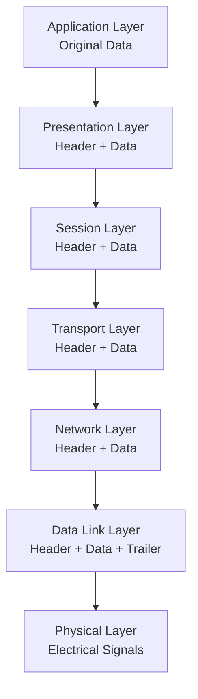
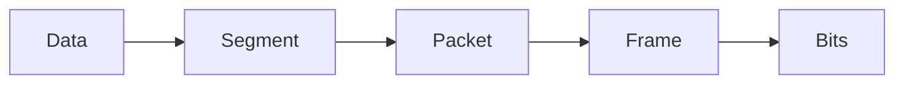

# Encapsulation and Data Flow

## Why This Matters

When you send a message or browse a website, your data doesn't just magically appear at its destination. It gets **wrapped, labeled, and processed** at each network layer—like a package being prepared for shipping with multiple layers of packaging, addresses, and handling instructions.

Understanding encapsulation is crucial because it explains:

- How applications communicate across networks
- Why network troubleshooting follows the OSI layers
- How network performance and security work at different levels
- What network engineers see when analyzing traffic

## Key Terms

- **Encapsulation**: The process of wrapping data with protocol information at each layer
- **De-encapsulation**: The reverse process of unwrapping data as it moves up layers
- **PDU (Protocol Data Unit)**: The data structure at each layer with its specific name
- **Header**: Control information added to the beginning of data
- **Trailer**: Control information added to the end of data (less common)
- **Payload**: The actual data being carried (the contents of the "package")

## The Encapsulation Process

### What is Encapsulation?

**Encapsulation** is the process of taking data from an upper layer, adding layer-specific header (and sometimes trailer) information, and passing it to the lower layer. Each layer treats the information from the layer above as data and adds its own control information.

**Think of it like preparing a package for shipping:**

1. **Item** (your data) goes in a box
2. **Box** gets a shipping label with addresses
3. **Box** goes in a delivery truck with a route manifest
4. **Truck** travels on roads with traffic rules
5. **Roads** are built with specific engineering standards

Each level adds its own "wrapper" with information needed for that level to do its job.

### PDU Names at Each Layer

Each layer has a specific name for its data structure and adds specific header information:

| OSI Layer        | PDU Name | What Gets Added | Purpose |
| ---------------- | -------- | --------------- | ------- |
| 7 - Application  | **Data** | Application content, user authentication | User applications and services |
| 6 - Presentation | **Data** | Data formatting, encryption information | Data translation and security |
| 5 - Session      | **Data** | Session management, dialog control | Dialog control |
| 4 - Transport    | **Segment** | Port numbers, delivery options | End-to-end delivery |
| 3 - Network      | **Packet** | Logical addresses, routing information | Inter-network communication |
| 2 - Data Link    | **Frame** | Physical addresses, error detection | Local network delivery |
| 1 - Physical     | **Bits** | Signal transmission characteristics | Physical transmission |



This diagram shows how data gets wrapped at each layer during encapsulation. Starting with original application data, each layer adds its own header information, creating progressively larger data structures. The process is like Russian nesting dolls—each layer contains all the layers above it plus its own control information.



## Concrete Example: Sending "Hello World"

Let's trace a simple "Hello World" message through encapsulation to see exactly what gets added at each layer:

### Starting Data
**Application wants to send**: `"Hello World"`

### Layer-by-Layer Encapsulation

**Layer 7 (Application)**:
```
Data: "Hello World"
```

**Layer 4 (Transport)**:
```
Transport Header: [Source Port: 8080 | Dest Port: 80 | Sequence: 1001]
Payload: "Hello World"
Result: [Transport Header][Hello World] = Segment
```

**Layer 3 (Network)**:
```
Network Header: [Source IP: 192.168.1.10 | Dest IP: 203.0.113.5 | Protocol: TCP]
Payload: [Transport Header][Hello World]
Result: [Network Header][Transport Header][Hello World] = Packet
```

**Layer 2 (Data Link)**:
```
Data Link Header: [Source MAC: AA:BB:CC:DD:EE:FF | Dest MAC: 11:22:33:44:55:66]
Payload: [Network Header][Transport Header][Hello World]
Result: [Data Link Header][Network Header][Transport Header][Hello World] = Frame
```

**Layer 1 (Physical)**:
```
Frame converted to electrical signals: 010101110011... = Bits
```

### Data Growth Through Layers

| Layer | Content Size | What's Included |
|-------|-------------|-----------------|
| **Application** | 11 bytes | `"Hello World"` |
| **Transport** | ~31 bytes | Transport header (20 bytes) + data (11 bytes) |
| **Network** | ~51 bytes | Network header (20 bytes) + Transport segment (31 bytes) |
| **Data Link** | ~65 bytes | Data Link header (14 bytes) + Network packet (51 bytes) |
| **Physical** | ~520 bits | Frame converted to electrical signals |

### De-encapsulation Process

When the frame reaches its destination:

**Layer 1 (Physical)**:
```
Receives: 010101110011... (electrical signals)
Converts: Electrical signals back to frame
Passes up: [Data Link Header][Network Header][Transport Header][Hello World]
```

**Layer 2 (Data Link)**:
```
Checks: "Is dest MAC 11:22:33:44:55:66 me?" ✓
Removes: [Data Link Header]
Passes up: [Network Header][Transport Header][Hello World]
```

**Layer 3 (Network)**:
```
Checks: "Is dest IP 203.0.113.5 me?" ✓
Removes: [Network Header]
Passes up: [Transport Header][Hello World]
```

**Layer 4 (Transport)**:
```
Checks: "Is dest port 80 my service?" ✓
Removes: [Transport Header]
Passes up: "Hello World"
```

**Layer 7 (Application)**:
```
Receives: "Hello World"
Processes: Original message successfully delivered!
```

## Real-World Applications

**Troubleshooting**: When networks fail, check each layer systematically (Physical → Data Link → Network → Transport → Application)

**Security**: Each layer provides security opportunities (encryption at Presentation, firewalls at Network, etc.)

**Performance**: Each layer adds overhead - understanding encapsulation helps explain network efficiency and optimization opportunities

## Summary

Encapsulation is the fundamental process that makes network communication possible. Every piece of data traveling across networks goes through this wrapping and unwrapping process, with each layer adding exactly the information needed for that layer's responsibilities.

**Key Takeaways**:

- **Each layer adds headers** with information needed for that layer's job
- **PDU names change** at each layer: Data → Segment → Packet → Frame → Bits
- **Headers are examined and removed** during de-encapsulation
- **Understanding encapsulation helps** with troubleshooting, performance, and security
- **All network communications** use this process for every message

**Remember**: Every email, web page, video stream, and file download goes through this exact process—it's the foundation of how networks work!
