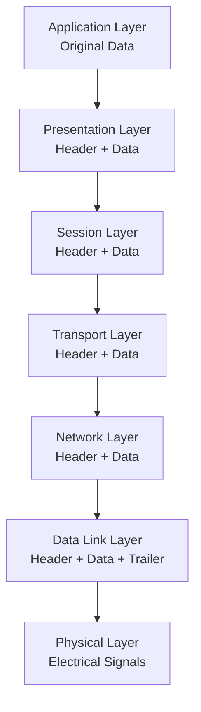
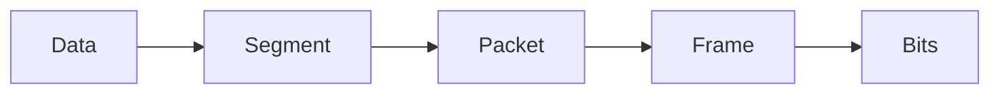
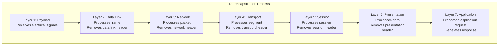

# Encapsulation and Data Flow

## Why This Matters

When you send a message or browse a website, your data doesn't just magically appear at its destination. It gets **wrapped, labeled, and processed** at each network layer—like a package being prepared for shipping with multiple layers of packaging, addresses, and handling instructions.

Understanding encapsulation is crucial because it explains:

- How applications communicate across networks
- Why network troubleshooting follows the OSI layers
- How network performance and security work at different levels
- What network engineers see when analyzing traffic

## Key Terms

- **Encapsulation**: The process of wrapping data with protocol information at each layer
- **De-encapsulation**: The reverse process of unwrapping data as it moves up layers
- **PDU (Protocol Data Unit)**: The data structure at each layer with its specific name
- **Header**: Control information added to the beginning of data
- **Trailer**: Control information added to the end of data (less common)
- **Payload**: The actual data being carried (the contents of the "package")

## The Encapsulation Process

### What is Encapsulation?

**Encapsulation** is the process of taking data from an upper layer, adding layer-specific header (and sometimes trailer) information, and passing it to the lower layer. Each layer treats the information from the layer above as data and adds its own control information.

**Think of it like preparing a package for shipping:**

1. **Item** (your data) goes in a box
2. **Box** gets a shipping label with addresses
3. **Box** goes in a delivery truck with a route manifest
4. **Truck** travels on roads with traffic rules
5. **Roads** are built with specific engineering standards

Each level adds its own "wrapper" with information needed for that level to do its job.

### PDU Names at Each Layer

Each layer has a specific name for its data structure:

| OSI Layer        | PDU Name                                | What Gets Added                     | Purpose                        |
| ---------------- | --------------------------------------- | ----------------------------------- | ------------------------------ |
| 7 - Application  | **Data**                          | Application content                 | User applications and services |
| 6 - Presentation | **Data**                          | Formatting/encryption               | Data translation and security  |
| 5 - Session      | **Data**                          | Session management                  | Dialog control                 |
| 4 - Transport    | **Segment** or **Datagram** | Port addressing, reliability        | End-to-end delivery            |
| 3 - Network      | **Packet**                        | Logical addresses, routing          | Inter-network communication    |
| 2 - Data Link    | **Frame**                         | Physical addresses, error detection | Local network delivery         |
| 1 - Physical     | **Bits**                          | Electrical/optical signals          | Physical transmission          |

This diagram shows how data gets wrapped at each layer during encapsulation. Starting with original application data, each layer adds its own header information, creating progressively larger data structures. The process is like Russian nesting dolls—each layer contains all the layers above it plus its own control information.

## Simple Example: Web Browsing Walkthrough

Let's trace what happens when you visit a website. We'll follow the encapsulation process step by step.

### Layer 7: Application Layer

**What happens**: Browser creates a web request
**PDU**: Application **Data**

### Layer 6-5: Presentation & Session Layers

**What happens**: Data formatting and session management applied
**PDU**: Still called **Data** (with formatting)

### Layer 4: Transport Layer

**What happens**: Transport header adds port identification and reliability
**PDU**: **Segment**

### Layer 3: Network Layer

**What happens**: Network header adds logical addressing for routing
**PDU**: **Packet**

### Layer 2: Data Link Layer

**What happens**: Data link header adds physical addressing for local delivery
**PDU**: **Frame**
**Key insight**: This layer only handles local network delivery

### Layer 1: Physical Layer

**What happens**: Frame becomes electrical signals
**PDU**: **Bits**

## De-encapsulation at the Destination

When the frame reaches the web server, the process reverses:

This diagram shows how the receiving server reverses the encapsulation process. At each layer, the corresponding header is examined and removed, revealing the data for the next layer up. The Physical layer receives electrical signals, Data Link processes the frame and removes its header to reveal the packet, and each successive layer removes its own header until the Application layer receives the original application request.

### What Each Layer Examines

1. **Physical**: Signal quality and timing
2. **Data Link**: "Is this frame for me?" (physical address check)
3. **Network**: "Is this packet for me?" (logical address check)
4. **Transport**: "Which application gets this?" (port addressing)
5. **Session**: Session management and dialog control
6. **Presentation**: Data formatting and encryption handling
7. **Application**: Process the actual application request

## What's in Headers?

Headers contain control information that each layer needs to do its job:

- **Application Layer**: Application-specific information
- **Presentation Layer**: Data format and encryption information
- **Session Layer**: Dialog management information
- **Transport Layer**: Port numbers and delivery options
- **Network Layer**: Logical addresses and routing information
- **Data Link Layer**: Physical addresses and error detection
- **Physical Layer**: Signal transmission characteristics

## Real-World Applications

### Network Performance

Understanding encapsulation helps with:

- **Efficiency**: Each layer adds overhead, affecting speed
- **Optimization**: Knowing where delays occur
- **Capacity planning**: Understanding data growth through layers

### Security Applications

Each layer provides security opportunities:

- **Application**: User authentication and input validation
- **Presentation**: Data encryption and formatting security
- **Transport**: Connection security and port management
- **Network**: Address filtering and routing security
- **Data Link**: Local network access control
- **Physical**: Physical security of transmission media

### Troubleshooting with Encapsulation Knowledge

When networks fail, check each layer systematically:

1. **Physical**: Are connections working?
2. **Data Link**: Can devices communicate locally?
3. **Network**: Can devices reach remote networks?
4. **Transport**: Are services available?
5. **Session**: Are sessions maintained?
6. **Presentation**: Is data formatted correctly?
7. **Application**: Is the application working correctly?

This layered approach helps isolate problems quickly and efficiently.

## Summary

Encapsulation is the fundamental process that makes network communication possible. Every piece of data traveling across networks goes through this wrapping and unwrapping process, with each layer adding exactly the information needed for that layer's responsibilities.

**Key Takeaways**:

- **Each layer adds headers** with information needed for that layer's job
- **PDU names change** at each layer: Data → Segment → Packet → Frame → Bits
- **Headers are examined and removed** during de-encapsulation
- **Understanding encapsulation helps** with troubleshooting, performance, and security
- **All network communications** use this process for every message

**Remember**: Every email, web page, video stream, and file download goes through this exact process—it's the foundation of how networks work!
