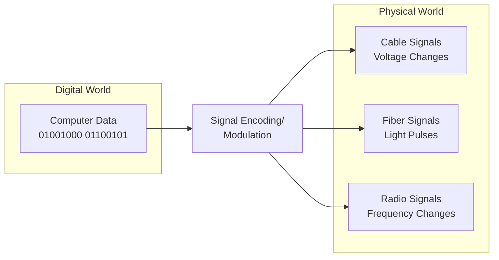
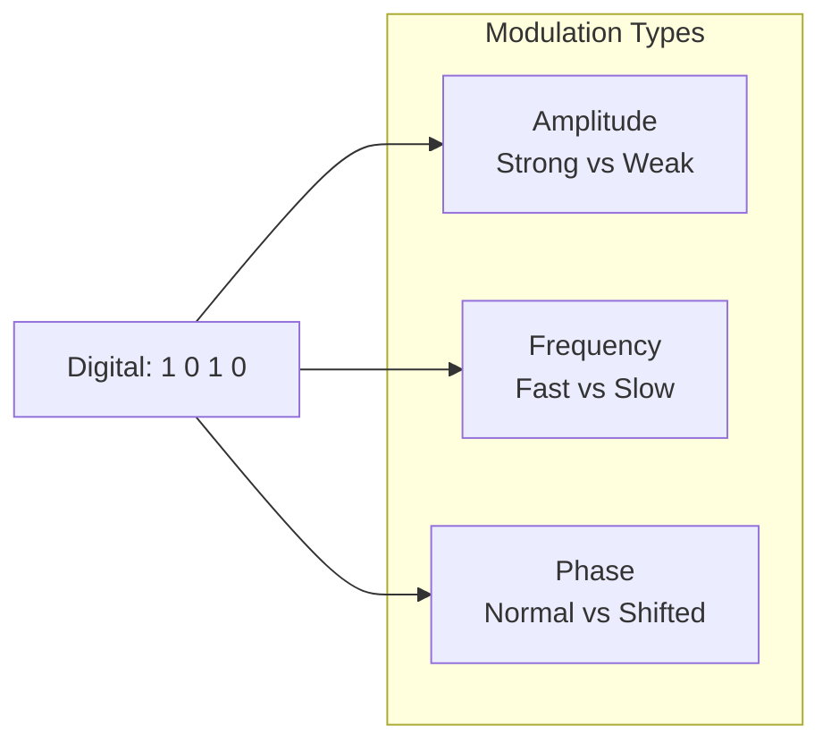

# Signal Encoding and Modulation Concepts

## Why This Matters

All the networking layers we've discussed—from applications to protocols to addresses—ultimately come down to one fundamental challenge: **How do we turn the 1s and 0s that computers understand into signals that can travel through cables, fiber optics, or radio waves?**

This transformation from digital data to physical signals is what makes all network communication possible. Whether you're streaming video, sending email, or browsing the web, your data must be converted into signals that can travel across the physical media.

Understanding these concepts helps you:

- Choose appropriate network technologies for different scenarios
- Understand why some connections are faster or more reliable than others
- Troubleshoot physical layer problems
- Make informed decisions about network infrastructure

## Key Terms

- **Modulation**: The process of varying a signal's properties to encode information
- **Line Coding**: Digital signal encoding used on wired networks
- **Signal Encoding**: Converting digital data into physical signals
- **Analog Signal**: Continuously varying signal that can carry information
- **Digital Signal**: Discrete signal with distinct states (0s and 1s)

## Digital vs. Analog Signals

### Understanding the Challenge

**The fundamental problem**: Computers work with discrete digital values (1s and 0s), but physical media transmit analog signals (varying voltages, light intensities, or radio frequencies).

**Think of it like language translation**: You need to convert computer "language" (binary) into "physical language" (signals) that cables and wireless can carry.

This diagram shows how digital computer data must be converted into different types of physical signals depending on the transmission medium. Each medium requires different encoding techniques to represent the same digital information as analog signals that can propagate through that specific physical environment.

### Digital Signal Characteristics

**Digital signals** have distinct, discrete states:

- **Binary**: Only two states (0 and 1)
- **Discrete**: Sharp transitions between states
- **Regenerable**: Can be perfectly reconstructed
- **Noise resistant**: Easy to distinguish between states

### Analog Signal Characteristics

**Analog signals** have continuously varying properties:

- **Amplitude**: Signal strength/height
- **Frequency**: How often the signal repeats per second
- **Phase**: Timing relationship between signals
- **Continuous**: Smooth transitions between values

## Basic Modulation and Line Coding Concepts

### Why Different Techniques Exist

Different physical media require different approaches because:

- **Different media have different properties** (copper vs. fiber vs. radio)
- **Different applications have different needs** (speed vs. reliability vs. cost)
- **Technology has evolved** to provide better performance over time

**Wired Networks (Ethernet)**: Use electrical signals in copper cables for reliable, consistent transmission
**Wireless Networks (Wi-Fi)**: Use radio waves through air for mobility, but can be affected by interference
**Fiber Optic Networks**: Use light signals in glass fibers for very fast, long-distance transmission

## Encoding Techniques for Different Media

### Media-Specific Approaches

**Wired Networks (Line Coding)**: Direct electrical representation using voltage levels
**Fiber Optic**: Light pulses (light on = 1, light off = 0)  
**Wireless Networks (RF Modulation)**: Information encoded in radio wave properties using three main approaches:

- **Amplitude**: Vary signal strength (strong = 1, weak = 0)
- **Frequency**: Vary how fast the signal changes (high frequency = 1, low frequency = 0)  
- **Phase**: Vary signal timing (normal timing = 1, shifted timing = 0)

This diagram shows three fundamental ways to encode digital information in analog signals. Amplitude modulation varies signal strength, frequency modulation varies how fast the signal oscillates, and phase modulation varies the timing relationship. Modern systems often combine these techniques for higher data rates.

## Why This Matters for Networks

### Connection to OSI Model

This is **Layer 1 (Physical Layer)** from our OSI model! Remember how we learned that the Physical Layer "transmits raw bits over physical media"? Signal encoding and modulation are exactly how this happens—they're the techniques that convert our digital data into the actual physical signals that travel through cables, fiber, and radio waves.

### Real-World Impact

Understanding signal encoding helps explain:

- **Why some connections are faster than others** (fiber > wired > wireless typically)
- **Why wireless can be less reliable than wired** (interference, distance effects)
- **Why fiber optic is used for high-speed connections** (light travels fast, minimal interference)
- **How all network data ultimately becomes physical signals**

## Summary

Signal encoding and modulation are the bridge between the digital world of computers and the analog world of physical transmission. Understanding these basic concepts helps explain how networks actually work.

**Key Takeaways**:

- **All digital data must be converted** to physical signals for transmission
- **Different media use different approaches**: electrical (wired), optical (fiber), radio (wireless)
- **Understanding these concepts explains** network behavior and performance differences

**The Big Picture**: Every bit of data in network communication relies on these signal encoding principles to bridge the gap between digital information and physical transmission.
