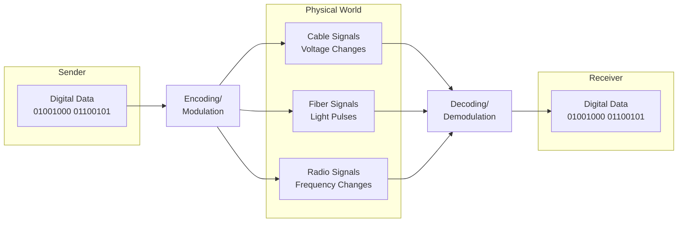
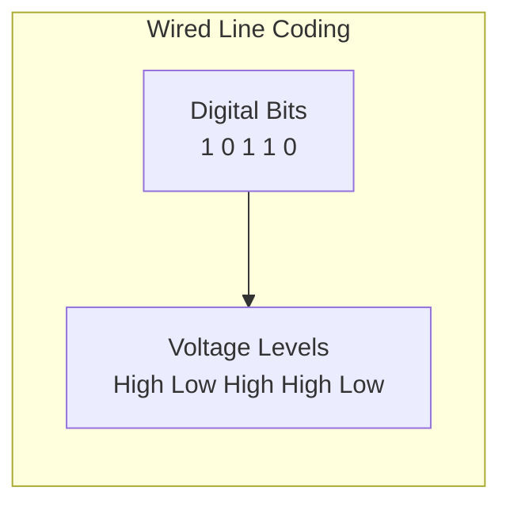
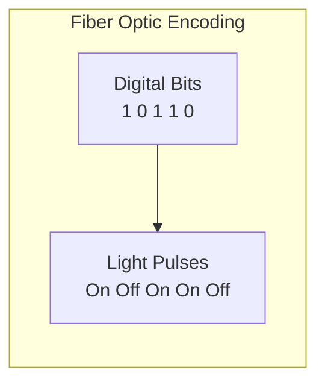
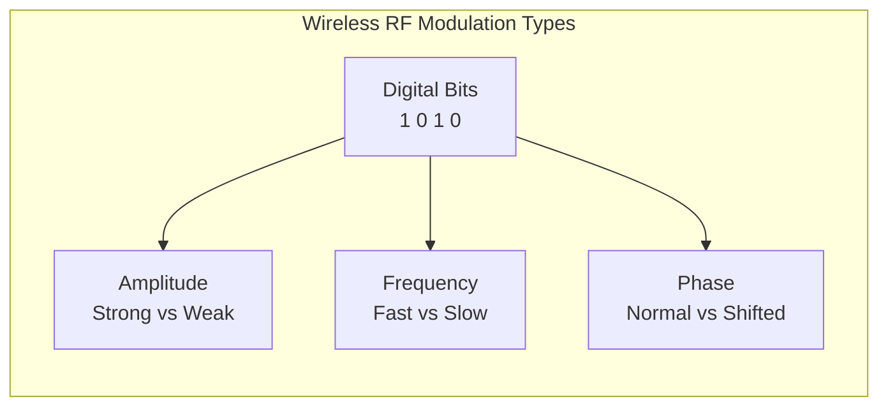

# Signal Encoding and Modulation Concepts

## The Core Challenge

The fundamental networking challenge: **How do we convert digital 1s and 0s into physical signals for transmission, then convert those physical signals back into digital data at the receiver?** This is Layer 1 (Physical Layer) of the OSI model—signal encoding and modulation handle both directions: turning raw bits into physical signals for transmission, and decoding received signals back into digital data.

## Key Terms

- **Signal Encoding**: Converting digital data into physical signals for transmission
- **Signal Decoding**: Converting received physical signals back into digital data
- **Analog Signal**: Continuously varying signal that can carry information
- **Digital Signal**: Discrete signal with distinct states (0s and 1s)
- **Line Coding**: Digital signal encoding used on wired networks
- **Modulation**: The process of varying a signal's properties to encode information

## Digital vs. Analog Signals

**The fundamental problem**: Computers work with discrete digital values (1s and 0s), but physical media transmit analog signals (varying voltages, light intensities, or radio frequencies). Think of it like language translation—converting computer "language" (binary) into "physical language" (signals) for transmission, then translating received signals back into binary at the destination.

This diagram shows the complete communication process: digital data is converted into physical signals for transmission through different media, then converted back into digital data at the receiver. Each medium requires different encoding/decoding techniques to reliably carry digital information as analog signals.

### Digital vs. Analog Signal Comparison

| Characteristic             | Digital Signals                            | Analog Signals                             |
| -------------------------- | ------------------------------------------ | ------------------------------------------ |
| **States**           | Binary: Only two states (0 and 1)          | Continuous: Infinite possible values       |
| **Transitions**      | Discrete: Sharp transitions between states | Smooth transitions between values          |
| **Properties**       | Fixed voltage levels                       | Variable amplitude, frequency, phase       |
| **Noise Resistance** | High: Easy to distinguish between states   | Lower: Can be affected by interference     |
| **Reconstruction**   | Perfect: Can be regenerated exactly        | Imperfect: Degradation with distance/noise |

## How Different Media Work

Different physical media require different approaches because they have different properties (copper vs. fiber vs. radio), different applications have different needs (speed vs. reliability vs. cost), and technology has evolved to provide better performance over time. Each media type handles both encoding (digital → physical) for transmission and decoding (physical → digital) at the receiver.

### Wired Networks

**Ethernet** uses direct electrical representation with voltage levels in copper cables for reliable, consistent transmission. Devices need to stay "in step" with the signal so they can tell where each bit begins and ends. Many encoding methods include regular transitions that act like a built‑in metronome, so no separate clock wire is needed. In Ethernet, frames start with a short pattern (preamble + SFD) that helps the receiver line up cleanly; after that, bits arrive at a steady rhythm.

### Fiber Optic Networks

Use light signals in glass fibers for very fast, long-distance transmission. Simple approach: light pulses where light on = 1, light off = 0.

### Wireless Networks (RF Modulation)

**Wi-Fi** uses radio waves through air for mobility, but can be affected by interference. Information is encoded in radio wave properties using three main approaches:

- **Amplitude**: Vary signal strength (strong = 1, weak = 0)
- **Frequency**: Vary how fast the signal changes (high frequency = 1, low frequency = 0)
- **Phase**: Vary signal timing (normal timing = 1, shifted timing = 0)

This diagram shows three fundamental ways to encode digital information in radio frequency signals for wireless transmission. Amplitude modulation varies signal strength, frequency modulation varies how fast the signal oscillates, and phase modulation varies the timing relationship. Modern wireless systems often combine these techniques for higher data rates.

## Summary

Signal encoding and decoding explain why some connections are faster than others (fiber > wired > wireless typically) and why wireless can be less reliable (interference, distance effects). All digital data must be converted to physical signals for transmission, then converted back to digital data at the receiver, with different media using different approaches: electrical (wired), optical (fiber), radio (wireless). Every bit of network communication relies on these signal encoding and decoding principles to bridge the gap between digital information and physical transmission in both directions.
