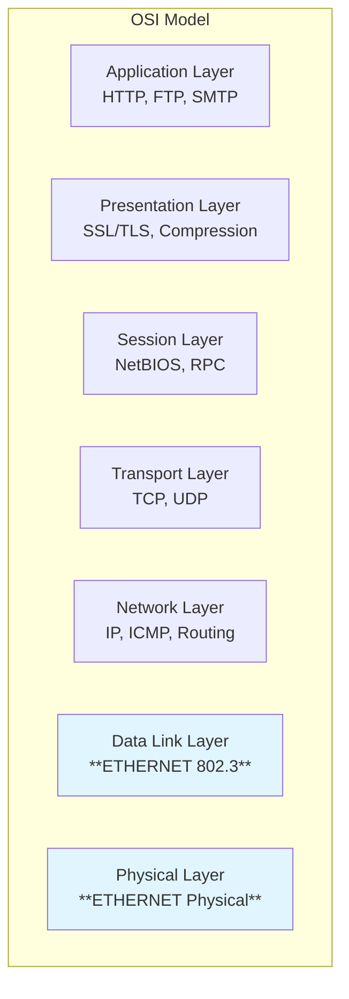

# Ethernet Foundations

## Overview

Ethernet forms the backbone of modern networking, providing the essential Layer 2 foundation for internet communication. This lecture establishes Ethernet's fundamental role and examines the frame structure that enables reliable data transmission across diverse network environments.

## Ethernet in Context

### OSI Positioning

Ethernet operates at both Layer 1 (Physical) and Layer 2 (Data Link), providing the essential foundation for network communication.

This diagram shows Ethernet's position in the OSI model, highlighting its dual responsibility at Layers 1 and 2. Layer 2 handles frame formatting, addressing, and error detection, while Layer 1 manages the physical transmission of signals across different media types (copper, fiber, wireless).

**Ethernet's Role:** Ethernet wraps Layer 3 data (IP packets) in Layer 2 frames with MAC addresses for physical transmission.

### Ethernet's Success Story

Ethernet's dominance in networking didn't come from technical superiority but from a "good enough" approach that prioritized practicality over perfection. When computer networks were emerging in the 1980s, several competing technologies battled for market adoption: Token Ring (IBM) offered sophisticated deterministic access, FDDI provided high-performance fiber solutions, and ATM featured elegant cell-based quality of service. However, these competitors were complex and expensive.

**Why Ethernet Won:** Ethernet succeeded because it was simple, affordable, and "good enough" for most applications. While competitors offered theoretical advantages, Ethernet provided adequate performance at a fraction of the cost and complexity. This principle—choosing practical solutions over perfect ones—remains fundamental to network engineering today.

**Modern Impact:** Today's Ethernet has evolved far beyond its humble beginnings, now powering the world's largest data centers and cloud infrastructures. Modern implementations operate at speeds of 25G, 100G, and even 400G, demonstrating remarkable scalability. Every major cloud provider (AWS, Google, Microsoft) relies on high-speed Ethernet for internal data center communication. When you stream a video, send an email, or access a web application, that data likely travels over Ethernet networks multiple times during its journey from server to your device.

## Frame Structure & MAC Addressing

### IEEE 802.3 Frame Format

The Ethernet frame structure represents decades of engineering refinement, balancing efficiency, reliability, and compatibility. Each field serves a specific purpose in ensuring successful data transmission.

**Ethernet Frame Structure:**

| Preamble  | SFD         | Destination MAC | Source MAC     | EtherType   | Data/Payload  | FCS         |
| --------- | ----------- | --------------- | -------------- | ----------- | ------------- | ----------- |
| 7 bytes   | 1 byte      | 6 bytes         | 6 bytes        | 2 bytes     | 46-1500 bytes | 4 bytes     |
| Sync bits | Frame start | Target address  | Sender address | Protocol ID | Actual data   | Error check |

This table shows the Ethernet frame layout with each column representing a field in transmission order. Total frame size ranges from 64 to 1518 bytes.

**Key Field Details:**

- **Preamble + SFD**: Synchronization (alternating 1s/0s) + frame delimiter (10101011)
- **MAC Addresses**: 48-bit unique hardware identifiers for sender and receiver
- **EtherType**: Protocol identification (0x0800=IPv4, 0x86DD=IPv6)
- **FCS**: CRC-32 error detection for frame integrity

**Frame Size Limits:** Minimum frame size (64 bytes) prevents collision detection problems, while maximum size (1518 bytes) ensures fair network access and manageable buffer requirements.

**Synchronization & Spacing Notes:** The Preamble and SFD work together to provide synchronization and byte alignment—the receiving device uses these patterns to "lock onto" the incoming signal timing. Additionally, the Interframe Gap (IFG) enforces 96-bit times of silence between frames, preventing network congestion and allowing proper frame processing.

### MAC Addressing System

Media Access Control (MAC) addresses provide globally unique device identification, enabling precise frame delivery across complex networks. This addressing system operates independently of higher-layer addressing schemes like IP. Ethernet supports unicast (normal device-to-device), broadcast (FF:FF:FF:FF:FF:FF sends to all devices), and multicast (efficient group communication for streaming/updates).

**48-bit Global Uniqueness Concept:** Each network interface receives a unique 48-bit MAC address from the manufacturer, ensuring no two devices share the same address worldwide. This system has managed over 281 trillion possible addresses since its inception.

**MAC Address Format Breakdown:**

| Component                                | Size    | Purpose                     | Example           |
| ---------------------------------------- | ------- | --------------------------- | ----------------- |
| OUI (Organizationally Unique Identifier) | 24 bits | Manufacturer identification | 00:1B:44 (Apple)  |
| Device-Specific Portion                  | 24 bits | Unique device identifier    | 11:3A:B7          |
| Complete Address                         | 48 bits | Global unique identifier    | 00:1B:44:11:3A:B7 |

This table shows how MAC addresses combine manufacturer identification with device-specific identifiers to ensure global uniqueness across all network devices.

## Summary

Ethernet's success stems from its practical approach to networking challenges, providing reliable data transmission through well-designed frame structures and addressing systems. The IEEE 802.3 frame format balances efficiency with error detection, while MAC addressing ensures unique device identification across global networks.

**Critical Concepts:**

- Ethernet frame structure provides the foundation for all higher-layer protocols
- MAC addressing enables precise data delivery independent of logical addressing schemes
- Synchronization mechanisms ensure reliable communication across diverse physical media
- Ethernet serves as the delivery mechanism for IP traffic across physical network segments
