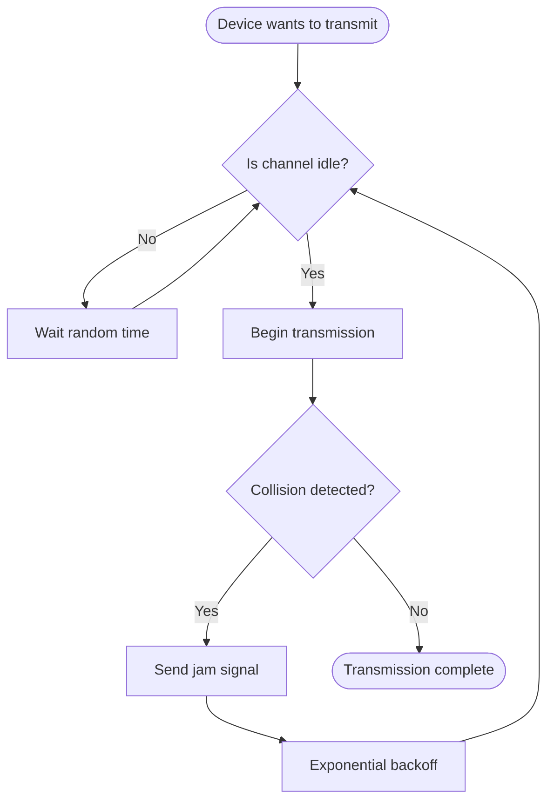
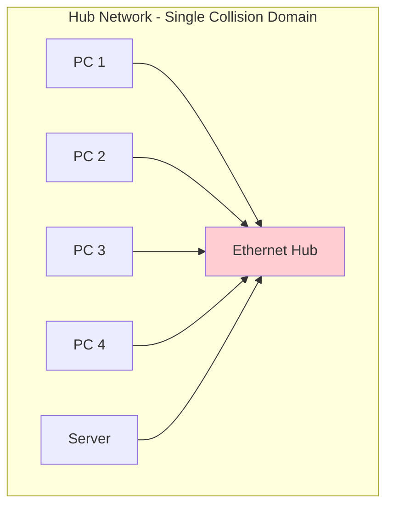
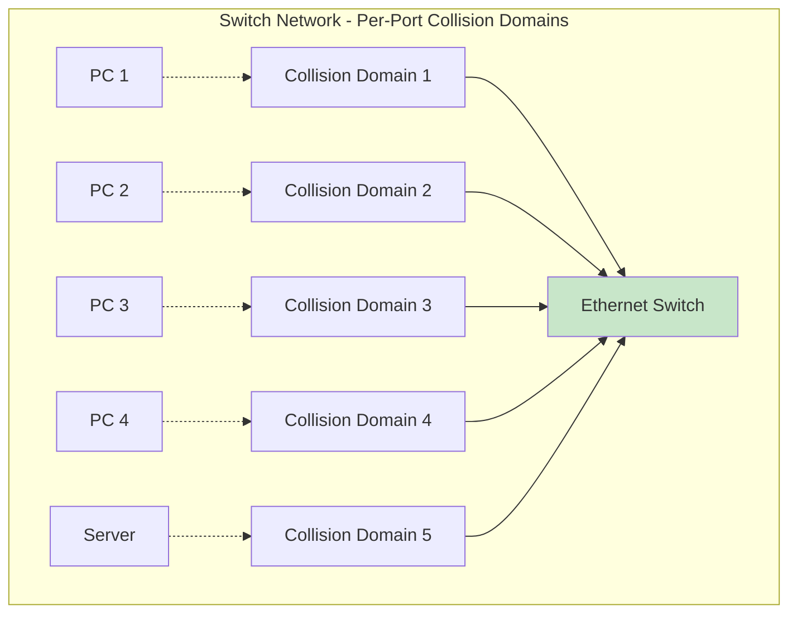

# Ethernet Operation

## Overview

Ethernet's operational mechanisms determine how devices share network access, detect collisions, and evolve toward modern switching architectures. This lecture examines the technical algorithms and practical implementations that make Ethernet networks function reliably in real-world environments.

## CSMA/CD & Collision Detection

### Algorithm Operation

Carrier Sense Multiple Access with Collision Detection (CSMA/CD) solves the fundamental problem of multiple devices sharing a single communication medium. The algorithm implements a "listen before talk" approach with intelligent collision handling.

This flowchart illustrates the complete CSMA/CD algorithm process, showing how devices coordinate access to shared network media and handle collision scenarios.

**Algorithm Steps Explained:**

1. **Carrier Sense**: Device listens to the medium before attempting transmission
2. **Multiple Access**: Multiple devices can attempt to access the same medium
3. **Collision Detection**: Devices monitor for signal distortions indicating collisions
4. **Jam Signal**: 32-bit pattern alerts all devices that a collision occurred
5. **Exponential Backoff**: Increasing random delays reduce the probability of repeated collisions

**Why This Matters**: CSMA/CD enables shared medium networks to function efficiently despite the inherent unpredictability of when devices need to communicate.

### Collision Domain Concept

A collision domain represents all network segments where transmitted frames can collide with each other. Understanding collision domains is essential for network design and performance optimization.

This diagram shows a hub-based network where all connected devices share a single collision domain. Any transmission from one device can potentially collide with transmissions from any other device on the same hub.

**Shared Media Limitations:**
- All devices compete for the same bandwidth
- Network performance degrades as more devices are added
- Collision probability increases with network utilization
- Maximum effective utilization typically limited to 30-40% of theoretical bandwidth

**Network Diameter and Timing Requirements:** The maximum physical size of a collision domain is limited by signal propagation time. Devices must be able to detect collisions before completing frame transmission, which constrains network topology and cable lengths.

### Evolution to Switching

The transition from hubs to switches revolutionized Ethernet by eliminating shared collision domains and enabling full-duplex communication.

This diagram shows how switches create separate collision domains for each port, eliminating collisions between different ports and enabling simultaneous conversations across the network.

**Performance Benefits Analysis:**
- Each port provides dedicated bandwidth instead of shared bandwidth
- Multiple simultaneous conversations possible
- Collision detection becomes unnecessary on switch ports
- Network utilization can approach 100% of available bandwidth

**Half-Duplex vs Full-Duplex Comparison:**

| Characteristic | Half-Duplex | Full-Duplex |
|---------------|-------------|-------------|
| **Communication Direction** | One direction at a time | Both directions simultaneously |
| **Collision Detection** | Required (CSMA/CD) | Not needed |
| **Bandwidth Utilization** | Shared between send/receive | Dedicated for each direction |
| **Typical Usage** | Hub connections, legacy | Modern switch ports |
| **Performance** | Lower effective throughput | Higher effective throughput |

This table shows how full-duplex operation eliminates the limitations of shared media, enabling more efficient network communication.

## Standards & Physical Media

### Standards Evolution Overview

Ethernet standards have evolved systematically to provide higher speeds while maintaining backward compatibility, ensuring network investments remain protected as technology advances.

**Speed Progression:**
- **10BASE-T** (1990): 10 Mbps over twisted pair copper
- **100BASE-TX** (1995): 100 Mbps Fast Ethernet over enhanced copper  
- **1000BASE-T** (1999): 1 Gbps Gigabit Ethernet over Category 5e copper
- **10GBASE-T** (2006): 10 Gbps over Category 6a copper

**Backward Compatibility Principle:** Each new standard maintains compatibility with previous versions through auto-negotiation, allowing mixed-speed networks to function seamlessly while providing upgrade paths.

### Media Types

Different physical media serve specific network requirements based on distance, speed, environmental factors, and cost considerations.

**Copper vs Fiber Basic Differences:**
- **Copper**: Cost-effective, easy installation, limited distance (~100 meters)
- **Fiber**: Higher cost, specialized skills, extended distance (kilometers), immunity to electromagnetic interference

**Distance and Speed Relationships:** As speeds increase, maximum cable distances typically decrease due to signal integrity requirements. Fiber optic media generally supports longer distances at higher speeds compared to copper alternatives.

## Summary

CSMA/CD algorithms enabled early Ethernet networks to coordinate shared media access, while the evolution to switching eliminated collisions and dramatically improved performance. Understanding these operational principles provides the foundation for modern network design.

**Critical Operational Concepts:**
- CSMA/CD solves the shared media access problem through listen-before-talk and collision detection
- Collision domains define the scope of potential frame collisions in network segments
- Switching eliminates collisions by creating dedicated communication paths
- Standards evolution maintains backward compatibility while increasing performance

**Connection to Network Design:** Understanding these operational principles is essential for designing efficient networks and forms the foundation for advanced switching concepts.
