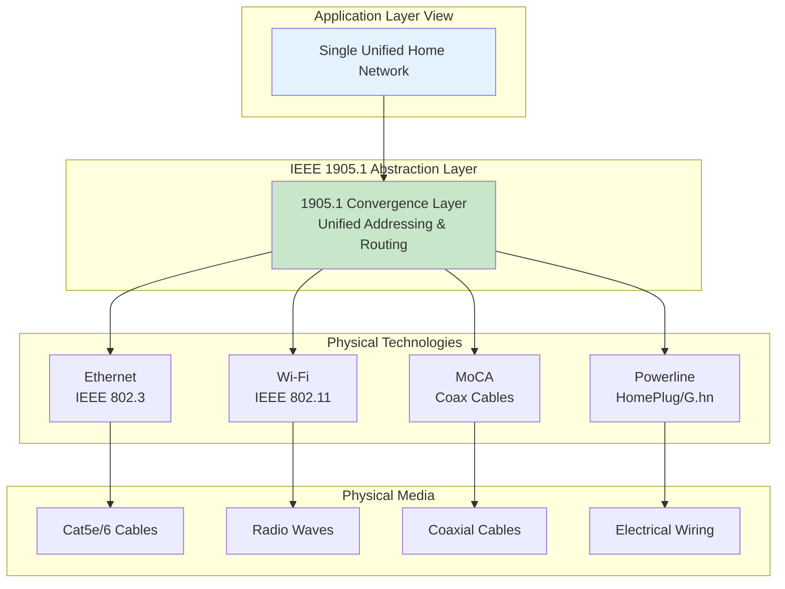

# Ethernet over Other Standards: IEEE 1905.1 Convergence

## The Multi-Media Home Network Challenge

Modern homes and buildings use multiple network technologies simultaneously:
- **Ethernet cables** in some rooms
- **Wi-Fi** for mobile devices
- **Coax cables** (originally for cable TV) via MoCA
- **Power lines** (electrical wiring) for hard-to-reach areas

**The Problem:** These technologies traditionally operated as separate, incompatible networks. Devices on Wi-Fi couldn't seamlessly communicate with devices on powerline networks without complex manual configuration.

## IEEE 1905.1: Convergent Digital Home Network

**IEEE 1905.1-2013** (Convergent Digital Home Network) creates a unified "abstraction layer" that makes different physical network technologies appear as one logical network.

**What the diagram shows:** IEEE 1905.1 sits between applications and various physical network technologies, providing a unified interface. Applications see one network, while IEEE 1905.1 handles the complexity of routing traffic across different physical media (cables, Wi-Fi, coax, powerline).

## How It Works

**Key Capabilities:**

| Feature | Description |
|---------|-------------|
| **Topology Discovery** | Automatically finds all devices and connections across different media types |
| **Unified Addressing** | Uses standard MAC addresses regardless of underlying technology |
| **Optimal Path Selection** | Routes traffic through the best available medium (e.g., wired over wireless when available) |
| **Seamless Handoff** | Devices can move between technologies (Wi-Fi to Ethernet) without connection loss |

**Example Scenario:**
- Laptop on Wi-Fi in bedroom needs to access printer connected via powerline adapter in office
- IEEE 1905.1 discovers the printer, finds the optimal path (Wi-Fi → Ethernet router → powerline → printer)
- Application sees simple network connection; complexity handled by 1905.1 layer

## Supported Technologies

**Common IEEE 1905.1 Compatible Standards:**

- **IEEE 802.3 (Ethernet):** Traditional wired networking
- **IEEE 802.11 (Wi-Fi):** Wireless networking
- **MoCA (Multimedia over Coax Alliance):** Networking over coaxial TV cables (up to 2.5 Gbps)
- **IEEE 1901 (HomePlug):** Networking over electrical power lines
- **ITU G.hn:** Unified standard for networking over power lines, phone lines, and coax

**Frame Structure:** Each physical technology keeps its native frame format. IEEE 1905.1 operates at a higher layer, managing routing and topology rather than modifying frames.

## Practical Benefits

**For Home/Small Office Networks:**
- **Flexibility:** Use existing wiring (coax, power) instead of running new Ethernet cables
- **Coverage:** Combine technologies to reach difficult areas (basement, garage)
- **Performance:** Automatic failover to best available path
- **Simplicity:** Single network configuration, not multiple separate networks

**Limitations:**
- **Speed Variability:** Different media have different speeds (Ethernet > MoCA > Powerline typically)
- **Compatibility:** Requires IEEE 1905.1 compliant devices/adapters
- **Powerline Challenges:** Electrical noise can degrade powerline performance
- **Management Complexity:** More sophisticated equipment and troubleshooting

## Connection to Course Concepts

**OSI Model Perspective:**
- IEEE 1905.1 operates primarily at **Layer 2 (Data Link)** as an abstraction and management layer
- Provides topology discovery and path selection across multiple Layer 1 physical technologies
- Maintains Layer 2 addressing (MAC) across different media for unified device identification

**Ethernet Relevance:**
- Each technology uses its native frame format (Ethernet, Wi-Fi, MoCA, powerline frames)
- IEEE 1905.1 provides interoperability between these different frame types
- MAC addressing remains central to device identification across all media
- Demonstrates how Ethernet principles extend beyond traditional cables

## Summary

IEEE 1905.1 solves the multi-technology home network challenge by creating a unified abstraction layer over diverse physical media. Instead of managing separate Ethernet, Wi-Fi, coax, and powerline networks, IEEE 1905.1 presents them as one logical network with automatic path selection and seamless device mobility.

**Key Takeaways:**
- **Convergence layer** unifies multiple physical network technologies
- **Automatic discovery and routing** across heterogeneous media
- **Leverages existing infrastructure** (coax, power lines) for networking
- **Maintains Ethernet principles** (MAC addressing, frame structure) across all media

**Practical Impact:** Enables flexible, cost-effective home and small business networks using whatever physical media is available, without sacrificing the simplicity of a single unified network.

