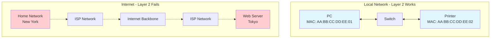
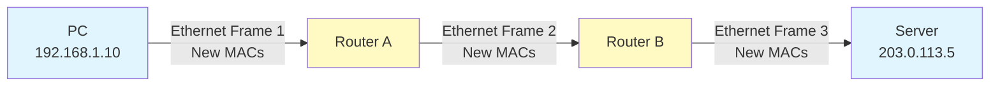
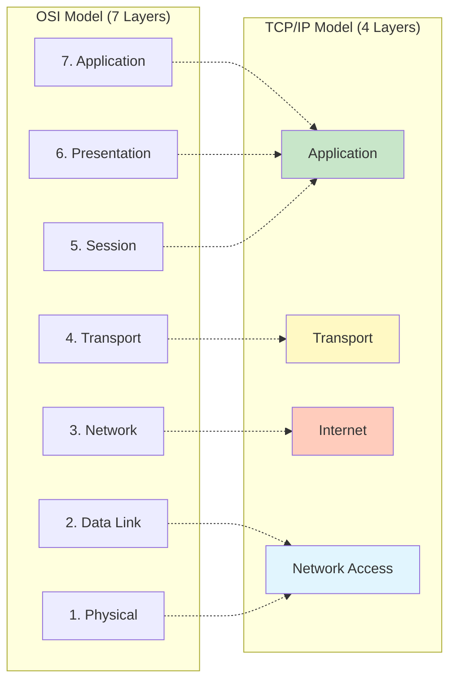

# Internet Protocol and TCP/IP Model

## Overview

The Internet Protocol (IP) and the TCP/IP protocol suite form the foundation of modern internetworking, enabling billions of devices worldwide to communicate across different networks. This lecture explains why Layer 2 addressing isn't sufficient for global communication, introduces IP's role at Layer 3, and explores the TCP/IP model that powers the Internet.

## Key Terms

- **Internet Protocol (IP)**: Layer 3 protocol that enables communication across different networks
- **Internetworking**: Connecting multiple independent networks together
- **TCP/IP Model**: Four-layer practical networking model used on the Internet
- **Transmission Control Protocol (TCP)**: Reliable, connection-oriented transport protocol
- **User Datagram Protocol (UDP)**: Fast, connectionless transport protocol
- **Port Number**: Identifier that enables multiple services to share a single IP address
- **Best-effort Delivery**: Network service that attempts delivery without guarantees
- **Connectionless Protocol**: Protocol that sends data without establishing a connection first

## Why IP Exists: From Layer 2 to Layer 3

In Week 4, we learned that Ethernet uses **MAC addresses** for communication at Layer 2. MAC addresses work perfectly for devices on the same local network, but **what happens when you need to communicate across networks?**

Imagine you're in New York trying to access a web server in Tokyo. Your data must traverse dozens of different networks: your home network, your ISP's network, multiple backbone networks, the destination ISP's network, and finally the server's network.

**MAC addresses cannot solve this problem because:**

- MAC addresses are **flat** (no hierarchy) and provide no information about network location
- MAC addresses only work within a single broadcast domain (local network)
- Routers separate networks and do not forward frames based on MAC addresses alone
- There's no scalable way to build forwarding tables for billions of MAC addresses globally

This diagram contrasts local network communication (where Layer 2 MAC addressing works perfectly) with internetwork communication (where MAC addresses cannot provide the hierarchical addressing needed to route across multiple independent networks).

**The solution:** We need **hierarchical addressing** that indicates network location, similar to how postal addresses work. Just as a street address includes city, state, and country information that guides mail delivery, IP addresses contain network information that guides packet routing.

**Internet Protocol (IP)** provides this solution, operating at **Layer 3 (Network Layer)** of the OSI model (from Week 3), sitting between Layer 2 (Ethernet - Week 4) and Layer 4 (TCP/UDP - this week). IP provides the logical addressing and routing capabilities necessary for internetworking.

**How IP Works with Ethernet:**

IP doesn't replace Ethernet—it works **in partnership** with it. When data travels across networks:

1. **On your local network**: IP packets are wrapped in Ethernet frames with MAC addresses
2. **At the router**: The router removes the Ethernet frame, examines the IP destination, and makes a routing decision
3. **To the next network**: The router wraps the IP packet in a new Ethernet frame with new MAC addresses for the next hop
4. **This process repeats** at every router along the path until reaching the destination network

**Key Concept:** The IP packet (192.168.1.10 → 203.0.113.5) stays the same end-to-end, but Ethernet frames are recreated at each router with new MAC addresses. Each frame only travels one network segment—IP packets travel across all networks.

This is why we say "**IP packets ride inside Ethernet frames**"—Ethernet provides local delivery, while IP provides end-to-end delivery across multiple networks.

### Layer 2 vs Layer 3 Comparison

| Characteristic              | Layer 2 (Ethernet/MAC)                       | Layer 3 (IP)                                     |
| --------------------------- | -------------------------------------------- | ------------------------------------------------ |
| **Addressing Type**   | Physical (MAC addresses)                     | Logical (IP addresses)                           |
| **Address Format**    | 48-bit hardware address (AA:BB:CC:DD:EE:FF)  | 32-bit (IPv4) or 128-bit (IPv6) software address |
| **Scope**             | Local network only (single broadcast domain) | Global internetwork (across multiple networks)   |
| **Address Structure** | Flat (no hierarchy)                          | Hierarchical (network + host portions)           |
| **Routing**           | Switching within a network                   | Routing between networks                         |
| **Devices**           | Switches, bridges                            | Routers, Layer 3 switches                        |
| **Typical Use**       | Local delivery within LAN                    | End-to-end delivery across Internet              |

This table highlights the fundamental differences between Layer 2 and Layer 3, showing why both layers are necessary and how they serve complementary roles in network communication.

### IP Core Characteristics

IP has three fundamental characteristics that might seem like limitations but are actually features that enable the Internet's massive scale:

1. **Connectionless**: IP sends packets without establishing a connection first. Each packet is independent and contains complete addressing information.
2. **Best-effort Delivery**: IP attempts to deliver packets but makes no guarantees. Packets might be lost, duplicated, delayed, or arrive out of order.
3. **Unreliable**: IP provides no acknowledgments, retransmissions, or delivery confirmations.

**Why are these "limitations" actually features?**

- **Speed**: No connection setup overhead means immediate transmission
- **Efficiency**: Routers don't maintain connection state for billions of simultaneous communications
- **Scalability**: Simple, stateless operation enables the Internet's enormous size
- **Flexibility**: Upper layers (like TCP) can add reliability only when needed

**The key insight:** IP's job is simply to get packets from source network to destination network. Other protocols (TCP) handle reliability when applications need it.

## TCP/IP Model Overview

### TCP/IP vs OSI Models

While the OSI model provides an excellent conceptual framework (as we learned in Week 3), the **TCP/IP model** is what actually runs on the Internet. The TCP/IP model is older than OSI, more practical, and specifically designed for internetworking.

**The Four-Layer TCP/IP Model:**

1. **Application Layer**: Provides network services directly to applications (HTTP, FTP, SMTP, DNS)
2. **Transport Layer**: Provides end-to-end communication services (TCP, UDP)
3. **Internet Layer**: Handles logical addressing and routing between networks (IP, ICMP)
4. **Network Access Layer**: Handles physical network access (Ethernet, Wi-Fi, physical media)

This diagram shows how the OSI seven-layer model maps to the TCP/IP four-layer model. TCP/IP consolidates OSI's upper three layers (Application, Presentation, Session) into a single Application layer, and combines the lower two layers (Data Link, Physical) into the Network Access layer.

**Why TCP/IP is More Practical:**

- **Simpler**: Four layers instead of seven reduce complexity
- **Proven**: Developed in the 1970s and battle-tested on ARPANET (Internet's predecessor)
- **Flexible**: Application layer handles all application-level concerns without rigid separation
- **Implemented**: This is what actually runs on your computer and network devices

## Transport Layer: TCP and UDP

The **Transport Layer** (Layer 4) sits between applications and the Internet Layer, providing end-to-end communication services. Two protocols dominate this layer: **TCP** and **UDP**.

**TCP: Reliable Communication**

Transmission Control Protocol provides **reliable, connection-oriented** communication.

**How TCP achieves reliability:**

- Establishes connection first (three-way handshake) before sending data
- Every data segment must be acknowledged by the receiver
- If acknowledgment doesn't arrive, sender retransmits the data
- Sequence numbers ensure data arrives in correct order
- This waiting, tracking, and retransmitting takes time and processing

**Use when:** Web browsing (HTTP/HTTPS), email (SMTP, IMAP), file transfer (FTP, SFTP), remote access (SSH)
**Trade-off:** Reliability comes at the cost of higher overhead and latency

**UDP: Fast Communication**

User Datagram Protocol provides **fast, connectionless** communication.

**How UDP achieves speed:**

- No connection setup - just sends data immediately
- No acknowledgments - doesn't wait to confirm delivery
- No retransmissions - lost packets are simply lost
- Minimal header (8 bytes vs TCP's 20+ bytes)
- This "fire and forget" approach is much faster

**Use when:** DNS lookups, live streaming, VoIP, online gaming
**Trade-off:** Speed comes at the cost of no reliability guarantees

### TCP vs UDP Comparison

| Characteristic           | TCP (Transmission Control Protocol)      | UDP (User Datagram Protocol)         |
| ------------------------ | ---------------------------------------- | ------------------------------------ |
| **Connection**     | Connection-oriented (requires handshake) | Connectionless (no setup)            |
| **Reliability**    | Reliable (guarantees delivery)           | Unreliable (best-effort)             |
| **Ordering**       | Ordered delivery                         | No ordering guarantee                |
| **Speed**          | Slower (due to overhead)                 | Faster (minimal overhead)            |
| **Header Size**    | 20+ bytes                                | 8 bytes                              |
| **Use Cases**      | Web, email, file transfer, remote access | DNS, streaming, VoIP, gaming         |
| **Error Recovery** | Automatic retransmission                 | None (application handles if needed) |
| **Flow Control**   | Yes                                      | No                                   |

This table contrasts TCP and UDP characteristics, highlighting their different design philosophies: TCP prioritizes reliability while UDP prioritizes speed and simplicity.

**Choosing Between TCP and UDP:**

Understanding the mechanisms explains the trade-offs: TCP's acknowledgments and retransmissions guarantee delivery but add delay; UDP's "send and forget" approach is faster but can lose data.

- **Must data arrive reliably and in order?** → TCP (uses ACKs and retransmissions)
- **Is speed/low latency more important than perfect accuracy?** → UDP (no waiting for ACKs)
- **Can the application tolerate occasional packet loss?** → UDP (no retransmissions)

### Port Numbers

Both TCP and UDP use **port numbers** to enable multiple services to share a single IP address. Think of an IP address as a building's street address, and port numbers as apartment numbers within that building.

**Port Number Ranges:**

| Range                 | Type                  | Usage                                                            |
| --------------------- | --------------------- | ---------------------------------------------------------------- |
| **0-1023**      | Well-known ports      | Reserved for common services (requires administrator privileges) |
| **1024-49151**  | Registered ports      | Assigned to specific services by IANA                            |
| **49152-65535** | Dynamic/Private ports | Temporary ports for client connections                           |

**Common Well-Known Ports:**

| Port          | Protocol | Service | Description                    |
| ------------- | -------- | ------- | ------------------------------ |
| **22**  | TCP      | SSH     | Secure Shell (remote access)   |
| **25**  | TCP      | SMTP    | Email sending                  |
| **53**  | TCP/UDP  | DNS     | Domain Name System             |
| **80**  | TCP      | HTTP    | Web traffic (unencrypted)      |
| **443** | TCP      | HTTPS   | Secure web traffic (encrypted) |

**How Ports Enable Multiple Services:**

Port numbers allow multiple services on one IP address. For example, a server can run web (port 80), email (port 25), and SSH (port 22) simultaneously. When your browser visits `https://www.example.com`, it connects to port **443** (HTTPS) using a random source port like **51234** for that specific connection. Each browser tab uses a different source port to keep connections separate.

## Summary

IP and the TCP/IP protocol suite provide the foundation for internetworking, solving the critical problem that MAC addresses cannot route traffic across multiple networks. IP's connectionless, best-effort design enables the Internet's massive scale, while TCP and UDP provide transport services tailored to different application needs.

**Critical Concepts:**

- Layer 2 (MAC) addresses work locally; Layer 3 (IP) addresses work globally
- IP provides hierarchical addressing and routing between networks
- TCP/IP model (4 layers) is the practical implementation of internetworking
- TCP provides reliability for applications that need guarantees
- UDP provides speed for applications that tolerate loss
- Port numbers enable multiple services to share a single IP address
- IP packets ride inside Ethernet frames for local delivery at each network segment
