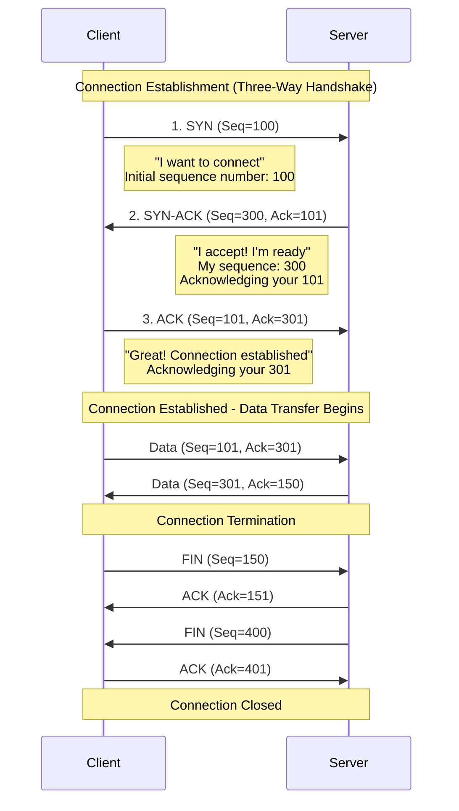
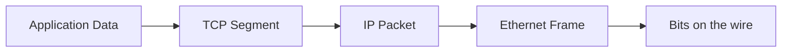

# TCP Operations and Encapsulation

## Overview

Building on the TCP/IP fundamentals from the previous lecture, this session explores how TCP establishes reliable connections through the three-way handshake and demonstrates how data flows through the complete protocol stack with real header structures. Understanding these operational details is essential for network troubleshooting and performance optimization.

## Key Terms

- **Three-Way Handshake**: TCP's connection establishment process using SYN, SYN-ACK, and ACK
- **SYN (Synchronize)**: TCP flag used to initiate a connection
- **ACK (Acknowledge)**: TCP flag used to acknowledge received data
- **FIN (Finish)**: TCP flag used to terminate a connection
- **Sequence Number**: TCP field that tracks the order of bytes sent
- **Acknowledgment Number**: TCP field that confirms received bytes
- **IP Header**: Layer 3 protocol header containing routing information
- **TCP Segment**: Transport layer PDU containing TCP header and application data
- **UDP Datagram**: Transport layer PDU containing UDP header and application data
- **Protocol Data Unit (PDU)**: Data structure at a specific protocol layer

## TCP Connection Management and Reliability

TCP provides reliable communication through connection management, sequence tracking, and acknowledgments. Understanding this lifecycle is essential for troubleshooting network applications.

### Three-Way Handshake (Connection Establishment)

Unlike UDP's "just send it" approach, TCP establishes a **connection** before transmitting application data through a three-way handshake that ensures both sides are ready and agree on initial sequence numbers.

This diagram illustrates the complete TCP connection lifecycle: establishment via three-way handshake (SYN, SYN-ACK, ACK), bidirectional data transfer with sequence and acknowledgment numbers, and graceful termination using FIN flags.

**Step-by-Step Explanation:**

**Step 1 - Client sends SYN:**

- Client initiates connection with TCP segment having **SYN flag set**
- Includes initial **sequence number** (e.g., 100) chosen randomly
- "SYN" means "synchronize" - proposing to establish a connection

**Step 2 - Server responds with SYN-ACK:**

- Server accepts by sending segment with **both SYN and ACK flags set**
- Includes its own initial **sequence number** (e.g., 300)
- Acknowledgment number is client's sequence + 1 (101), confirming receipt
- "I received your SYN and I'm ready to communicate"

**Step 3 - Client sends ACK:**

- Client acknowledges server's SYN with **ACK flag set**
- Acknowledgment number is server's sequence + 1 (301)
- Connection is now **established** and data transfer can begin

**Why Three Steps?**

The three-way handshake ensures both sides can send and receive data, agree on initial sequence numbers for tracking data order, and are ready before data transmission begins.

### Reliable Data Transfer

Once connected, TCP ensures reliable delivery through:

**Acknowledgments:** Every segment must be acknowledged. If no acknowledgment arrives within a timeout period, data is retransmitted.

- Example: Client sends Seq=101 (100 bytes) → Server responds Ack=201 ("received up to byte 200")

**Sequence Numbers:** Each byte is numbered sequentially to detect missing segments, reorder out-of-order segments, and detect duplicates.

- Example: Segments arrive as Seq=100, Seq=300, Seq=200 → receiver buffers and reorders correctly

### Connection Termination

TCP connections close gracefully using **FIN (Finish)** flags in a four-step process:

1. Side A sends **FIN** (no more data to send)
2. Side B sends **ACK** (acknowledging the FIN)
3. Side B sends **FIN** (no more data to send from this side)
4. Side A sends **ACK** (acknowledging the FIN)

This ensures both sides agree to close and all data has been received.

**When to Use TCP vs UDP:** As covered in the previous lecture, choose TCP when reliability and ordering are critical (web, email, file transfer); choose UDP when speed and low latency matter more than perfect accuracy (DNS, streaming, gaming).

## TCP/IP Encapsulation in Practice

Building on Week 3, here is a concise refresher focused on TCP. Keep the big picture in mind: each lower layer wraps the data from the layer above.

### Quick view

### What each layer adds (TCP path)

- Application: the message (e.g., HTTP request)
- Transport (TCP): source/destination ports, sequence/ack numbers, flags (SYN/ACK/FIN), checksum
- Internet (IP): source/destination IP addresses, TTL, Protocol=6 (TCP)
- Data Link (Ethernet): source/destination MAC addresses, EtherType, FCS (error check)

Notes:

- MAC addresses change at each hop (next-hop delivery). IP addresses remain end-to-end.
- Ports identify applications on a host; IPs identify hosts.

### Mini walkthrough (HTTPS example)

1. Browser creates HTTP request → TCP wraps it as a segment (ephemeral source port → 443), tracking bytes with sequence numbers.
2. IP adds addressing (source/destination IPs). Ethernet delivers to the next hop on the local link.
3. Receiver removes headers in reverse (Ethernet → IP → TCP) and passes the original HTTP data to the application.

### Why this matters for TCP

- Encapsulation adds small, fixed headers; typical IPv4+TCP+Ethernet overhead is roughly 40–58 bytes per packet.
- TCP’s headers enable reliability and ordering; IP gets the packet across networks; Ethernet gets it across the local link.
- For small messages, header overhead is noticeable; for large transfers, it becomes negligible per packet.

## Summary

TCP's three-way handshake establishes reliable connections, while its sequence numbers and acknowledgments ensure ordered, guaranteed delivery. Understanding the encapsulation process—how application data becomes TCP segments, IP packets, and Ethernet frames—is fundamental to network operation, troubleshooting, and optimization.

**Critical Concepts:**

- TCP three-way handshake (SYN, SYN-ACK, ACK) establishes connections before data transfer
- TCP provides reliability through acknowledgments, retransmissions, and sequence numbers
- UDP trades reliability for speed with its minimal 8-byte header
- IP header (20 bytes) contains routing information and TTL hop limiting
- TCP header (20+ bytes) contains ports, sequence numbers, and control flags
- Complete encapsulation adds ~58 bytes overhead for typical packets
- Each layer examines and removes its header during de-encapsulation
- Packet capture tools reveal encapsulation details for troubleshooting

**Bridge to Week 6:** We now understand IP's role, TCP/UDP operation, and encapsulation. The next critical question is: "What do IP addresses actually look like, and how are they structured?" Week 6 explores IP addressing in detail, including address formats, network/host portions, subnetting, and IPv6.

## References

- RFC 793: Transmission Control Protocol
- RFC 768: User Datagram Protocol
- RFC 791: Internet Protocol
- [Wireshark Network Analysis](https://www.wireshark.org/)
- [TCP/IP Illustrated, Volume 1](https://www.amazon.com/TCP-Illustrated-Vol-Addison-Wesley-Professional/dp/0201633469)
