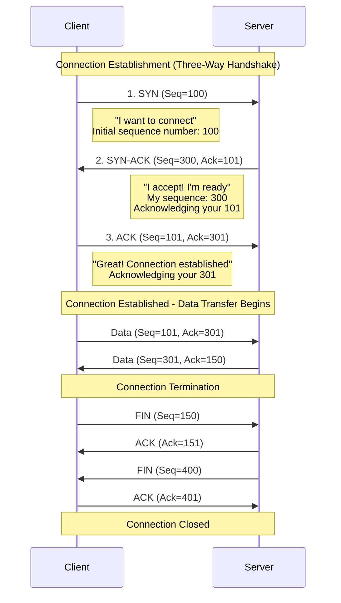
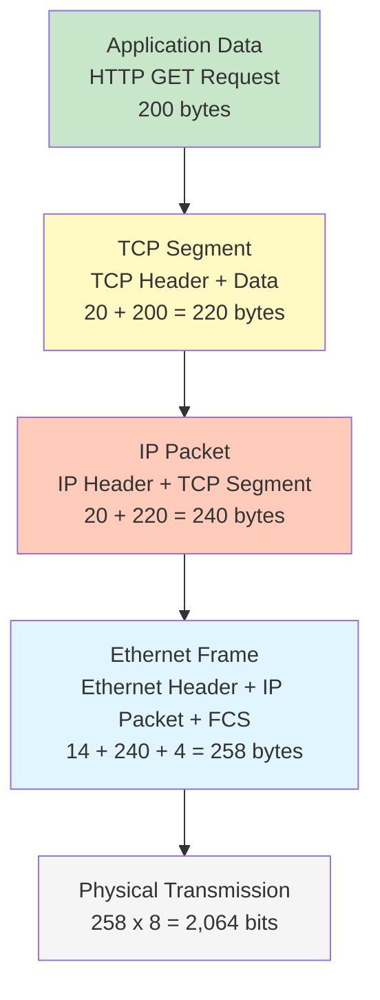

# TCP Operations and Encapsulation

## Overview

Building on the TCP/IP fundamentals from the previous lecture, this session explores how TCP establishes reliable connections through the three-way handshake and demonstrates how data flows through the complete protocol stack with real header structures. Understanding these operational details is essential for network troubleshooting and performance optimization.

## Key Terms

- **Three-Way Handshake**: TCP's connection establishment process using SYN, SYN-ACK, and ACK
- **SYN (Synchronize)**: TCP flag used to initiate a connection
- **ACK (Acknowledge)**: TCP flag used to acknowledge received data
- **FIN (Finish)**: TCP flag used to terminate a connection
- **Sequence Number**: TCP field that tracks the order of bytes sent
- **Acknowledgment Number**: TCP field that confirms received bytes
- **IP Header**: Layer 3 protocol header containing routing information
- **TCP Segment**: Transport layer PDU containing TCP header and application data
- **UDP Datagram**: Transport layer PDU containing UDP header and application data
- **Protocol Data Unit (PDU)**: Data structure at a specific protocol layer

## TCP Connection Management and Reliability

TCP provides reliable communication through connection management, sequence tracking, and acknowledgments. Understanding this lifecycle is essential for troubleshooting network applications.

### Three-Way Handshake (Connection Establishment)

Unlike UDP's "just send it" approach, TCP establishes a **connection** before transmitting application data through a three-way handshake that ensures both sides are ready and agree on initial sequence numbers.



This diagram illustrates the complete TCP connection lifecycle: establishment via three-way handshake (SYN, SYN-ACK, ACK), bidirectional data transfer with sequence and acknowledgment numbers, and graceful termination using FIN flags.

**Step-by-Step Explanation:**

**Step 1 - Client sends SYN:**

- Client initiates connection with TCP segment having **SYN flag set**
- Includes initial **sequence number** (e.g., 100) chosen randomly
- "SYN" means "synchronize" - proposing to establish a connection

**Step 2 - Server responds with SYN-ACK:**

- Server accepts by sending segment with **both SYN and ACK flags set**
- Includes its own initial **sequence number** (e.g., 300)
- Acknowledgment number is client's sequence + 1 (101), confirming receipt
- "I received your SYN and I'm ready to communicate"

**Step 3 - Client sends ACK:**

- Client acknowledges server's SYN with **ACK flag set**
- Acknowledgment number is server's sequence + 1 (301)
- Connection is now **established** and data transfer can begin

**Why Three Steps?**

The three-way handshake ensures both sides can send and receive data, agree on initial sequence numbers for tracking data order, and are ready before data transmission begins.

### Reliable Data Transfer

Once connected, TCP ensures reliable delivery through:

**Acknowledgments:** Every segment must be acknowledged. If no acknowledgment arrives within a timeout period, data is retransmitted.
- Example: Client sends Seq=101 (100 bytes) → Server responds Ack=201 ("received up to byte 200")

**Sequence Numbers:** Each byte is numbered sequentially to detect missing segments, reorder out-of-order segments, and detect duplicates.
- Example: Segments arrive as Seq=100, Seq=300, Seq=200 → receiver buffers and reorders correctly

### Connection Termination

TCP connections close gracefully using **FIN (Finish)** flags in a four-step process:

1. Side A sends **FIN** (no more data to send)
2. Side B sends **ACK** (acknowledging the FIN)
3. Side B sends **FIN** (no more data to send from this side)
4. Side A sends **ACK** (acknowledging the FIN)

This ensures both sides agree to close and all data has been received.

**When to Use TCP vs UDP:** As covered in the previous lecture, choose TCP when reliability and ordering are critical (web, email, file transfer); choose UDP when speed and low latency matter more than perfect accuracy (DNS, streaming, gaming).

## TCP/IP Encapsulation in Practice

### Protocol Headers

Building on Week 3's encapsulation concepts, we now examine the specific fields in IP, TCP, and UDP headers that enable internetworking.

**IP Header (20 bytes minimum)** - Routes packets across networks:

| Field                    | Size    | Purpose                     | Example Value                  |
| ------------------------ | ------- | --------------------------- | ------------------------------ |
| **Version**        | 4 bits  | IP version                  | 4 (IPv4) or 6 (IPv6)           |
| **Header Length**  | 4 bits  | Header size in 32-bit words | 5 (= 20 bytes)                 |
| **TTL**            | 8 bits  | Time to Live (hop limit)*   | 64 (decrements at each router) |
| **Protocol**       | 8 bits  | Upper layer protocol        | 6 = TCP, 17 = UDP, 1 = ICMP    |
| **Source IP**      | 32 bits | Sender's IP address         | 192.168.1.10                   |
| **Destination IP** | 32 bits | Receiver's IP address       | 203.0.113.5                    |

*TTL prevents infinite routing loops. Starts at 64 or 128, decrements at each router. When it reaches 0, the packet is discarded.

**TCP Header (20+ bytes)** - Enables reliable, ordered communication:

| Field                           | Size    | Purpose                      | Example Value                   |
| ------------------------------- | ------- | ---------------------------- | ------------------------------- |
| **Source Port**           | 16 bits | Sending application's port   | 51234 (ephemeral)               |
| **Destination Port**      | 16 bits | Receiving application's port | 443 (HTTPS)                     |
| **Sequence Number**       | 32 bits | Position in byte stream      | 1000 (bytes sent so far)        |
| **Acknowledgment Number** | 32 bits | Next expected byte           | 5000 (expecting byte 5000 next) |
| **Flags**                 | 9 bits  | Control bits                 | SYN, ACK, FIN, RST, PSH, URG    |
| **Window Size**           | 16 bits | Receiver buffer space        | 65535 (can receive 64KB)        |
| **Checksum**              | 16 bits | Error detection              | Calculated value                |

Key TCP Flags: **SYN** (connection establishment), **ACK** (acknowledge data), **FIN** (graceful close), **RST** (abrupt close), **PSH** (deliver immediately), **URG** (priority data)

**UDP Header (8 bytes fixed)** - Simple, fast communication:

| Field                      | Size    | Purpose                            | Example Value     |
| -------------------------- | ------- | ---------------------------------- | ----------------- |
| **Source Port**      | 16 bits | Sending application's port         | 53214 (ephemeral) |
| **Destination Port** | 16 bits | Receiving application's port       | 53 (DNS)          |
| **Length**           | 16 bits | Total size (header + data)         | 64 bytes          |
| **Checksum**         | 16 bits | Error detection (optional in IPv4) | Calculated value  |

## Complete Encapsulation Example: Web Request

Let's trace a complete web request from your browser to a web server, showing exactly what gets added at each layer.

**Scenario:** Your web browser (192.168.1.10) requests a web page from www.example.com (203.0.113.5) over HTTPS.

### Layer-by-Layer Encapsulation

```
Application Layer:
    HTTP GET /index.html HTTP/1.1
    Size: 200 bytes
            ↓
Transport Layer (TCP Segment):
    TCP Header: 20 bytes (Src Port: 51234, Dst Port: 443, Seq: 1000, Ack: 5000, Flags: PSH/ACK)
    Payload: 200 bytes (HTTP data)
    Total: 220 bytes
            ↓
Internet Layer (IP Packet):
    IP Header: 20 bytes (Src IP: 192.168.1.10, Dst IP: 203.0.113.5, TTL: 64, Protocol: 6=TCP)
    Payload: 220 bytes (TCP segment)
    Total: 240 bytes
            ↓
Network Access Layer (Ethernet Frame):
    Ethernet Header: 14 bytes (Src MAC: 11:22:33:44:55:66, Dst MAC: AA:BB:CC:DD:EE:FF)
    Payload: 240 bytes (IP packet)
    Ethernet Trailer: 4 bytes (FCS checksum)
    Total: 258 bytes
            ↓
Physical Layer:
    258 bytes × 8 = 2,064 bits transmitted as electrical signals
```

**Note:** Ethernet MACs change at each router hop—the destination MAC is the next-hop device, not the final destination. IP addresses remain constant end-to-end.

### Complete Encapsulation Diagram



This diagram shows the complete encapsulation process for a web request, with each layer adding its header and the data growing from 200 bytes of application data to 258 bytes as a complete Ethernet frame ready for physical transmission.

### Size Progression Table

| Layer                 | PDU Name       | Header Size  | Payload Size | Total Size | Overhead |
| --------------------- | -------------- | ------------ | ------------ | ---------- | -------- |
| **Application** | Data           | 0            | 200 bytes    | 200 bytes  | 0%       |
| **Transport**   | TCP Segment    | 20 bytes     | 200 bytes    | 220 bytes  | 10%      |
| **Internet**    | IP Packet      | 20 bytes     | 220 bytes    | 240 bytes  | 20%      |
| **Data Link**   | Ethernet Frame | 14 + 4 bytes | 240 bytes    | 258 bytes  | 29%      |
| **Physical**    | Bits           | -            | 258 bytes    | 2,064 bits | -        |

This table shows how data grows as it moves down the protocol stack, with each layer adding its own header. The original 200-byte HTTP request becomes 258 bytes on the wire, representing 29% protocol overhead.

**Key Insights:**

- Original data: 200 bytes
- Total overhead: 58 bytes (29% of final frame size)
- IP + TCP headers alone: 40 bytes (20% overhead)
- For small messages, overhead percentage is significant
- For large files, overhead percentage becomes negligible (40 bytes overhead on a 1500-byte packet = 2.7%)

### De-encapsulation at Receiver

When the frame arrives at the destination server (203.0.113.5), the process reverses (as covered in Week 3):

1. **Physical → Data Link:** Converts bits to frame, checks FCS
2. **Data Link → Network:** Checks destination MAC (77:88:99:AA:BB:CC), removes Ethernet header, examines EtherType (0x0800 = IPv4)
3. **Network → Transport:** Checks destination IP (203.0.113.5), removes IP header, examines Protocol field (6 = TCP)
4. **Transport → Application:** Checks destination port (443 = HTTPS), processes sequence/ACK numbers, removes TCP header
5. **Application:** Receives HTTP GET request (200 bytes), processes and responds

### Practical Application: Packet Capture Tools

Network engineers use **packet capture tools** like **Wireshark** to see this encapsulation in action. These tools capture frames from the network and decode each layer's headers.

**What Wireshark shows:**

1. **Frame details**: Ethernet source/destination MACs, frame size
2. **IP details**: Source/destination IPs, TTL, protocol field
3. **TCP/UDP details**: Ports, sequence numbers, flags
4. **Application details**: HTTP requests, DNS queries, etc.

**Common troubleshooting scenarios:**

- **TCP retransmissions**: Network congestion or packet loss
- **Wrong destination port**: Application misconfiguration  
- **Unexpected RST flags**: Firewall blocking or connection refused

Understanding encapsulation enables you to:

- **Troubleshoot** network problems at the correct layer
- **Optimize** performance by understanding overhead
- **Secure** networks by knowing what information is visible at each layer
- **Design** efficient protocols and applications

## Summary

TCP's three-way handshake establishes reliable connections, while its sequence numbers and acknowledgments ensure ordered, guaranteed delivery. Understanding the encapsulation process—how application data becomes TCP segments, IP packets, and Ethernet frames—is fundamental to network operation, troubleshooting, and optimization.

**Critical Concepts:**

- TCP three-way handshake (SYN, SYN-ACK, ACK) establishes connections before data transfer
- TCP provides reliability through acknowledgments, retransmissions, and sequence numbers
- UDP trades reliability for speed with its minimal 8-byte header
- IP header (20 bytes) contains routing information and TTL hop limiting
- TCP header (20+ bytes) contains ports, sequence numbers, and control flags
- Complete encapsulation adds ~58 bytes overhead for typical packets
- Each layer examines and removes its header during de-encapsulation
- Packet capture tools reveal encapsulation details for troubleshooting

**Bridge to Week 6:** We now understand IP's role, TCP/UDP operation, and encapsulation. The next critical question is: "What do IP addresses actually look like, and how are they structured?" Week 6 explores IP addressing in detail, including address formats, network/host portions, subnetting, and IPv6.

## References

- RFC 793: Transmission Control Protocol
- RFC 768: User Datagram Protocol
- RFC 791: Internet Protocol
- [Wireshark Network Analysis](https://www.wireshark.org/)
- [TCP/IP Illustrated, Volume 1](https://www.amazon.com/TCP-Illustrated-Vol-Addison-Wesley-Professional/dp/0201633469)
