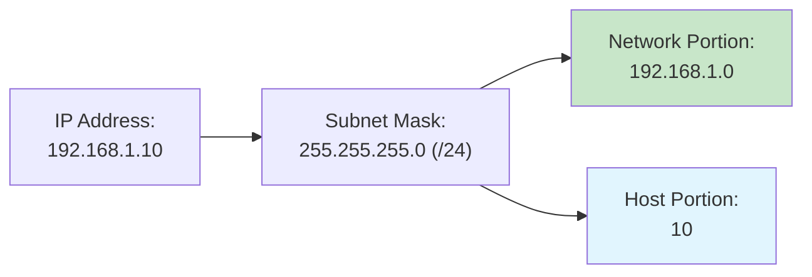
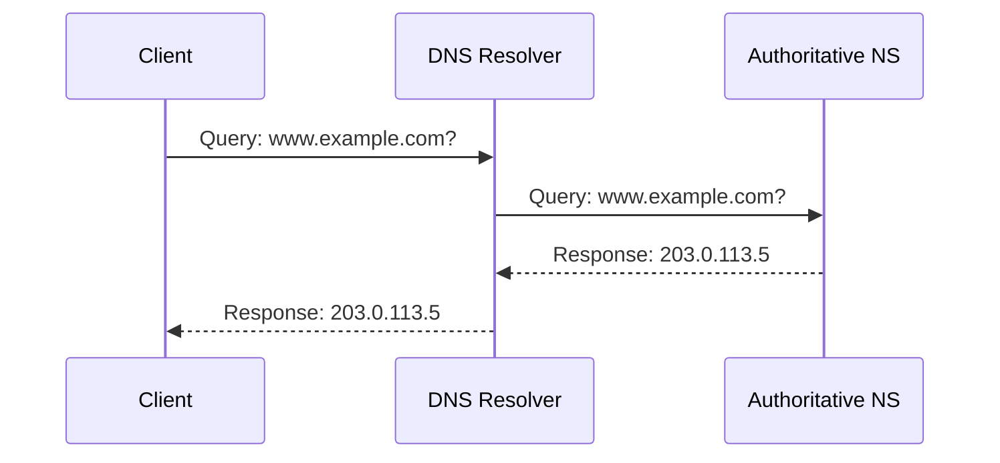

# IPv4 Addressing Fundamentals

## Overview

IPv4 addressing explains how devices are identified and grouped on IP networks. In this lesson, we will explore dotted‑decimal notation, subnet masks and CIDR (Classless Inter-Domain Routing), private ranges, and IP assignment, and we will see how DNS (Domain Name System) maps names to IPs. We will also run a short live demo to discover your device's network configuration.

## Key Terms

- **IPv4 Address**: 32-bit logical identifier, shown as a.b.c.d
- **Subnet Mask**: Bitmask that separates network vs host portions
- **CIDR (Classless Inter-Domain Routing)**: Slash-prefix length notation (e.g., /24)
- **Network Address**: All host bits zero in a subnet
- **Broadcast Address**: All host bits one in a subnet
- **DHCP (Dynamic Host Configuration Protocol)**: Automatic IP addressing for clients
- **DNS (Domain Name System)**: Maps human-friendly names to IP addresses
- **NAT (Network Address Translation)**: Translates private IPs to public IPs (Week 7)

## Address Structure & Notation

IPv4 addresses are 32 bits, commonly shown as four decimal octets: a.b.c.d (0–255 each). Subnet masks indicate how many leading bits represent the network portion; remaining bits represent the host portion.

- Address example: 192.168.1.10
- Mask example: 255.255.255.0 (aka /24 → first 24 bits are network)
- Network portion: 192.168.1.0; Host portion: 10

Think of it like a mailing address: the **network portion** is the street name (e.g., "Main Street"), and the **host portion** is the unique house number (e.g., "123"). Everyone on Main Street shares the same network.

Diagram: IPv4 split with subnet mask



This diagram shows how the subnet mask divides the IPv4 address into the network portion (left, shared by all hosts in the subnet) and the host portion (right, unique per device).

Quick check:

- If the mask is /24, how many host addresses are available? (~254 usable)
  - Why: 8 host bits give 256 total; minus network address and broadcast ≈ 254 usable

## Subnet Masks and CIDR (Classless Inter-Domain Routing)

CIDR (Classless Inter-Domain Routing) uses a slash (/) followed by a number to denote prefix length (network bits). Examples: /8, /16, /24.

Common prefixes and intuition

| CIDR | Subnet Mask     | Approx. Hosts | Typical Use Case      |
| ---- | --------------- | ------------- | --------------------- |
| /8   | 255.0.0.0       | ~16.7 million | Large ISP / Corp      |
| /16  | 255.255.0.0     | ~65,000       | Medium Enterprise     |
| /24  | 255.255.255.0   | ~254          | Small Office/Home Net |
| /30  | 255.255.255.252 | 2             | Point-to-point link   |

Quick reference: special + private ranges

- Special addresses: 127.0.0.1 (loopback), 0.0.0.0 (any), 255.255.255.255 (broadcast)

RFC1918 private ranges (very important)

| Class | Range                         | CIDR           | Common Use        |
| ----- | ----------------------------- | -------------- | ----------------- |
| A     | 10.0.0.0 - 10.255.255.255     | 10.0.0.0/8     | Large enterprises |
| B     | 172.16.0.0 - 172.31.255.255   | 172.16.0.0/12  | Medium networks   |
| C     | 192.168.0.0 - 192.168.255.255 | 192.168.0.0/16 | Home/SOHO (Small Office/Home Office) |

Notes:

- Network address: all host bits 0 (e.g., 192.168.1.0/24)
- Broadcast address: all host bits 1 (e.g., 192.168.1.255/24)

Quick check:

- Is 172.20.5.7 private? (Yes, 172.16.0.0/12 range)
  - Reasoning: 172.20.x.x falls within 172.16.0.0–172.31.255.255

### Why Private Ranges Matter

Private IP ranges exist to conserve public IPv4 addresses. Multiple organizations can use the same private ranges (like 192.168.1.0/24) internally without conflict because they're isolated from each other. Private addresses cannot be routed directly on the public Internet - they require a translation mechanism at the gateway (covered in Week 7: NAT).

## Address Assignment: Static vs DHCP (Dynamic Host Configuration Protocol)

- Static: manually configured; good for servers/infra, management interfaces
- DHCP: automatic leases (IP, mask, gateway, DNS) for clients
- DORA (Discovery, Offer, Request, Acknowledgment) at a high level: discover, offer, request, acknowledge
- Decision cues:
  - Static: servers, core infrastructure (routers/switches/APs (Access Points)), critical on-premises
  - DHCP reservation: printers, cameras, appliances that need stable IPs
  - DHCP: user endpoints; lab/temporary devices; elastic VMs (Virtual Machines)/containers

## DNS (Domain Name System): Name Resolution

- Human-friendly names map to IPs via DNS
- Resolvers cache results for performance
- DNS TTL (Time To Live, cache lifetime) is unrelated to IP packet TTL (hop limit)
- Your device is typically configured with a *recursive resolver* (like 1.1.1.1 or 8.8.8.8) that does the hard work of finding the answer from authoritative servers for you.

DNS flow diagram



This sequence illustrates a DNS resolver querying an authoritative name server on behalf of a client and returning the resolved IP address to the client.

Quick check:

- Which layer uses DNS? (Application)

## Live Demo: Your Network Configuration

What you'll do: inspect your device’s configuration and test local connectivity.

Commands

- Windows: `ipconfig /all`
- macOS: `ifconfig` or `ip addr`
- Linux: `ip addr`, `ip route`, `cat /etc/resolv.conf`

Steps

1) Run the appropriate command(s). Identify:
   - IPv4 address, subnet mask, default gateway, DNS servers
2) Is your IP private (RFC1918)? Why is that common on Wi‑Fi/LAN (Local Area Network)?
3) Connectivity quick checks:
   - `ping 127.0.0.1` (loopback)
   - `ping <your-default-gateway>` (local router)
   - Caveat: ICMP (Internet Control Message Protocol) may be blocked; a timeout isn’t always a Layer 3 failure

Example snippet (what “good” looks like)

```
IPv4 Address . . . . . . . . . . : 192.168.1.42
Subnet Mask . . . . . . . . . . . : 255.255.255.0
Default Gateway . . . . . . . . . : 192.168.1.1
DNS Servers . . . . . . . . . . . : 1.1.1.1, 8.8.8.8
```

Tip: If you see multiple interfaces (Wi‑Fi/Ethernet/VPN [Virtual Private Network]), use the one that shows the active gateway.

Reflect

- How your address, mask, and gateway relate to your local network; how DNS answers name lookups

## Finding the Network with a Subnet Mask (bitwise AND)

We can find the network address by applying a bitwise AND between the IP address and its subnet mask. The mask has 1s for network bits and 0s for host bits; ANDing keeps network bits and zeroes out host bits.

Example

```
IP:        192.168.1.130  → 11000000.10101000.00000001.10000010
Mask:      255.255.255.0  → 11111111.11111111.11111111.00000000
--------------------------------------------------------------- &
Network:   192.168.1.0    → 11000000.10101000.00000001.00000000
```

Quick check:

- With 192.168.1.130/24, the network is 192.168.1.0 and the host is .130
