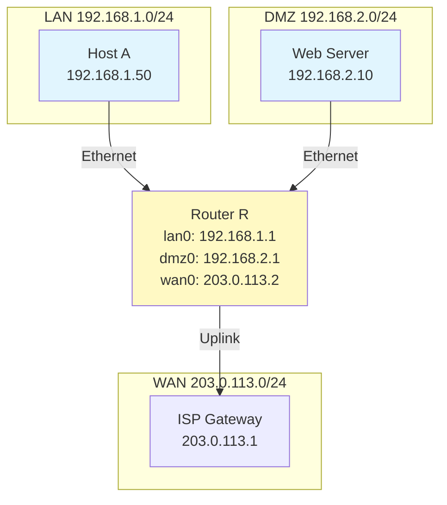
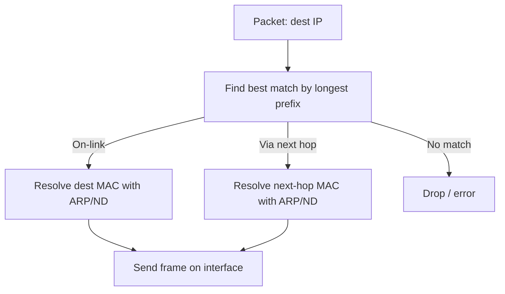

# Routing, IPv6, and ICMP Diagnostics

## Overview
In this lesson, we will connect addressing to forwarding decisions using routing tables, build essential IPv6 literacy, and use ICMP‑based tools (`ping`, `traceroute`) for diagnostics. Short live demos will let us try these commands on our own machines.

## Key Terms
- **Routing Table**: List of destination prefixes and next hops
- **Default Route**: 0.0.0.0/0 catch-all to a gateway
- **Longest-Prefix Match**: Most specific matching route is chosen
- **IPv6 Address**: 128-bit address, hexadecimal with colons
- **Link-Local (IPv6)**: fe80::/10 addresses usable on the local segment
- **ICMP**: Control messaging protocol for IP (diagnostics, errors)
- **TTL (Time To Live)**: Hop limit decremented by routers

## Reading a Routing Table
Routing chooses the next hop for a packet based on the destination IP. The most specific (longest-prefix) route that matches is selected.
Example: 10.1.2.3 matches both 10.0.0.0/8 and 10.1.2.0/24 → choose /24 (more specific).

Core concepts
- Default route: 0.0.0.0/0 (catch-all to gateway)
- On-link route: directly connected network (e.g., 192.168.1.0/24) - sent directly without a router
- Specific static routes (optional)
- Your OS resolves next-hop MAC addresses automatically (ARP/ND covered in Week 7)

Diagram: Router with LAN, DMZ, and WAN

This diagram shows a router with three interfaces: `lan0` (192.168.1.1/24) to the LAN, `dmz0` (192.168.2.1/24) to a DMZ, and `wan0` (203.0.113.2/24) upstream toward the ISP at 203.0.113.1. Traffic for local subnets stays on-link; everything else follows the default route toward the ISP.

Router R routing table (annotated)
| Destination        | Next Hop       | Interface | Note                  |
|--------------------|----------------|-----------|-----------------------|
| 0.0.0.0/0         | 203.0.113.1    | wan0      | Default route to ISP  |
| 192.168.1.0/24    | 0.0.0.0        | lan0      | Directly connected    |
| 192.168.2.0/24    | 0.0.0.0        | dmz0      | Directly connected    |
| 203.0.113.0/24    | 0.0.0.0        | wan0      | Directly connected    |

Host A (192.168.1.50) routing table (conceptual)
| Destination        | Next Hop     | Interface | Note                 |
|--------------------|--------------|-----------|----------------------|
| 0.0.0.0/0         | 192.168.1.1  | eth0      | Default to Router R  |
| 192.168.1.0/24    | 0.0.0.0      | eth0      | On-link LAN          |

### Where routes come from

| Source        | How it’s added                    | Example                                 | Notes                                   |
|---------------|-----------------------------------|-----------------------------------------|-----------------------------------------|
| Connected     | Interface up with an IP/prefix    | 192.168.1.0/24 via eth0                 | Added/removed when interfaces change    |
| Default (IPv4)| DHCP option (router/default gw)   | default via 192.168.1.1 dev eth0        | Renewals can update this route          |
| Default (IPv6)| Router Advertisement (RA)         | default via fe80::1 dev en0             | Part of IPv6 Neighbor Discovery (ND)    |
| Static        | Manually configured               | 10.0.0.0/8 via 192.168.1.254            | Persist until removed                   |
| Dynamic       | Routing protocol (deferred)       | OSPF/EIGRP/BGP learned prefixes         | Covered in routing weeks                |

Diagram: How a route is selected and used

This diagram shows the lookup: the OS finds the most specific matching route; if the network is on‑link it sends directly, otherwise it resolves the next‑hop’s MAC and forwards to the gateway. If no route matches, the packet is dropped.

Quick checks
- Which source likely installed your default route: DHCP (IPv4) or RA (IPv6)?
- If an interface goes down, what happens to the connected route? (Removed)

Live Demo — View your routing table (5 min)
- Windows: `route print`
- macOS/Linux: `netstat -rn`
  - Task: Find the default route and its gateway. Does it match your `ipconfig/ifconfig` gateway?
  - Tip: On Linux `ip route` shows sources (e.g., "proto kernel" = connected)

## IPv6 Primer
IPv6 addresses are 128 bits written in hexadecimal with colons. Leading zeros can be omitted; one consecutive sequence of zeros can be compressed with `::`.
Compression rules (at a glance)
- Drop leading zeros in each group
- Use `::` once to compress a single run of all‑zero groups

Table: IPv4 vs IPv6 (recognition)
| Feature      | IPv4                         | IPv6                               |
|--------------|------------------------------|------------------------------------|
| Size         | 32 bits                      | 128 bits                           |
| Notation     | 192.168.1.1 (dotted decimal) | 2001:db8:85a3::8a2e:370:7334       |

Common IPv6 address types (recognition)
| Type       | Prefix   | Purpose            |
|------------|----------|--------------------|
| Global     | 2000::/3 | Internet routable  |
| Link-local | fe80::/10| Local segment only |
| Loopback   | ::1/128  | Local host         |
Note: Link‑local addresses often include an interface tag (e.g., fe80::1%en0 on macOS).

Practice
- Compress: 2001:0db8:0000:0000:0000:0000:0000:0001 → 2001:db8::1
- Expand: 2001:db8::8a2e → 2001:0db8:0000:0000:0000:0000:0000:8a2e

## Practical Diagnostics with ICMP
ICMP provides control and error messages for IP networks.

Each numbered line or "hop" in a traceroute represents a router that the packet passed through on its way to the destination.

Ping (ICMP Echo)
- Sends Echo Request, expects Echo Reply
- Measures round-trip time and basic reachability

Traceroute
- Sends packets with increasing TTL values
- Each router that decrements TTL to zero returns ICMP Time Exceeded
- Reveals the hop-by-hop path

Live Demo — `ping` and `traceroute`
- `ping www.google.com`
  - What IP did it resolve to? Average RTT? TTL meaning?
- `tracert www.google.com` (Windows) or `traceroute www.google.com` (macOS/Linux)
  - How many hops? Any `* * *` timeouts? Why might that happen?
  - Variants: Windows typically uses ICMP; Linux/macOS may use UDP or ICMP. Some hops rate‑limit or block replies.
- Optional: Use a browser-based traceroute to compare global paths

Key interpretation tips
- "Request timed out" in ping: destination may block ICMP or not reachable
- `* * *` in traceroute: hop did not respond (ICMP filtered or deprioritized)
- TTL in replies isn’t a reliable hop count (initial TTL varies by OS)

| ICMP Message          | Used By     | Meaning                                       |
| --------------------- | ----------- | --------------------------------------------- |
| **Echo Request/Reply**  | `ping`      | "Are you there?" / "Yes, I am."               |
| **Time Exceeded**     | `traceroute`| A router decremented the TTL to zero.         |
| **Destination Unreachable** | (System)    | A router or host cannot forward the packet.   |

## Summary
Addressing enables routing, and routing decides next hops via the most specific prefix. IPv6 extends addressing space and changes notation, but core ideas persist. ICMP tools (`ping`, `traceroute`) validate reachability and reveal paths, turning theory into practical troubleshooting.

**Critical Concepts:**
- Default vs on-link routes; longest-prefix match
- IPv6 notation and common address types (global, link-local, loopback)
- ICMP enables diagnostics: Echo (ping), Time Exceeded (traceroute)
