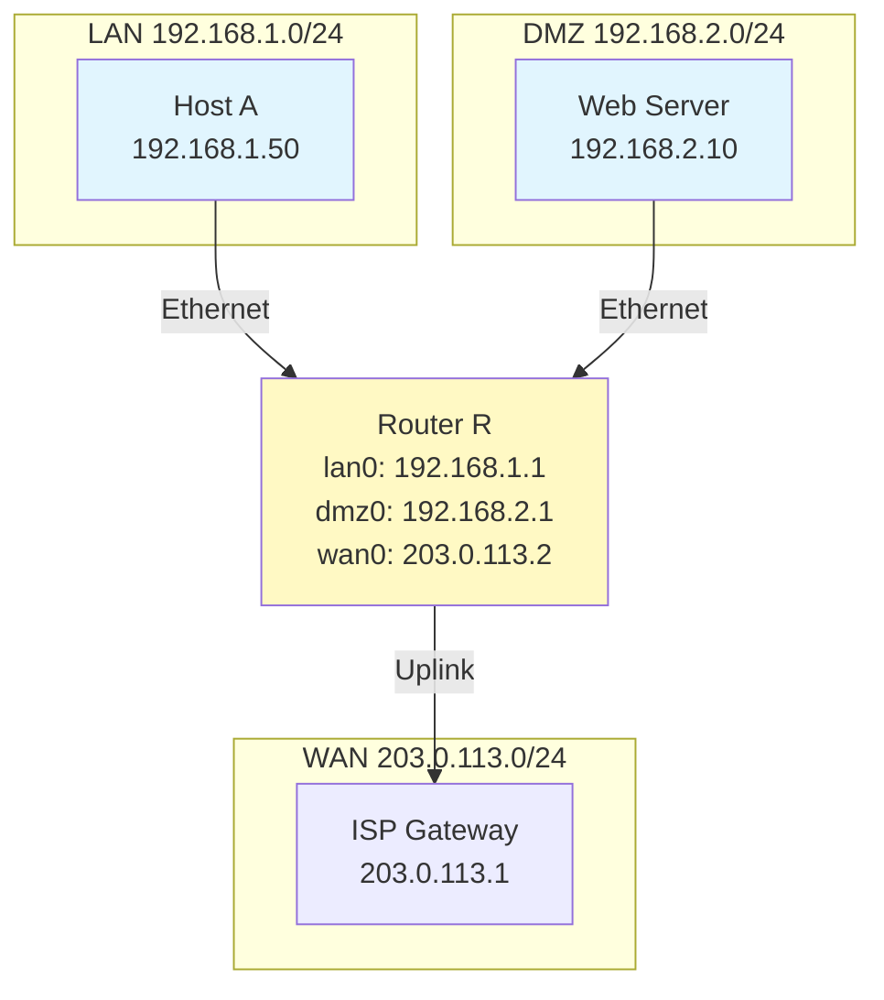
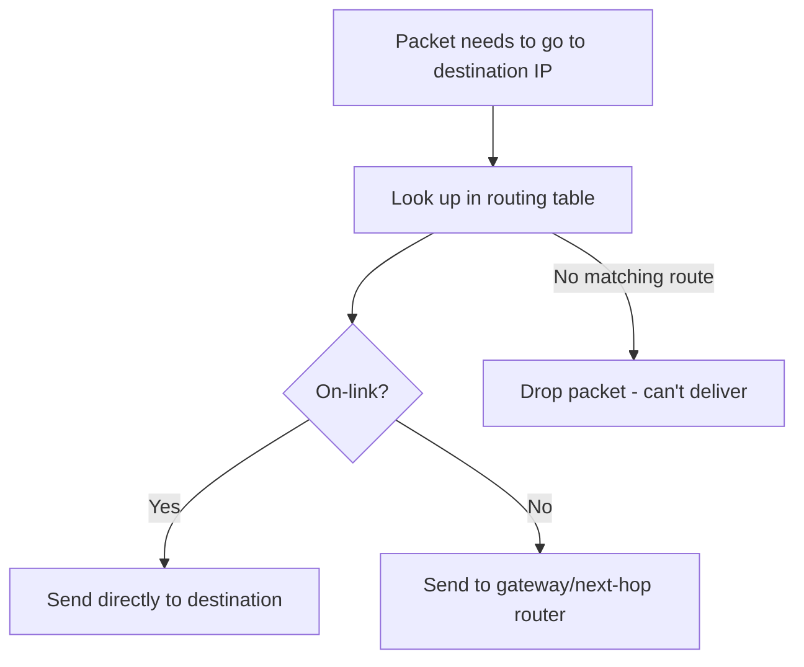

# Routing, IPv6, and ICMP Diagnostics

## Overview

In this lesson, we will connect addressing to forwarding decisions using routing tables, build essential IPv6 literacy, and use ICMP-based tools (`ping`, `traceroute`) for diagnostics. Short live demos will let us try these commands on our own machines.

## Key Terms

- **Routing Table**: List of destination prefixes and next hops
- **Default Route**: 0.0.0.0/0 catch-all to a gateway
- **IPv6 Address**: 128-bit address, hexadecimal with colons
- **ICMP (Internet Control Message Protocol)**: Control and diagnostic messaging for IP
- **Hop Limit (TTL)**: Per-hop counter decremented by routers; IPv4 uses TTL, IPv6 uses Hop Limit
- **On-link**: Directly reachable on the local segment; no router hop
- **DMZ (Demilitarized Zone)**: Network segment for public-facing services
- **ARP (Address Resolution Protocol)**: Maps IP to MAC addresses (Week 7)
- **ND (Neighbor Discovery)**: IPv6 equivalent of ARP
- **RA (Router Advertisement)**: IPv6 router announcements for configuration
- **RTT (Round-Trip Time)**: Time for packet to reach destination and return

## Reading a Routing Table

A routing table tells your device where to send packets. When a packet needs to be sent, the device looks at the destination IP and finds the best matching route.

**The Rule:** Use the most specific match (longest prefix).

Example: If destination is 10.1.2.3:

- Matches 10.0.0.0/8 (all of 10.x.x.x)
- Also matches 10.1.2.0/24 (only 10.1.2.x)
- Choose /24 because it's more specific

Three types of routes you'll see:

1. **Default route (0.0.0.0/0)**: Send everything else to this gateway (usually your router)
2. **On-link routes**: Devices on your local network - send directly without a router
3. **Specific routes**: Custom paths for certain networks (less common)

Diagram: Router with LAN, DMZ, and WAN

This diagram shows Router R connecting three networks: the LAN (Local Area Network) where Host A lives, a DMZ (Demilitarized Zone) for servers, and the WAN (Wide Area Network) connecting to the ISP (Internet Service Provider). Each connection is a separate interface on the router.

**Router R's routing table:**

| Destination    | Next Hop         | Interface | What this means                                    |
| -------------- | ---------------- | --------- | -------------------------------------------------- |
| 192.168.1.0/24 | Direct (on-link) | lan0      | LAN is directly connected - send on lan0           |
| 192.168.2.0/24 | Direct (on-link) | dmz0      | DMZ is directly connected - send on dmz0           |
| 203.0.113.0/24 | Direct (on-link) | wan0      | ISP network is directly connected - send on wan0   |
| 0.0.0.0/0      | 203.0.113.1      | wan0      | Everything else goes to ISP gateway (the Internet) |

**Host A's routing table (simpler):**

| Destination    | Next Hop         | Interface | What this means                               |
| -------------- | ---------------- | --------- | --------------------------------------------- |
| 192.168.1.0/24 | Direct (on-link) | eth0      | My local network - send directly              |
| 0.0.0.0/0      | 192.168.1.1      | eth0      | Everything else goes to Router R (my gateway) |

Note: Some systems display "on-link" or leave next-hop blank for directly connected routes. For on-link traffic, the OS resolves the destination MAC via ARP (Address Resolution Protocol) or ND (Neighbor Discovery) (Week 7).

### How routing tables get populated

Your device builds its routing table automatically:

1. **Connected routes**: Added when you configure an IP address on an interface
   - Example: Assign 192.168.1.50/24 → route for 192.168.1.0/24 appears
2. **Default gateway**: Provided by DHCP (IPv4) or Router Advertisement/RA (IPv6)
   - This tells you where to send Internet traffic
   - Example (IPv6): `default via fe80::1%en0`. The `%en0` is a zone index, which is critical because link-local addresses are not unique; it tells the OS which interface to use.
3. **Static routes**: Manually added by an administrator (rare on end-user devices)
4. **Dynamic routes**: Learned from routing protocols like OSPF or BGP (covered in later weeks)

**How routing decisions work:**

This diagram shows the basic decision: if the destination is on your local network, send it directly; otherwise, send it to your gateway. The gateway then repeats this process until the packet reaches its destination.

Route decision cheat sheet

| Destination  | Chosen route           | Interface / Next hop          |
| ------------ | ---------------------- | ----------------------------- |
| 192.168.1.77 | 192.168.1.0/24 (local) | Send directly on lan0         |
| 192.168.2.10 | 192.168.2.0/24         | Send directly on dmz0         |
| 8.8.8.8      | Default (0.0.0.0/0)    | Next hop 203.0.113.1 via wan0 |

Live Demo — View your routing table

**What you'll do:**

- Windows: Open Command Prompt and run `route print`
- macOS/Linux: Open Terminal and run `netstat -rn` or `ip route` (IPv4) and `ip -6 route` (IPv6)

**What to look for:**

- Find the line with `0.0.0.0` or `default` - this is your default route
- Note the gateway IP address - does it match what you saw in `ipconfig`/`ifconfig`?
- Find routes for your local network (they'll match your IP's network portion)
- Linux tip: `ip route get 8.8.8.8` shows the exact route/interface chosen

## IPv6 Primer

IPv6 addresses are 128 bits written in hexadecimal with colons. Leading zeros can be omitted; one consecutive sequence of zeros can be compressed with `::`.
Compression rules (at a glance)

- Drop leading zeros in each group
- Use `::` once to compress a single run of all-zero groups

Table: IPv4 vs IPv6 (recognition)

| Feature  | IPv4                         | IPv6                         |
| -------- | ---------------------------- | ---------------------------- |
| Size     | 32 bits                      | 128 bits                     |
| Notation | 192.168.1.1 (dotted decimal) | 2001:db8:85a3::8a2e:370:7334 |

Common IPv6 address types (recognition)

| Type       | Prefix    | Purpose            |
| ---------- | --------- | ------------------ |
| Global     | 2000::/3  | Internet routable  |
| Link-local | fe80::/10 | Local segment only |
| Loopback   | ::1/128   | Local host         |

Note: Link-local addresses often include an interface tag (e.g., `fe80::1%en0` on macOS).

Practice

- Compress: 2001:0db8:0000:0000:0000:0000:0000:0001 → 2001:db8::1
- Expand: 2001:db8::8a2e → 2001:0db8:0000:0000:0000:0000:0000:8a2e

## Practical Diagnostics with ICMP

ICMP (Internet Control Message Protocol) is a helper protocol that provides diagnostic and error messages for IP networks. Two essential tools use ICMP: `ping` and `traceroute`.

### Ping: Checking Reachability

`ping` answers the question: "Can I reach this device?" It works by sending an **ICMP Echo Request**. If the destination is reachable, it sends back an **ICMP Echo Reply**. This simple exchange confirms connectivity and measures the round-trip time (RTT).

### Traceroute: Finding the Path

`traceroute` answers the question: "What path do my packets take?" It reveals every router (hop) along the way by sending packets with a short lifespan (a low TTL (Time To Live)/Hop Limit). Each router that receives the packet sends back a "Time Exceeded" message, effectively announcing its location.

### Live Demo — `ping` and `traceroute`

**What you'll do:**

- Test connectivity: `ping www.google.com`
- Trace the path: `tracert www.google.com` (Windows) or `traceroute www.google.com` (macOS/Linux)

**What to look for:**

- In `ping`, you'll see reply times in milliseconds (ms). "Request timed out" means no reply was received.
- In `traceroute`, each numbered line is a router hop. `* * *` means a hop didn't reply, which is common.

Note: Windows traceroute sends ICMP; Linux/macOS often use UDP. On UDP traceroutes, the final hop may return "Port Unreachable" — this is expected.
