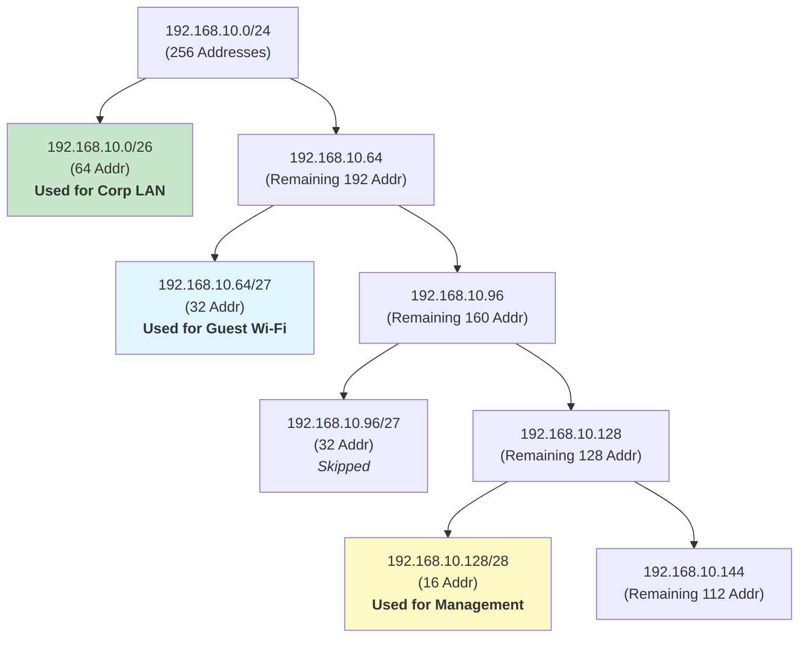

# Practical Subnetting
## Overview
In this lesson, we move from the theory of IP addressing to the practical skill of subnetting. We will learn why we divide networks and how to use Variable Length Subnet Masking (VLSM) to efficiently allocate IP address space to meet specific network requirements. This is a core skill for any network administrator.

## Key Terms
- **Subnetting**: The process of dividing a single large network into multiple smaller, more manageable networks, or "subnets".
- **VLSM (Variable Length Subnet Masking)**: A technique that allows network administrators to divide an IP address space into subnets of different sizes, wasting fewer addresses.
- **Network Address**: The first address in a subnet, which represents the subnet itself. All host bits are set to 0. It is not assignable to a device.
- **Broadcast Address**: The last address in a subnet. A packet sent to this address is delivered to all hosts on that subnet. All host bits are set to 1. It is not assignable to a device.
- **Usable Hosts**: The number of IP addresses in a subnet that can be assigned to devices. This is the total number of addresses minus the network and broadcast addresses.

## Subnetting Fundamentals

### Why We Subnet
In Week 6, we learned how IP addresses and subnet masks define a single network. But in the real world, a single, large network is often inefficient and insecure. We subnet for three main reasons:

1.  **Segmentation**: Subnetting allows us to create logical boundaries. We can create separate subnets for different departments (e.g., Sales, Engineering), security zones (e.g., a DMZ for public servers), or device types (e.g., voice-over-IP phones, security cameras). This isolates traffic and improves security.
2.  **Efficient Address Allocation**: Imagine you need a network for 50 devices and another for 10 devices. Without subnetting, you might have to use two /24 networks (254 usable IPs each), wasting hundreds of addresses. Subnetting lets you create a /26 network (62 usable IPs) and a /28 network (14 usable IPs), perfectly matching your needs.
3.  **Performance**: When a device sends a broadcast packet (like an ARP request), it goes to every other device in the same broadcast domain. Large broadcast domains create a lot of "chatter." Subnetting creates smaller broadcast domains, reducing unnecessary traffic and improving overall network performance.

### Core Principle: Borrowing Bits
The magic of subnetting comes from "borrowing" bits from the host portion of an address and using them for the network portion.

-   Every bit you borrow **doubles** the number of subnets you can create.
-   Every bit you borrow **halves** the number of hosts available in each subnet.

The formula for calculating usable hosts in a subnet is:
**2^(h) - 2**
Where **h** is the number of bits remaining in the host portion. We subtract 2 for the un-assignable network and broadcast addresses.

---

## VLSM Workflow
**Variable Length Subnet Masking (VLSM)** is the modern, efficient way to subnet. Instead of breaking a network into equal-sized pieces, VLSM allows us to create subnets of different sizes to precisely match our needs.

### Method
The process is straightforward and avoids wasted space if you follow one key rule: **Always allocate the largest subnets first.**

1.  **List Requirements**: Write down all the subnets you need and the number of hosts for each.
2.  **Sort by Size**: Arrange your list from the largest number of hosts to the smallest.
3.  **Allocate**: Start with your main address block. Carve out the first subnet from the beginning of the block that is large enough for your largest requirement.
4.  **Track Remaining Space**: Note the network address of the *next* available subnet. This is where your next allocation will begin.
5.  **Repeat**: Continue allocating from the available space for the next-largest requirement until all needs are met.

### Guided Example
Let's take the address block `192.168.10.0/24` and subnet it for these requirements:
-   Corporate LAN: 60 hosts
-   Guest Wi-Fi: 30 hosts
-   Management VLAN: 14 hosts

**Step 1 & 2: Sort Requirements**
1.  Corp LAN: 60 hosts (needs 6 host bits, since 2^6 - 2 = 62. This means a /26 mask, as 32 - 6 = 26).
2.  Guest Wi-Fi: 30 hosts (needs 5 host bits, since 2^5 - 2 = 30. This means a /27 mask).
3.  Management VLAN: 14 hosts (needs 4 host bits, since 2^4 - 2 = 14. This means a /28 mask).

**Step 3, 4, & 5: Allocate**

| Requirement | Network Address & Prefix | Usable IP Range          | Broadcast Address | Notes                              |
|-------------|--------------------------|--------------------------|-------------------|------------------------------------|
| 60 hosts    | `192.168.10.0/26`        | `192.168.10.1` - `62`    | `192.168.10.63`   | Corporate LAN (Local Area Network) |
| 30 hosts    | `192.168.10.64/27`       | `192.168.10.65` - `94`   | `192.168.10.95`   | Guest Wi-Fi                        |
| 14 hosts    | `192.168.10.128/28`      | `192.168.10.129` - `142` | `192.168.10.143`  | Management VLAN (Virtual LAN)      |

**Diagram: Visualizing the Address Space Split**

This diagram shows how the initial /24 block (256 addresses) is split using VLSM. We allocate the first /26 (64 addresses) for the Corp LAN, starting at `.0`. From the remaining space starting at `.64`, we allocate a /27 (32 addresses) for Guest Wi-Fi. We then skip the next /27 block (`.96` to `.127`) and allocate a /28 (16 addresses) starting at `.128` for Management. This demonstrates how VLSM allows flexible, non-contiguous allocations to match specific requirements efficiently.

---

## Quick Calculations Toolkit
Subnetting math can be fast if you remember a few power-of-two anchors:

| CIDR Prefix | Subnet Mask     | Total Addresses |
|-------------|-----------------|-----------------|
| **/24**     | 255.255.255.0   | 256             |
| **/25**     | 255.255.255.128 | 128             |
| **/26**     | 255.255.255.192 | 64              |
| **/27**     | 255.255.255.224 | 32              |
| **/28**     | 255.255.255.240 | 16              |

**Mental Math Tips:**
- **Find the Broadcast Address**: The broadcast address of a subnet is always the IP right before the network address of the *next* subnet.
- **Gateway Convention**: For consistency, most network administrators use either the first (`.1`) or the last (`.254`) usable IP address in a subnet for the default gateway.

## Hands-on Checks
After you've done the math, how can you be sure it's right?
- **Use a Tool**: For learning, it's great to use an online subnet calculator (or a command-line tool like `ipcalc` on Linux) to verify your work.
- **Ping Test**: A simple sanity check. If you've calculated that `192.168.10.1` to `192.168.10.62` is a usable range, configure a device with one of those IPs and try to `ping` the gateway. If it works, your calculation is likely correct.
