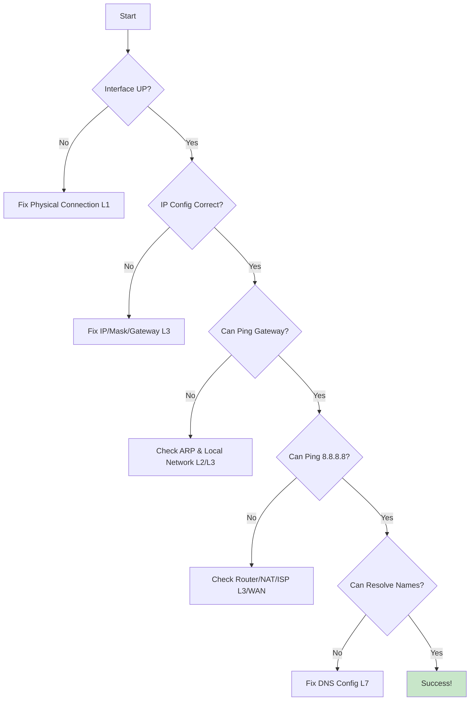
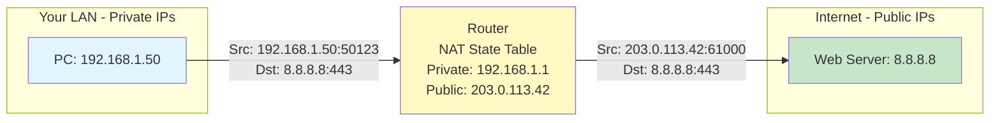

# IP Troubleshooting and NAT
## Overview
This lesson covers two critical, related topics: a systematic methodology for troubleshooting IP connectivity and an introduction to Network Address Translation (NAT), the technology that allows private IP addresses to access the public internet. Mastering a logical troubleshooting flow is essential for any network professional, and understanding NAT is key to how the modern internet functions.

## Key Terms
-   **Troubleshooting Methodology**: A systematic, layered approach to diagnosing and solving network problems, moving from the physical layer up to the application layer.
-   **ARP (Address Resolution Protocol)**: A Layer 2 protocol that discovers the MAC (hardware) address associated with a given IPv4 address on the local network.
-   **NAT (Network Address Translation)**: The process of modifying IP address information in packet headers while in transit across a routing device.
-   **PAT (Port Address Translation)**: Also known as NAT Overload, it is the most common type of NAT. It maps multiple private IP addresses to a single public IP address by using different source port numbers.
-   **SNAT (Source NAT)**: A type of NAT that changes the source IP address of outgoing packets.
-   **DNAT (Destination NAT)**: A type of NAT that changes the destination IP address of incoming packets, commonly used for port forwarding to internal servers.

## Systematic IP Troubleshooting
When a user says "the internet is down," the problem could be anywhere between their chair and the server they're trying to reach. A systematic, bottom-up methodology prevents guesswork and quickly isolates the problem.

### The Bottom-Up Methodology
We start at Layer 1 (the physical connection) and work our way up the protocol stack.

1.  **Layer 1 (Physical)**: **"Is it plugged in?"**
    -   **What to Check**: Verify physical connections, link lights on the network card and switch port, and interface status.
    -   **Goal**: Confirm the device has a live physical connection to the network. An interface that is "down" or shows no carrier is a Layer 1 problem.

2.  **Layer 3 (Network)**: **"Does it have the right address?"**
    -   **What to Check**: Verify the device's IP configuration. Is the IP address valid for the subnet? Is the subnet mask correct? Is the default gateway on the same subnet as the host?
    -   **Goal**: Ensure the device is logically configured to participate on the network. A misconfigured IP or mask will prevent communication.

3.  **Local Connectivity**: **"Can it talk to the gateway?"**
    -   **What to Check**: Use `ping <gateway-ip>` to test connectivity to the local router. If this fails, the problem is on the local network segment. The next step is to check ARP.
    -   **ARP's Role**: Use `arp -a` to see the ARP cache. A missing or incorrect entry for the gateway means the device can't even send a frame to the router.

4.  **Path to Internet**: **"Can it get past the gateway?"**
    -   **What to Check**: Use `ping 8.8.8.8` (a public Google DNS server) to test if traffic can be routed to the internet. If the gateway ping works but this fails, the problem is likely with the router, NAT, or the ISP connection. Use `traceroute` to see how far the packets get.

5.  **Name Resolution**: **"Can it resolve domain names?"**
    -   **What to Check**: If pinging an IP address works but `ping www.google.com` fails, the issue is almost certainly DNS. Use `nslookup` or `dig` to test the configured DNS servers.

**Diagram: Troubleshooting Decision Tree**

This flowchart shows the decision-making process for network troubleshooting. By following the steps from top to bottom, a network administrator can logically narrow down the scope of the problem until the root cause is identified.

---

## ARP - The Layer 2/3 Bridge
ARP is the critical glue between Layer 3 (IP addresses) and Layer 2 (MAC addresses) on an IPv4 network.

### What ARP Does
-   **Problem**: Your computer wants to send a packet to the gateway at `192.168.1.1`. It knows the IP address, but to build an Ethernet frame, it needs the gateway's MAC address.
-   **Solution**: Your computer sends an ARP Request, which is a broadcast on the local network, asking, "Who has `192.168.1.1`? Tell `192.168.1.100`." The router receives this broadcast and sends back an ARP Reply directly to your computer, saying, "I have `192.168.1.1`, and my MAC address is `00:1A:2B:3C:4D:5E`."
-   **ARP Cache**: Your computer stores this IP-to-MAC mapping in its ARP cache for a short time so it doesn't have to broadcast for every single packet. You can view this cache with the `arp -a` command.

### Common ARP Issues
-   **Duplicate IP Addresses**: If two devices are configured with the same IP, they will both respond to ARP requests, causing "ARP storms" and intermittent connectivity as the network switches back and forth between the two MAC addresses.
-   **Stale ARP Cache**: If a device's network card is replaced or its IP changes, other devices on the network might have an old, incorrect MAC address in their cache.
-   **Wrong Subnet**: A device can only send an ARP request for an IP address that is on its local subnet. If your gateway is misconfigured to be on a different subnet, your computer won't even try to ARP for it.

**IPv6 Note**: IPv6 does not use ARP. It uses the **Neighbor Discovery (ND)** protocol, which performs a similar function using ICMPv6 messages.

---

## NAT and PAT
Network Address Translation is the technology that enabled the internet to grow far beyond the limits of the IPv4 address space.

### Why NAT Exists
The primary reason for NAT is **IPv4 address conservation**. There are only ~4 billion IPv4 addresses, but there are far more devices connected to the internet. NAT allows an entire organization with thousands of devices to share a single, or a small handful of, public IP addresses. It also provides a basic form of security by hiding the internal network structure from the outside world.

### Types of NAT
-   **SNAT (Source NAT)**: Changes the **source** IP address of outgoing packets. This is the most common use case, where a private internal IP is translated to a public external IP.
-   **DNAT (Destination NAT)**: Changes the **destination** IP of incoming packets. This is used for **port forwarding**, where traffic sent to your public IP on a specific port (e.g., port 443 for a web server) is forwarded to a specific private IP on your internal network.
-   **PAT (Port Address Translation)**: This is the workhorse of NAT. It's a form of SNAT where the router maps multiple private IPs to its single public IP by assigning each outgoing connection a unique, temporary source port number.

**"Before & After NAT" Example**
This table shows how PAT modifies an outgoing packet. The router keeps a state table to remember that any replies coming back to its public IP on port `61000` should be sent back to `192.168.1.50`.

| Packet Field          | Before NAT (On Your LAN)    | After NAT (On the Internet)               |
|-----------------------|-----------------------------|-------------------------------------------|
| **Source IP:Port**    | `192.168.1.50:50123`        | `203.0.113.42:61000` (Router's Public IP) |
| **Destination IP:Port** | `8.8.8.8:443`               | `8.8.8.8:443` (Unchanged)                 |

**Diagram: NAT in Action**

This diagram shows the basic flow of a NAT'd connection. The PC sends a packet from its private IP. The router receives it, translates the source address to its own public IP, and forwards it to the internet. The web server sees the request as coming from the router's public IP and is completely unaware of the private IP address behind it.

## Live NAT Demonstration
You can see NAT in action yourself.

1.  **Check your Public IP**: In a web browser, go to a site like `ifconfig.me`. This will show you the public IP address that the rest of the internet sees for your connection.
2.  **Compare**: Now, compare this public IP to the private IP address you see when you run `ipconfig` or `ip addr`.
3.  **The "Aha!" Moment**: The two addresses are different. This is direct evidence of NAT at work, translating your private, internal address into a public, internet-routable address at your gateway router.
