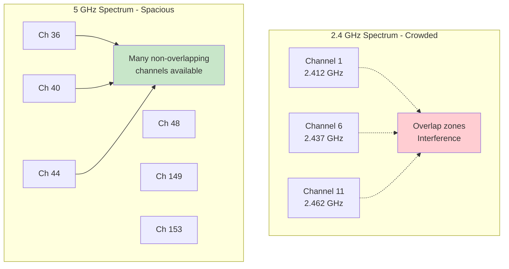
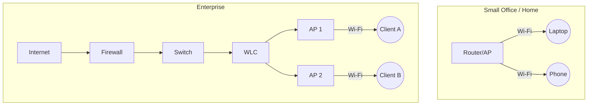

# Wireless Fundamentals

## Overview
In Week 4 we defined a Wireless Access Point (WAP). This lecture explains how Wi‑Fi actually works in practice: spectrum, channels, 802.11 standards, and core components (APs, clients, controllers). We end with a quick comparison of Wi‑Fi vs cellular to guide design choices.

## Key Terms
- **Channel**: Specific frequency range a Wi‑Fi network uses (like radio stations use different frequencies).
- **Non‑overlapping channels**: Channels that don't interfere with each other (2.4 GHz: 1/6/11).
- **MIMO**: Multiple antennas working together for better performance (Multiple Input, Multiple Output).
- **OFDMA**: Allows an access point to talk to multiple devices at the same time, like a delivery truck making multiple stops in one trip instead of a separate trip for each package.
- **WLC (Wireless LAN Controller)**: Central "brain" that manages multiple access points in large networks.

## Introduction to Wireless Technology

Wi‑Fi uses unlicensed RF spectrum (radio frequency waves that anyone can use without a license). The numbers 2.4 GHz and 5 GHz refer to how fast the radio waves vibrate - like AM/FM radio stations but much faster. Interference sources include co‑channel (same channel), adjacent‑channel (overlapping), and non‑Wi‑Fi devices (microwaves, cordless phones).

Diagram: 2.4 GHz vs. 5 GHz Channel Spectrum

This shows 2.4 GHz has only three non‑overlapping channels (1/6/11), while 5 GHz has many separate channels available. Think of it like 2.4 GHz being a crowded highway with only 3 lanes, while 5 GHz is a wide highway with many lanes - less traffic jams and better performance.

**What do channels 1/6/11 mean?** These are specific frequencies within the 2.4 GHz band - Channel 1 uses 2.412 GHz, Channel 6 uses 2.437 GHz, and Channel 11 uses 2.462 GHz. They're spaced far enough apart that they don't interfere with each other, unlike channels 2, 3, 4, etc. which would overlap and cause interference.

## The 802.11 Standards

Evolution highlights (focus on modern usage):

| Standard | Wi‑Fi Name | Bands          | Typical Throughput | Key Features |
|---------|------------|----------------|--------------------|--------------|
| 802.11n | Wi‑Fi 4    | 2.4 / 5 GHz    | 150–300 Mbps       | MIMO (multiple antennas)         |
| 802.11ac| Wi‑Fi 5    | 5 GHz          | 433–867 Mbps       | Wider channels, serves multiple users |
| 802.11ax| Wi‑Fi 6/6E | 2.4 / 5 / 6 GHz| 600–1200+ Mbps     | Better sharing, stronger security |

Notes:
- Wi‑Fi 6 focuses on serving more devices efficiently, not just raw speed (like adding more checkout lanes at a store).
- 6E opens up 6 GHz spectrum - cleaner airwaves but signals don't travel as far (higher frequency = shorter range).

## Wireless Network Components

- **Access Points (APs)**: Bridge wireless clients to the wired LAN (like a wireless-to-wired translator); enterprise APs often operate as lightweight APs managed by a controller.
- **Clients**: Laptops, phones, IoT devices—capabilities vary (IoT = small connected devices like smart plugs/cameras; some have better antennas, support different Wi‑Fi standards).
- **Controllers (WLCs)**: Centralized configuration, RF management, roaming support (think of it as the "headquarters" for all APs).

Diagram: Standalone APs vs. WLC‑Managed APs

In enterprises, the WLC acts like a central manager coordinating multiple APs - imagine one person controlling all the access points instead of configuring each one individually. This enables seamless roaming (moving between APs without losing connection) and consistent security policies.

## Cellular vs Wi‑Fi (When to Use Which)

- **Scope**: Wi‑Fi for on‑prem LAN performance and density; cellular for WAN mobility and coverage.
- **Cost & control**: Wi‑Fi is locally controlled; cellular depends on provider plans.
- **Typical choice**: Use Wi‑Fi for offices/campuses; cellular for mobile/backup links; combine for resilience.

## Quick Review Questions
- Why are channels 1/6/11 preferred in 2.4 GHz?
- Name two benefits of Wi‑Fi 6 in busy environments.
- What advantages do WLCs provide over standalone APs?

