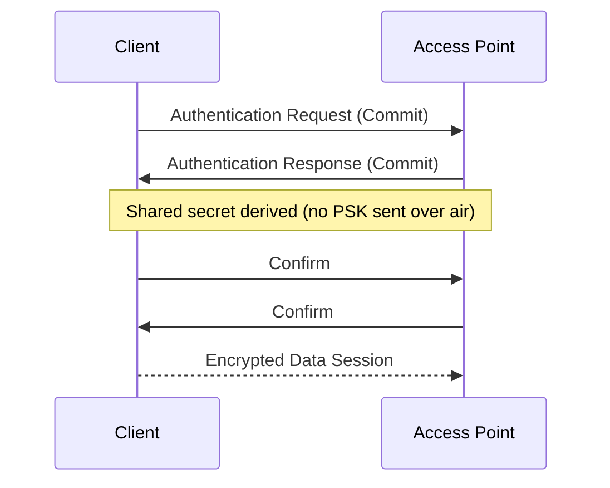

# WLAN Installation & Security

## Overview
From planning and site surveys to secure configuration, this lecture turns wireless fundamentals into an operational WLAN. We close with lightweight discovery tasks students can run on their own devices.

## Key Terms
- **SSID**: The Wi-Fi network name you see when connecting (like "CoffeeShop_WiFi").
- **PSK**: Pre-Shared Key - the common Wi-Fi password everyone uses.
- **802.1X**: Enterprise login system where each user has individual credentials.
- **RADIUS**: Server that checks if user credentials are valid (like Active Directory for Wi-Fi).
- **SAE (Simultaneous Authentication of Equals)**: Secure handshake method in WPA3 that doesn't reveal passwords over the air.
- **WEP (Wired Equivalent Privacy)**: Old Wi‑Fi encryption; easily cracked. Do not use.
- **WPA (Wi‑Fi Protected Access)**: Temporary improvement over WEP; better than WEP but outdated.
- **WPA2 (Wi‑Fi Protected Access II)**: Long‑time standard using strong encryption; still common.
- **WPA3 (Wi‑Fi Protected Access 3)**: Current best practice; more secure (uses SAE handshake).

## Installing a Wireless Network (Planning First)

### Site Survey

A site survey is like creating a blueprint before building - you walk around with tools to measure Wi-Fi coverage and interference before installing access points.

- **Goals**: Confirm coverage (where signal reaches), capacity (how many users), and interference (what's causing problems).
- **Considerations**: Building materials (concrete blocks signals more than drywall), AP placement height, client density, neighboring WLANs, and non‑Wi‑Fi interferers.
- **Outcomes**: Coverage map, recommended channels, transmit power plan.

### AP Configuration Basics

- **SSID naming conventions**: Avoid personal identifiers; consider guest vs. corporate SSIDs.
- **Channel selection**: Non‑overlapping in 2.4 GHz; dynamic or planned reuse in 5/6 GHz (reuse = spread APs across different channels so neighbors don’t collide).
- **Transmit power tuning**: Don't use maximum power on all APs—stronger signals create more interference with neighboring APs (like shouting louder doesn't help if everyone else is shouting too).

## Wireless Security

### Security Evolution

- **WEP** → Broken (easily cracked security)
- **WPA** → Interim (a temporary fix for WEP's flaws)
- **WPA2** → Common Baseline (strong for years, but vulnerable to some modern attacks)
- **WPA3** → Preferred (fixes WPA2's main vulnerabilities, much more secure)

Diagram: WPA3‑Personal SAE Handshake

This diagram shows how WPA3 creates a secure connection without actually sending the password over the air - both sides mathematically prove they know the password without revealing it. SAE (Simultaneous Authentication of Equals) is much more secure than WPA2 because attackers can't capture and crack passwords offline.

### Authentication Choices

- **PSK (Pre‑Shared Key)**: Everyone uses the same Wi-Fi password (like your home network). Simple but less secure since everyone knows the same password.
- **Enterprise (802.1X/RADIUS)**: Each person has their own username/password, like logging into a computer. More secure because each user is tracked individually and can be revoked if needed.

## WLAN Discovery (Lightweight)

### Tools

These commands let you see detailed information about nearby Wi-Fi networks:

- **Windows**: `netsh wlan show networks mode=bssid` (shows all nearby networks with technical details)
- **macOS**: Option‑click Wi‑Fi icon (shows signal strength, channel, and connection type)
- **Linux**: `iw dev` / `nmcli` tools (command-line network information)

**Technical terms you'll see:**
- **BSSID**: Basic Service Set ID - the MAC address of the access point (like a unique serial number)
- **RSSI**: Signal strength in dBm (negative numbers). Closer to 0 = stronger (e.g., -30 excellent, -70 fair, -85 poor)
- **PHY**: Physical layer - refers to which Wi-Fi standard is being used (n/ac/ax)

### Prompts

- Identify your SSID, security type, and channel. Any nearby APs on the same channel?
- Does your channel choice match best practices (1/6/11 on 2.4 GHz)?

## Quick Review Questions
- Why is “max transmit power” not a best practice for dense deployments?
- What security advantages does WPA3‑SAE provide over WPA2‑PSK?
- When would you choose 802.1X/RADIUS instead of PSK?

