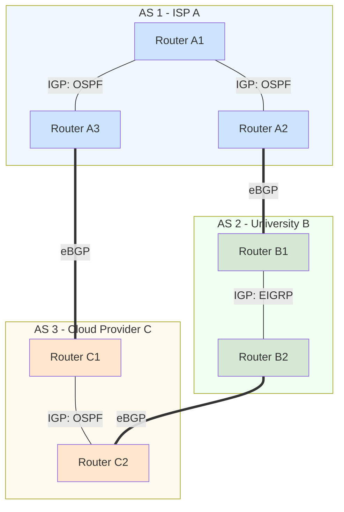
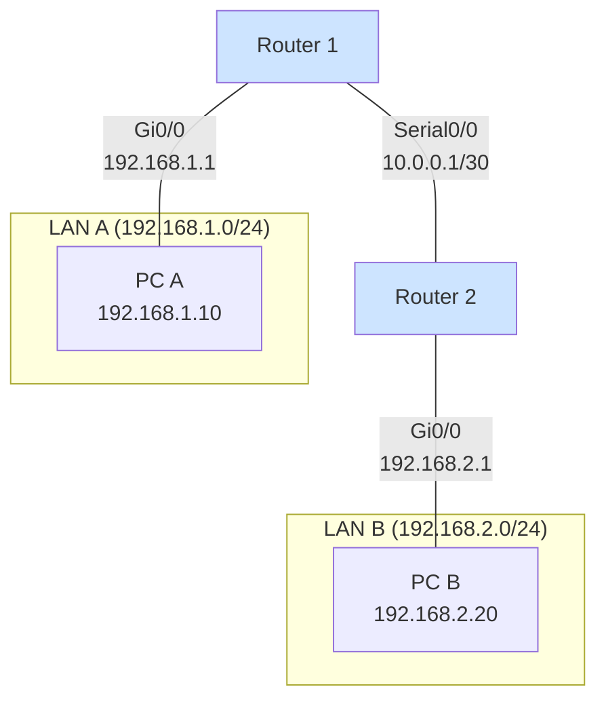
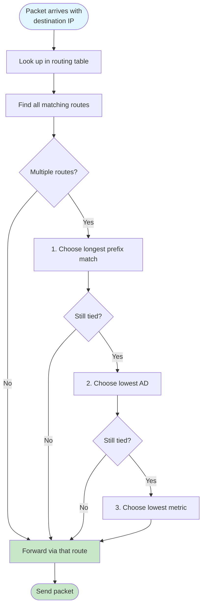

# Routing Fundamentals & Global Routing

## Overview
We build an intuitive picture of how routers move packets between networks. We’ll first outline routing protocol types at a high level, then see how the global Internet is organized into Autonomous Systems (AS). Finally, we’ll read a routing table and follow a packet step by step, finishing with how routers choose the “best” route.

What you’ll learn (in plain language):
- The kinds of routing protocols and where they are used
- Why the Internet is a “network of networks” (AS) and where BGP fits
- How to read a routing table and trace a packet across two routers
- How routers break ties: longest prefix → AD → metric

## Key Terms
- **Autonomous System (AS)**: A network under a single administrative control.
- **Administrative Distance (AD)**: Trust level of a route source.
- **Metric**: Protocol-specific path cost (e.g., OSPF cost, RIP hop count).
- **Convergence**: Time for all routers to agree on consistent routing information.

## Routing Protocol Basics

### Static vs Dynamic Routing
- **Static Routing**: Administrator manually configures routes on each router
  - Predictable and secure
  - Doesn't adapt to network changes
  - Practical for small networks or specific use cases
- **Dynamic Routing**: Routers automatically discover and share routes using protocols
  - Adaptive to network changes
  - Scales better for large networks
  - More complex to configure and troubleshoot

### Types of Routing Protocols

Routing protocols fall into two main categories based on their scope:

- **Interior Gateway Protocols (IGP)**: Operate *within* a single Autonomous System
  - Examples: OSPF, EIGRP, RIP
  - Goal: pick efficient paths inside one organization
- **Exterior Gateway Protocols (EGP)**: Operate *between* different Autonomous Systems
  - Example: BGP (Border Gateway Protocol)
  - Goal: exchange reachability between organizations; policy often matters more than raw speed

Routing protocols can also be classified by their algorithm:

- **Distance Vector**: Share routing tables with neighbors, "routing by rumor"
  - Examples: RIP, EIGRP
  - Simple mental model; can be slower to react to failures
- **Link-State**: Build a complete topology map, calculate best paths independently
  - Examples: OSPF, IS-IS
  - More setup, faster/more reliable convergence in practice

## The Global Internet: A Network of Networks

In the global Internet, no single routing protocol runs everywhere. The world’s networks are divided into thousands of Autonomous Systems (AS) — each typically an ISP, enterprise, or cloud region. Inside an AS, an IGP is used. Between ASes, everyone speaks BGP so they can reach each other while honoring business and security policies.

This diagram shows three separate Autonomous Systems, each running its own internal routing protocol (IGP). The connections *between* these systems use an exterior protocol (eBGP) to exchange reachability information, allowing them to route traffic to one another. Notice that:
- AS 1 (ISP A) uses OSPF internally
- AS 2 (University B) uses EIGRP internally
- AS 3 (Cloud Provider C) uses OSPF internally
- All three communicate with each other using BGP at their borders

## How Routers Think: The Routing Table

A router's job is to forward a packet to the next closest router toward its final destination. It makes this decision by consulting its routing table. Let's see how this works with a simple two-router network.

In this setup, Router 1 knows about its directly connected networks (LAN A and the link to R2). Router 2 knows about its own (LAN B and the link to R1). For PC A to reach PC B, R1 needs a route to LAN B, and R2 needs a route back to LAN A. These routes are either entered statically or learned via a dynamic protocol.

**Router 1's Routing Table**
| Prefix | Next Hop | Interface | How Learned |
|---|---|---|---|
| `192.168.1.0/24` | `0.0.0.0` | Gi0/0 | Connected |
| `10.0.0.0/30` | `0.0.0.0` | Serial0/0 | Connected |
| **`192.168.2.0/24`** | **`10.0.0.2`** | Serial0/0 | `Dynamic/Static` |

**Router 2's Routing Table**
| Prefix | Next Hop | Interface | How Learned |
|---|---|---|---|
| `192.168.2.0/24` | `0.0.0.0` | Gi0/0 | Connected |
| `10.0.0.0/30` | `0.0.0.0` | Serial0/0 | Connected |
| **`192.168.1.0/24`** | **`10.0.0.1`** | Serial0/0 | `Dynamic/Static` |

Packet walk (end-to-end):
- PC A sends to 192.168.2.20 → default gateway 192.168.1.1 (R1)
- R1 looks up 192.168.2.0/24 → next hop 10.0.0.2 → send out Serial0/0 to R2
- R2 receives, finds directly connected 192.168.2.0/24 → forwards to PC B

Return traffic follows the reverse path using R2’s route to 192.168.1.0/24 via 10.0.0.1.

## Advanced Route Selection

When a router has multiple routes to the same destination, it must decide which one to use. This follows a strict hierarchy:

1. **Longest Prefix Match**: The router always prefers the most specific route. A route to `10.1.1.0/26` is more specific than a route to `10.1.1.0/24`.
2. **Lowest Administrative Distance (AD)**: If multiple routes have the same prefix length, the router trusts the protocol with the lower AD value.
3. **Lowest Metric**: If the AD is also the same, the router uses the protocol's own cost calculation (metric) to break the tie.

This flowchart shows the three-step decision process routers use to select the best route. The longest prefix match always takes priority, followed by Administrative Distance, and finally the protocol-specific metric.

**Administrative Distance Quick Reference:**
| Route Source | AD |
|---|---|
| Connected | 0 |
| Static | 1 |
| eBGP | 20 |
| EIGRP | 90 |
| OSPF | 110|
| RIP | 120|
| iBGP | 200|

Lower AD means “more trusted.” Directly connected (0) beats everything. Static (1) beats any dynamic protocol. AD only matters when prefix length is the same.

## Key Takeaways
- IGPs are used inside an AS; BGP connects different ASes on the Internet.
- Routers forward based on their routing table using next-hop decisions.
- Route choice order: longest prefix → lowest AD → lowest metric.
- Simple topologies are great to practice reading routing tables and tracing packets.

## Quick Review Questions
- What is the difference between an IGP and an EGP?
- Why does the global Internet use different routing protocols in different locations?
- When two routes for the same destination exist, what is the first criterion a router uses to select the best one?
- In the two-router example, what happens if the link between R1 and R2 fails?
