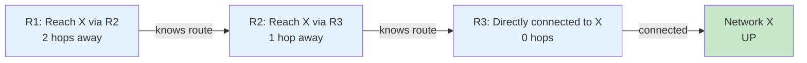
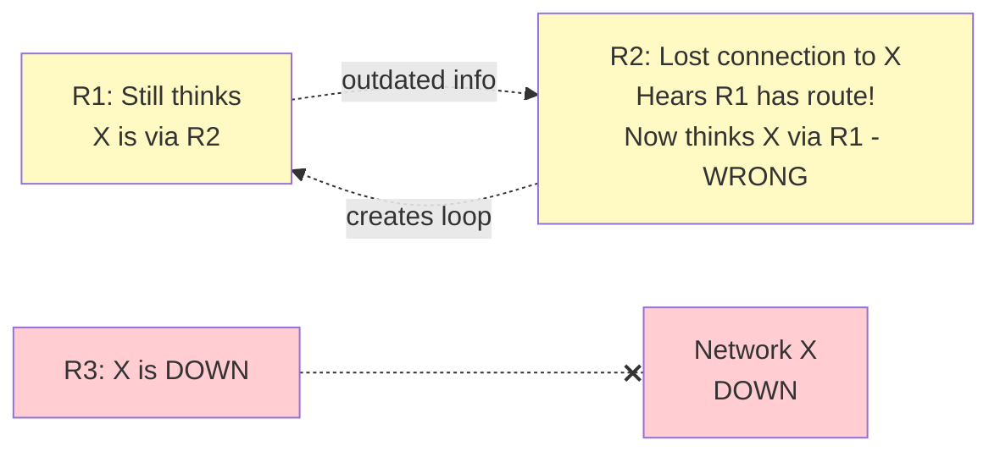
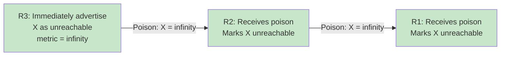
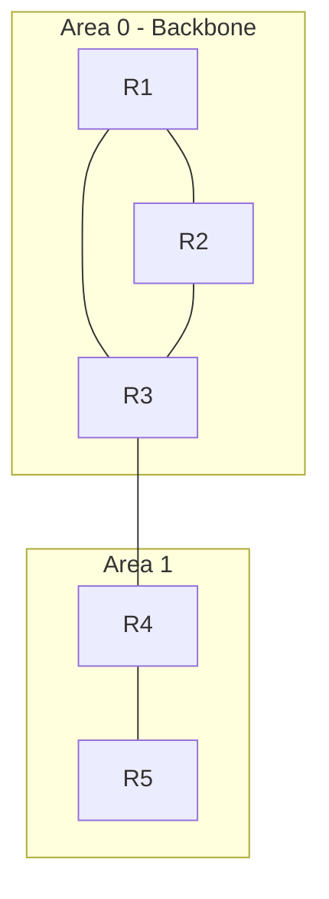
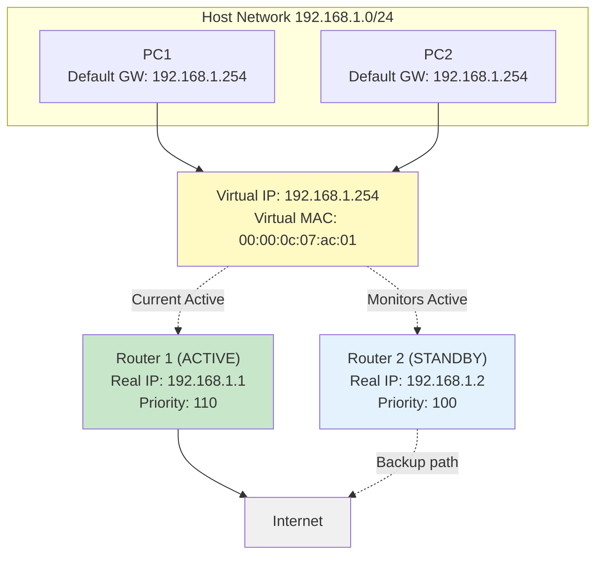

# Routing Protocols & Advanced Topics

## Overview
We build a clear mental model for how routing protocols behave. First, Distance Vector (RIP) and why loops happen. Then, Link-State (OSPF) and how a shared map plus SPF avoids those issues. We wrap up with a quick comparison, high availability for default gateways, and what's different in IPv6.

## Key Terms
- **Distance Vector**: Routing protocol that shares routing table information with neighbors.
- **Link-State Database (LSDB)**: Complete topology map shared by all routers in an area.
- **Split Horizon**: Technique to prevent routing loops by not advertising routes back where they came from.
- **FHRP (First-Hop Redundancy Protocol)**: Provides gateway redundancy for hosts.

## Distance Vector Protocols (e.g., RIP)

Distance Vector protocols operate on the principle of "routing by rumor." Each router only knows what its direct neighbors tell it, and it shares its own routing table with those neighbors.

### How Distance Vector Works
- Each router maintains a routing table with distances (metrics) to destinations
- Routers periodically share their entire routing table with directly connected neighbors
- Upon receiving updates, routers recalculate their own table
- The metric typically increases as information passes through routers (e.g., hop count)

### RIP (Routing Information Protocol)
- Simple DV protocol that uses hop count as its metric (max 15 hops)
- Sends periodic updates (every 30 seconds) of entire routing table
- Easy to configure, minimal overhead
- While largely historical, it's excellent for learning DV behavior

### Problems with Distance Vector
- **Count-to-Infinity**: Routing loops can form when a network fails
- **Slow Convergence**: Takes time for all routers to agree on topology changes
- **Periodic Updates**: Bandwidth waste even when network is stable

### The Count-to-Infinity Problem (Step-by-Step)

**Step 1: Normal Operation**

All routers have correct information. R1 knows X is 2 hops away, R2 knows it's 1 hop away, R3 is directly connected.

**Step 2: Network X Fails**

When X fails, R1 hasn't heard about it yet. R2 hears from R1 that it has a route to X, so R2 incorrectly thinks it can reach X through R1. This creates a loop! Packets bounce between R1 and R2, and the hop count slowly "counts to infinity."

**Step 3: Solution - Poison Reverse**

Poison reverse fixes this by having R3 immediately advertise X as unreachable (metric 16 in RIP = infinity). This information quickly propagates to R2 and R1, preventing the loop before it forms.

### Loop Prevention Techniques
- **Split Horizon**: Don't advertise a route back out the same interface you learned it from
- **Poison Reverse**: Advertise failed routes as unreachable (infinite metric)

## Link-State Protocols (e.g., OSPF)

Link-State protocols take a fundamentally different approach. Every router learns the full topology of the network and builds an identical map, called the Link-State Database (LSDB).

### How Link-State Works
**Concept**: Everyone gets a synchronized map (LSDB) of the network.

**Process**:
1. **Discover neighbors**: Routers send Hello packets to find adjacent routers
2. **Form adjacencies**: Establish relationships with neighbors
3. **Exchange Link-State Advertisements (LSAs)**: Share information about directly connected links
4. **Synchronize LSDBs**: Ensure all routers in an area have identical topology maps
5. **Run Dijkstra SPF**: Each router independently calculates best paths to all destinations

### OSPF (Open Shortest Path First)
- Industry-standard link-state protocol
- Uses cost as metric (based on bandwidth by default)
- Organizes networks into areas for scalability
- Supports VLSM and CIDR
- Fast convergence through event-driven updates
- Event-driven updates for changes; LSAs are also refreshed periodically (default ~30 minutes)

OSPF uses the concept of "areas" to improve scalability. Routers in the same area share an identical LSDB. Routers connecting different areas (like R3) are called Area Border Routers (ABRs) and are responsible for summarizing information between areas. Area 0 (the backbone) must be present and all other areas must connect to it.

## Distance Vector vs Link-State

| Feature | Distance Vector (e.g., RIP) | Link-State (e.g., OSPF) |
|---|---|---|
| View of Network | Local neighbor perspective | Complete topology map |
| Updates | Periodic, entire table | Event-driven, only changes |
| Convergence | Slow (minutes) | Fast (seconds) |
| Scalability | Limited (max 15 hops for RIP) | High (hierarchical with areas) |
| Resource Needs | Low (CPU/RAM) | Higher initially (CPU/RAM for SPF) |
| Loop Prevention | Split horizon, poison reverse | Less prone; SPF and rapid LSA flooding minimize loops |
| Bandwidth Usage | Higher (periodic full updates) | Lower (only sends changes) |

### When to Use Each Protocol

| Use RIP when... | Use OSPF when... |
|---|---|
| Network is small (< 15 hops) | Network is large or growing |
| Simple configuration is priority | Fast convergence is critical |
| Minimal router resources | Sufficient CPU/RAM available |
| Learning/lab environment | Production enterprise network |
| Legacy equipment support needed | Modern, standards-based required |

## High Availability (First-Hop Redundancy)

### The Problem
If a host's default gateway router fails, the host loses all connectivity outside its local network. Even if redundant routers exist, hosts typically configure only one default gateway and can't automatically fail over.

### The Solution: FHRP
First-Hop Redundancy Protocols (FHRPs) create a *virtual* gateway IP address and MAC address shared between multiple physical routers.

This diagram shows an FHRP setup (HSRP/VRRP). Both PCs use the virtual IP (192.168.1.254) as their default gateway. Router 1 is currently Active and handles traffic. Router 2 monitors Router 1 via heartbeat messages. If Router 1 fails, Router 2 instantly becomes Active and responds to the virtual MAC address—hosts experience no interruption.

**Common FHRPs:**
- **HSRP (Hot Standby Router Protocol)**: Cisco proprietary
- **VRRP (Virtual Router Redundancy Protocol)**: Industry standard (RFC 5798)
- **GLBP (Gateway Load Balancing Protocol)**: Cisco proprietary with load balancing

**How it Works:**
1. Multiple routers share a virtual IP address (the VIP)
2. One router is **Active** (or Master) and handles all traffic
3. Another is **Standby** (or Backup), monitoring the Active router
4. If Active fails, Standby promotes itself instantly (subsecond failover)
5. Hosts only know about the virtual IP—failover is transparent

## IPv6 Routing Specifics

Routing in IPv6 is conceptually similar to IPv4 (longest prefix, AD, metric still apply), but some mechanisms are different:

### Key Differences
- **No broadcast**: IPv6 uses multicast and anycast instead of broadcast
  - Routers use `ff02::` multicast addresses for protocol communication
- **Link-local addressing**: Every IPv6 interface has a link-local address (`fe80::/10`)
  - Used for neighbor discovery and routing protocol adjacencies
- **Larger address space**: 128-bit addresses mean many more possible networks and hosts

### IPv6 Routing Protocols
- **OSPFv3**: OSPF for IPv6
  - Uses IPv6 Next Header 89 (same as OSPF protocol number)
  - Per-link operation instead of per-subnet
  - Decouples addressing from topology

### Neighbor Discovery (ICMPv6)
Replaces ARP and adds router discovery functionality:
- **Router Solicitation (RS)**: Host requests router information
- **Router Advertisement (RA)**: Router advertises prefix, default gateway
- **Neighbor Solicitation (NS)**: Like ARP request
- **Neighbor Advertisement (NA)**: Like ARP reply

