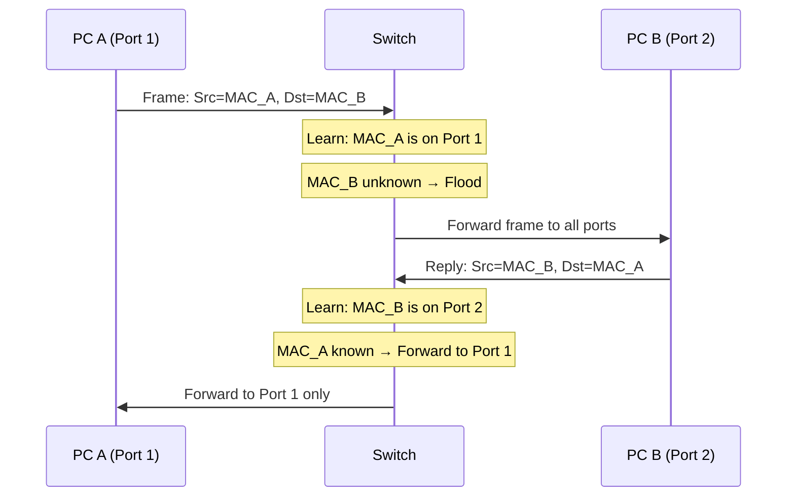
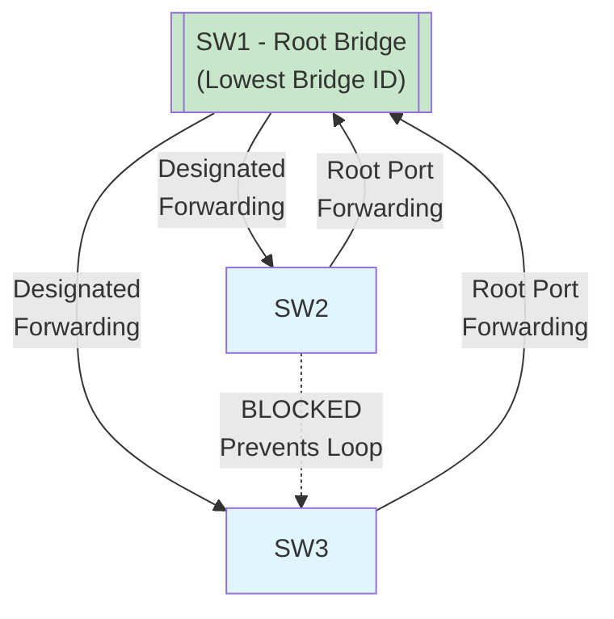

# Switching Fundamentals

## Overview

We'll learn how modern switches forward Ethernet frames. First, we define collision and broadcast domains. Then we see how switches learn MAC addresses and make forwarding decisions. Finally, we cover Spanning Tree Protocol (STP) to prevent loops in redundant topologies.

## Key Concepts

- **Collision Domain**: A network segment where frames can collide. In the old hub era, all ports shared one collision domain. Modern switches create a **separate collision domain per port** (called **microsegmentation**), eliminating collisions and enabling full-duplex operation.
- **Broadcast Domain**: A network segment where a broadcast frame (like ARP) reaches all devices. By default, **all ports on a switch belong to one broadcast domain**, so broadcasts reach every device on the switch.

## How Switches Forward Frames

Switches use a **MAC address table** (also called CAM table) to make intelligent forwarding decisions. Three behaviors:

1. **Learn**: When a frame arrives, record `Source MAC → Ingress Port` in the table.
2. **Forward**: If destination MAC is in the table, send the frame out that specific port only.
3. **Flood**: If destination MAC is unknown (or broadcast), send the frame out all ports except the source port.

The switch starts with an empty table. After the first exchange, it knows both MACs and forwards efficiently.

**Key insight**: Flooding is normal for unknown destinations and broadcasts.

## Spanning Tree Protocol (STP)

**Problem**: Redundant links between switches are good for reliability but create **Layer 2 loops**. A broadcast frame can circulate forever, causing a broadcast storm that crashes the network.

**Solution**: STP automatically detects loops and **blocks** redundant links. If the primary path fails, STP unblocks the backup path.

**How it works**:

1. Switches elect a **Root Bridge** (switch with lowest Bridge ID).
2. Each switch finds its best path to the Root Bridge.
3. Each link has one **Designated Port** (forwarding) and redundant ports are **blocked**.

The link between SW2 and SW3 is blocked to prevent a loop. If the SW1↔SW2 link fails, STP unblocks the SW2↔SW3 link to restore connectivity.
