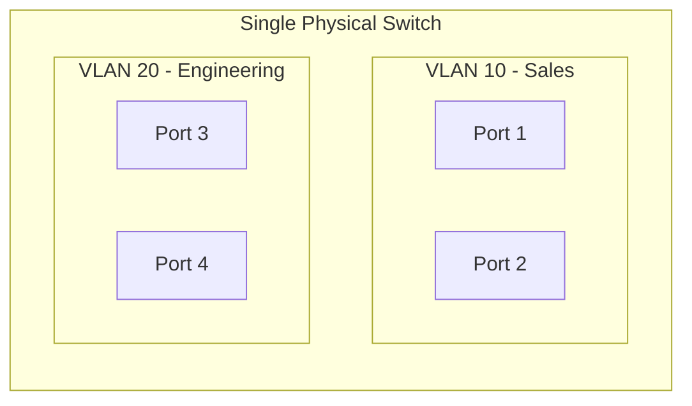
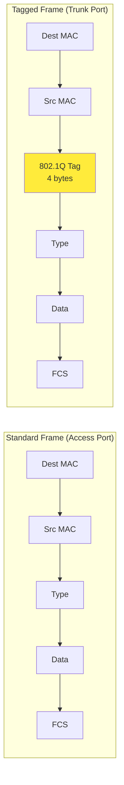
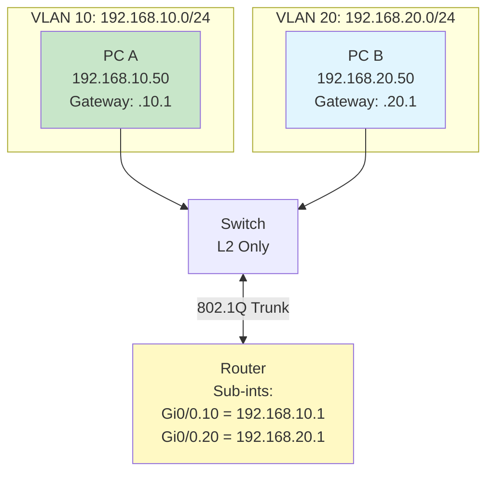

# VLANs & Inter-VLAN Routing

## Overview
We'll segment one physical switch into multiple broadcast domains using VLANs, carry multiple VLANs over a single link using 802.1Q trunking, and route between VLANs at Layer 3.

## What Are VLANs?

**Recall from last lecture**: By default, all ports on a switch belong to one broadcast domain—broadcasts reach everyone.

**VLANs** (Virtual LANs) let you create **multiple broadcast domains on one physical switch**. You assign each switch port to a VLAN (e.g., VLAN 10, VLAN 20). Ports in different VLANs cannot communicate at Layer 2—they're isolated.

**Key point**: VLAN assignment is **flexible**. An administrator can assign any port to any VLAN through configuration. Port 1 can be VLAN 10, Port 3 can be VLAN 20, Port 5 can be VLAN 10 again—it's purely logical.

Ports 1 and 2 (VLAN 10) can communicate. Ports 3 and 4 (VLAN 20) can communicate. VLAN 10 ↔ VLAN 20 requires a router because they're separate Layer 2 domains. This isolation provides security, better performance (smaller broadcast domains), and flexibility.

## Trunk Ports and 802.1Q Tagging

To connect multiple switches (or a switch to a router), we need to carry multiple VLANs over a single physical link. This is where **trunk ports** come in.

**Two port types:**

- **Access Port**: Belongs to **one VLAN**. Frames sent on the wire are **untagged**. Used for end devices (PCs, printers).
- **Trunk Port**: Carries **multiple VLANs**. Frames sent on the wire are **tagged** with a VLAN ID using 802.1Q. Used for switch-to-switch or switch-to-router links.

**How 802.1Q works**: A 4-byte tag is inserted into the Ethernet frame between the Source MAC and Type/Length fields. The tag contains the VLAN ID (12 bits = 4096 possible VLANs).

When a frame enters an access port (say, VLAN 10), the switch adds the VLAN 10 tag before sending it out a trunk. The receiving switch reads the tag and forwards the frame to the correct VLAN.

**Native VLAN**: One VLAN (default: VLAN 1) travels untagged on a trunk. Best practice: change it from VLAN 1 and don't use it for user traffic.

## Inter-VLAN Routing

**Problem**: VLANs are separate Layer 2 broadcast domains. Devices in VLAN 10 (e.g., 192.168.10.0/24) cannot reach devices in VLAN 20 (e.g., 192.168.20.0/24) because switches operate at Layer 2 only.

**Solution**: Use a **Layer 3 device** (router or Layer 3 switch) to route between VLANs.

### Router-on-a-Stick

One physical link connects the switch to the router. The link is configured as a **trunk** (carries multiple VLANs). The router has one **sub-interface per VLAN**—each sub-interface is the default gateway for that VLAN.

**How it works**:
1. PC A (VLAN 10) sends a packet to PC B (192.168.20.50).
2. PC A sends to its gateway (192.168.10.1).
3. Switch forwards the frame on the trunk (tagged VLAN 10).
4. Router receives it on sub-interface `Gi0/0.10`.
5. Router routes it to `Gi0/0.20` (different subnet).
6. Router sends it back on the trunk (tagged VLAN 20).
7. Switch forwards it to PC B on VLAN 20.

**Sub-interface note**: A sub-interface (e.g., `Gi0/0.10`) is a logical division of one physical interface. The router sees multiple IP addresses on one physical port.

### Alternative: Layer 3 Switch

A **Layer 3 switch** has routing hardware built in. Instead of sub-interfaces, you create **SVIs** (Switch Virtual Interfaces)—one per VLAN. Example: `VLAN 10 SVI = 192.168.10.1`, `VLAN 20 SVI = 192.168.20.1`. The switch routes between VLANs internally at wire speed. No external router needed.

**Which device to buy?**
- If you buy a device labeled "Layer 2 switch" or just "switch," it does **not** have routing—use Router-on-a-Stick.
- If you buy a "Layer 3 switch" or "multilayer switch," it **does** have routing (SVIs).
- "All-in-one" home/SOHO routers often have VLANs + routing in one box (like a small L3 switch).

**Key idea**: Inter-VLAN routing always requires Layer 3 (routing between subnets). The routing function can live in a separate router, inside a Layer 3 switch, or in an all-in-one device. The concept is the same; only the hardware packaging differs.

