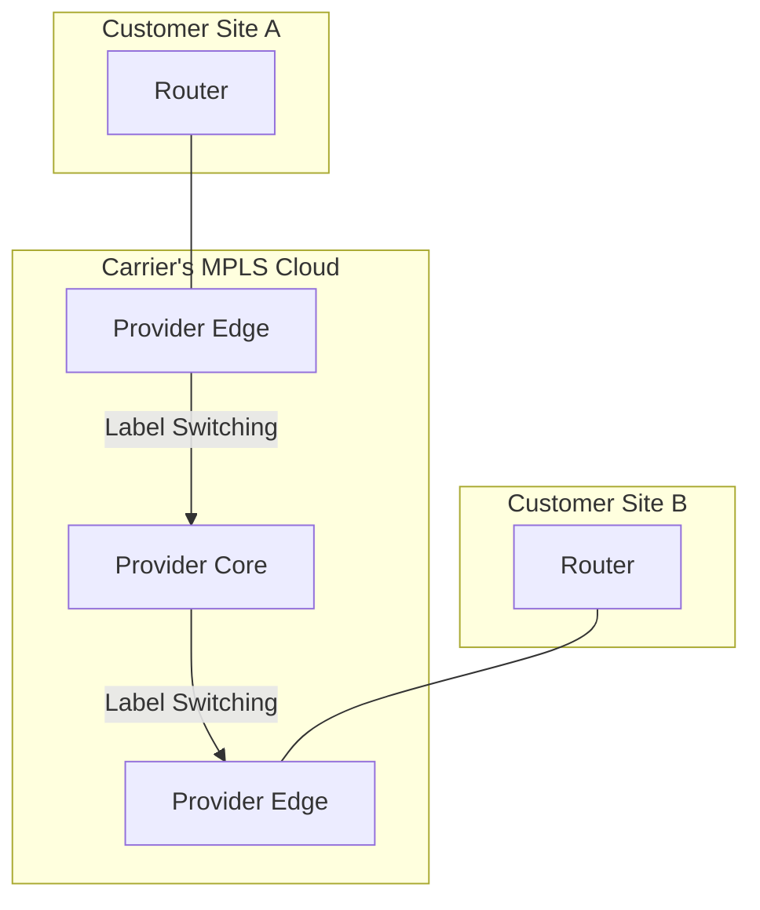

# WAN Protocols & Troubleshooting

## Overview
We introduce the protocols that operate over WAN links and common methods for troubleshooting WAN connectivity issues. Understanding these protocols helps demystify how data travels securely and reliably over provider networks.

## WAN Protocols

### Legacy Protocols (Conceptual)
- **PPP (Point-to-Point Protocol)**: Used to create a direct connection between two nodes, often for authentication (PPPoE for DSL).
- **Frame Relay**: A packet-switching technology that allowed a single circuit to connect to multiple sites via PVCs (Permanent Virtual Circuits).

### Modern WAN Protocols
- **Ethernet WAN (Metro Ethernet)**: Using Ethernet as a WAN technology to connect sites within a metropolitan area.
- **MPLS (Multiprotocol Label Switching)**: A carrier technology that forwards packets based on labels, not IP addresses. Enables traffic engineering, QoS, and secure VPNs over a shared infrastructure.
- **SD-WAN (Software-Defined WAN)**: Newer approach using software overlays (often over internet links) to replace/augment MPLS, with centralized control.

### Diagram: MPLS Cloud

This diagram shows how MPLS creates a "virtual private network" over a carrier's shared cloud. Customer routers (R1, R2) connect to the provider's edge routers, and traffic is forwarded based on labels, keeping it isolated from other customers' traffic.

## VPNs as a WAN Solution

- **Site-to-Site VPN**: Creating an encrypted tunnel over the public internet to connect two or more LANs.
- **Benefit**: A cost-effective and flexible alternative to expensive dedicated WAN circuits like MPLS or leased lines.

## WAN Troubleshooting

### Key Difference
The demarc. Unlike a LAN, you don't control the entire path. The goal is to determine if the problem is on your side or the provider's.

### Troubleshooting Steps
1. **Check the CPE**: Is your router/firewall powered on and configured correctly?
2. **Ping the Gateway**: Can you ping your default gateway IP provided by the ISP?
3. **Isolate DNS**: Try `ping 8.8.8.8` vs `ping google.com` to separate WAN connectivity from name resolution issues.
4. **Check the Demarc**: Are there link lights on the provider's equipment?
5. **Contact the Provider**: If you suspect the issue is on their side, provide them with clear information from your tests.

### Common Tools
- `ping`: Tests basic reachability.
- `traceroute`: Visualizes the path and identifies where packets stop.
- **Provider Status Pages**: Check for known outages in your area.

## Quick Review Questions
- How does MPLS keep customer traffic separate on a shared network?
- Why might a company choose a Site-to-Site VPN over a dedicated MPLS circuit?
- If you can ping 8.8.8.8 but not google.com, what is likely the problem?

