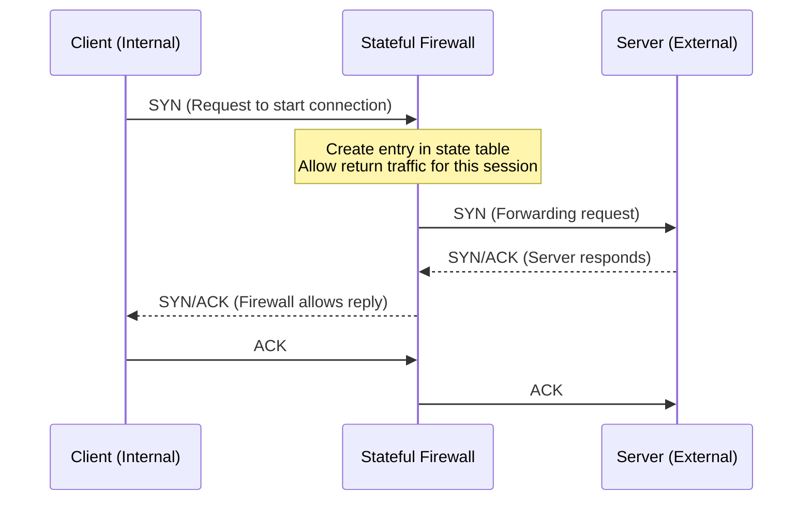

# Security Fundamentals & Firewalls

## Overview
Week 12 introduces the foundational principles of network security. Building on our knowledge of how networks operate, we'll explore the core concepts of the CIA triad, physical security, and the essential hardware and software used to protect networks. We will focus heavily on firewalls, intrusion detection/prevention systems (IDS/IPS), and the role of VPNs in securing data.

## Core Security Principles

### The CIA Triad
The foundation of information security.
- **Confidentiality**: Keeping data private (achieved with encryption).
- **Integrity**: Ensuring data has not been altered (achieved with hashing).
- **Availability**: Ensuring systems are accessible to authorized users (achieved with redundancy, backups).

### Physical Security & Risk
- Protecting network devices (routers, switches, servers) from unauthorized physical access.
- Locking wiring closets, using rack security, and controlling access to data centers.

## Defining Firewalls

### Purpose
A firewall is a device or software that inspects network traffic and permits or denies it based on a set of security rules. It enforces an access control policy between networks.

### Firewall Types (Evolution)
- **Packet Filtering (Stateless)**: Early firewalls that inspected packets in isolation based on IP/port numbers. Fast but limited.
- **Stateful Inspection**: Tracks the state of active connections and makes decisions based on the context of the traffic. The dominant firewall technology for years.
- **Next-Generation Firewall (NGFW)**: Stateful firewalls with advanced features like application awareness, integrated IPS, and deep packet inspection.

## Firewall Technologies & Features

### Application Layer vs. Network Layer Firewalls
- **Network Layer**: Makes decisions based on Layer 3/4 info (IP addresses, ports).
- **Application Layer (Proxy/NGFW)**: Understands specific applications (HTTP, SQL) and can block malicious activity within allowed traffic (e.g., block SQL injection over port 80).

### Other Firewall Features
- **Access Control Lists (ACLs)**: The set of rules defining what traffic is permitted or denied.
- **NAT**: Hides internal IP addresses behind a public IP. This provides basic obfuscation but is **not** a primary security control.
- **Scanning Services**: Many firewalls integrate anti-virus, anti-malware, and content filtering services.

### Diagram: Stateful Firewall Logic

This diagram shows a stateful firewall tracking a TCP connection. When the internal client initiates a connection, the firewall creates a state table entry. This allows the return traffic from the server to pass back through, even without a specific rule for it, because it's part of an established, legitimate session.

## Quick Review Questions
- What is the difference between Confidentiality and Integrity in the CIA triad?
- Why is a stateful firewall more secure than a stateless packet filter?
- Is NAT a security feature? Why or why not?

