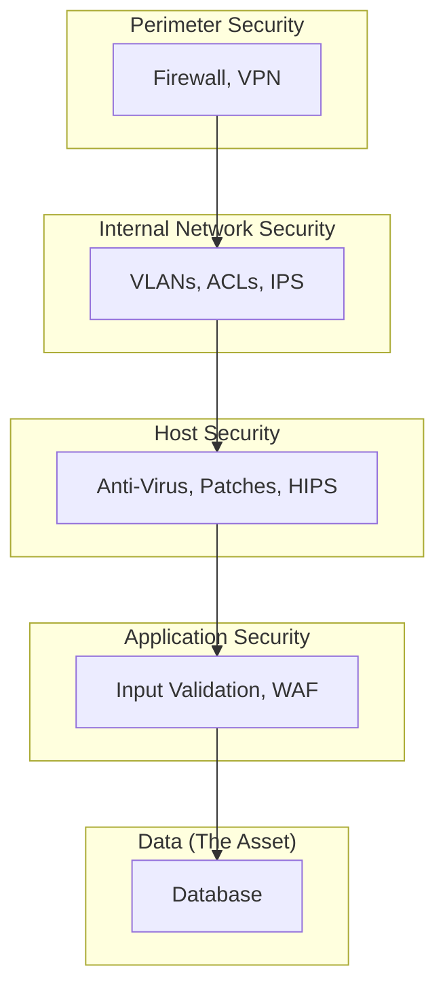

# Advanced Security Devices & Concepts

## Overview
Moving beyond firewalls to other critical security devices and understanding the principles of a layered security approach (Defense in Depth).

## Intrusion Detection & Prevention Systems

- **IDS (Intrusion Detection System)**: Passively monitors network traffic and alerts administrators when it detects suspicious activity.
  - *Example*: Raises an alert if it sees multiple failed logins from one IP.
- **IPS (Intrusion Prevention System)**: Sits inline with traffic and can actively block malicious traffic when it's detected.
  - *Example*: Actively blocks that IP after too many failed attempts.

### Detection Methods
- **Signature-based**: Looks for known attack patterns.
- **Anomaly-based**: Looks for deviations from a baseline of normal network behavior.

## VPN Termination (Concentrators & Firewalls)

- **Purpose**: Handling incoming VPN connections. While dedicated **VPN Concentrators** exist for large scale, most modern organizations terminate VPNs directly on their **Firewall**.
- **Remote Access VPN**: Provides a secure, encrypted tunnel for individual users (e.g., remote employees) to connect to the corporate network over the public internet. This ensures confidentiality and integrity of data.

## Device Security & Hardening

### Problems Affecting Device Security
- **Default Credentials**: Leaving default usernames/passwords unchanged.
- **Unpatched Systems**: Failing to apply security patches for known vulnerabilities.
- **Unnecessary Services**: Running services that are not needed, which increases the attack surface.

### Hardening
The process of securing a device by reducing its surface of vulnerability.

## Defense in Depth

- **Concept**: A layered security approach. If one layer fails, the next one is there to stop the attack.
- **Typical Layers**: Perimeter (Firewall/VPN) → Internal (VLANs/ACLs) → Host (AV/Patching) → Application (WAF) → Data (Encryption).

### Diagram: Layered Security Model

This diagram shows the Defense in Depth model. Security controls are applied at multiple layers, from the network perimeter all the way down to the application and data itself, providing redundant protection against threats.

## Quick Review Questions
- What is the primary difference between an IDS and an IPS?
- Why is "Defense in Depth" better than relying solely on a strong firewall?
- Name three common steps to "harden" a network device.

